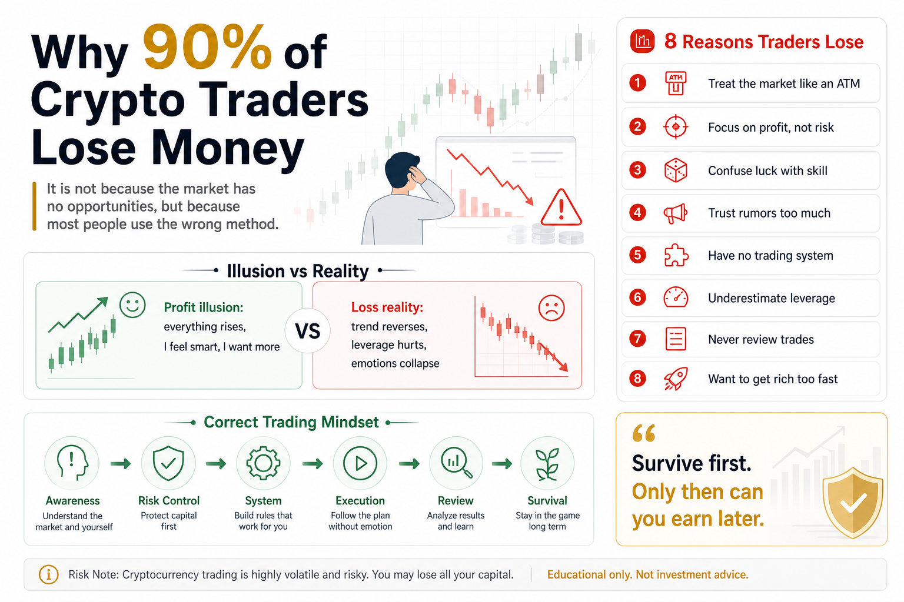

# Why 90% of Crypto Traders Lose Money

Many people enter the crypto market for one simple reason:

They hear that someone got rich.

That story is powerful.

It makes crypto feel like a shortcut. If someone else made life-changing money, maybe you only need to be early enough, bold enough, or lucky enough to copy the result.

But the reality is much harsher.

Most people do not lose because they never made money. Many of them made money at some point. They caught a rally. They bought a coin that went up. Their account balance once looked exciting.

Then they gave it all back.

They chased tops, refused to cut losses, used too much leverage, averaged down blindly, and let emotion replace rules.

So the real question is not:

Can crypto make money?

The real question is:

Why do so many people still end up losing?

## 1. They Treat the Market Like an ATM

Beginners often enter the market with the hidden assumption that the market should pay them.

They see a coin rise 50% and feel that missing it is a loss. They see someone post a profit screenshot and feel behind. They watch a green candle and believe the next one must also be green.

Trading quickly becomes an emotional loop:

- When price rises, they fear missing out.
- When price falls, they refuse to accept being wrong.
- When they are stuck, they keep adding.
- When they lose, they want revenge.

The market does not care how badly you want to make money.

Crypto is full of opportunity, but it is not an ATM. It is a multiplier. It magnifies your knowledge, but it also magnifies greed, fear, impatience, and overconfidence.

Without rules, the market does not give you profits. It punishes your emotions.

## 2. They Focus on Profit, Not Risk

Most beginners ask:

How much can this coin go up?

Experienced traders ask a different question:

How much can I lose if I am wrong?

That difference changes everything.

New traders love profit screenshots, big return stories, and hot coin lists. But they rarely calculate the risk behind a trade.

Before entering a position, you should know:

- How much of your account can this trade lose?
- Can you survive five losing trades in a row?
- What happens if the market drops 30% overnight?
- What happens if an exchange freezes, an API fails, or liquidity disappears?

Many people do not lose because their direction was wrong once.

They lose because they were not prepared to be wrong.

In crypto, one bad direction call is not fatal. A bad direction call with oversized position, high leverage, and no stop-loss can destroy the account.

## 3. They Confuse Luck with Skill

In a bull market, many people temporarily look smart.

Almost everything rises. Random picks make money. Simple opinions sound brilliant. Account balances increase quickly.

Then confidence turns into illusion:

I understand the market.

But in many cases, it was not skill. It was favorable market wind.

Real skill is not measured by how much you make in a rising market. It is measured by how much you keep when conditions change.

A mature trader is tested in three moments:

- During a sharp rally, can they control greed?
- During a sharp drop, can they follow discipline?
- During a losing streak, can they stop making impulsive trades?

If profit comes only from feeling, losses will also come from feeling.

Sooner or later, the market separates luck from ability.

## 4. They Trust “News” Too Much

Crypto is flooded with news, rumors, group messages, insider claims, and short-term narratives.

A project is about to announce something.

A fund is entering.

A whale is accumulating.

An exchange listing is coming.

These messages are exciting because they make people feel they know something others do not.

But by the time ordinary traders hear the news, it is often no longer early.

Sometimes what you see is exactly what someone else wants you to see. Your entry may be someone else’s exit.

The most expensive thing in the market is not always trading fees.

It is unverified information.

Reliable trading should not be built on “I heard.” It should be built on data, rules, and risk that you can actually control.

## 5. They Have No Trading System

Most losing traders are not completely lazy. Many of them learn a lot.

The problem is that they learn in fragments.

Today they study moving averages. Tomorrow they watch RSI. Next week they try MACD. Then they jump into grid trading, futures, arbitrage, or some “AI strategy.”

They know a little about many things, but nothing becomes a system.

So every market move becomes a new guess:

Should I chase this rally?

Should I cut this loss?

Should I open a position in this sideways market?

Why did this trade fail?

Without a system, every trade is a fresh emotional decision.

The value of quantitative thinking is that it turns guessing into rules.

At minimum, a trading system must answer:

- When do I buy?
- How much do I buy?
- When do I sell?
- What do I do when I am wrong?
- How do I know whether the strategy works over time?

If you cannot answer these questions, you are not ready for serious capital, and definitely not ready for leverage.

## 6. They Underestimate Leverage

Leverage is one of the fastest ways beginners lose money.

In spot trading, a price drop hurts, but you may still have time and flexibility. In leveraged futures, a short-term move against you can force you out before your idea has any chance to recover.

Many people think leverage magnifies profit.

It does.

But first, it magnifies mistakes.

If your direction is wrong, leverage magnifies the loss.

If your position is too large, leverage removes your margin for error.

If you have no stop-loss, leverage turns a small mistake into a major event.

Crypto markets can move violently. Spikes, crashes, sudden liquidations, and sharp reversals are normal.

If a strategy cannot survive without leverage, leverage will not save it. It will only expose the weakness faster.

## 7. They Do Not Review Their Trades

After losing money, many people say:

I was unlucky.

But if every loss is blamed on luck, nothing improves.

Review is not about blaming yourself. It is about creating feedback.

After each trade, you should record:

- Why did I enter?
- What was my position size?
- Did I have a stop-loss plan?
- Did I follow the plan?
- Was the loss caused by the strategy or by execution?
- What should I do differently next time?

Without review, there is no feedback.

Without feedback, trading skill does not compound.

## 8. They Want to Get Rich Fast, But Refuse to Get Better Slowly

Crypto makes people hate slowness.

When you see others make huge gains in a day, steady learning feels boring. When someone claims to double an account quickly, risk control feels unnecessary. When a high-return strategy appears, people forget that high return always comes with high risk.

But the people who survive long term are rarely the most aggressive.

They are usually the ones who manage risk best.

Trading is not a sprint. It is a survival game.

You must survive before you can talk about returns.

You must control drawdown before you can enjoy compounding.

You must build rules before you can escape emotion.

## How Beginners Should Start

If you are new to crypto, your first goal should not be to make money quickly.

Your first goal should be to build the right order.

First, do not start with high-leverage futures.

Begin with spot trading, small capital, and low frequency. Learn how the market moves before trying to accelerate results.

Second, do not put too much capital into one coin.

Position sizing matters more than prediction. No single idea should decide the survival of your account.

Third, do not blindly trust signals or rumors.

Other people’s opinions can be references, but they cannot take your loss for you.

Fourth, learn quantitative thinking early.

Quantitative trading is not magic. It is not a guaranteed-profit machine. Its real value is using data, rules, backtesting, risk control, and automation to reduce emotional trading.

Even if you cannot code yet, you can start by making your trading more rule-based:

- Trade only opportunities you understand.
- Write down your reason before entering.
- Set a maximum loss for each trade.
- Review your account curve weekly.
- Do not trade when your emotions are out of control.

These habits look simple, but they are the foundation of long-term trading.

## Conclusion

Losing money is not the most dangerous part of trading.

The dangerous part is not knowing why you lost.

Crypto is not impossible to trade profitably, but it does not reward unprepared people for long.

Most traders lose because they enter the market with the wrong mindset:

They treat rallies as skill, leverage as a shortcut, rumors as certainty, and luck as a system.

If you want to last, do not search for a secret shortcut first.

Start by respecting the market.

Less fantasy, more rules.

Less impulse, more risk control.

Less “I feel,” more “the data shows.”

In the market, only those who survive first have a chance to earn later.

> Risk warning: This article is for educational purposes only and does not constitute investment advice. Digital assets are highly volatile. Only trade with capital you can afford to lose.

