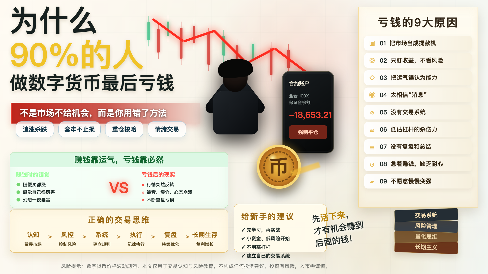

# 为什么90%的人做数字货币最后亏钱

很多人第一次进入数字货币市场，不是因为理解了区块链，也不是因为看懂了交易逻辑，而是因为听到了一句话：

“有人靠这个暴富了。”

这句话很有诱惑力。

它会让人产生一种错觉：别人能在币圈赚钱，我只要进来得足够早、胆子足够大、运气足够好，也能复制同样的故事。

但现实往往更残酷。

大多数人不是没有赚到过钱，而是赚到以后又亏回去了；不是没有买中过上涨的币，而是最后死在重仓、追高、杠杆、合约和情绪里。

所以，真正值得讨论的问题不是“数字货币能不能赚钱”，而是：

为什么这么多人最后还是亏钱？

## 一、他们把市场当成提款机

新手最常见的误区，是刚入场就默认市场应该给自己送钱。

看到别人一天翻倍，就觉得自己也能做到；看到某个币涨了50%，就觉得错过就是损失；看到K线连续上涨，就觉得后面一定还会涨。

于是交易从一开始就变成了情绪游戏：

- 涨了，怕错过；
- 跌了，不甘心；
- 套了，想补仓；
- 爆了，想翻本。

市场不会因为你着急赚钱就配合你。

数字货币市场的波动很大，机会确实多，但它不是提款机。它更像一台放大器：会放大你的认知，也会放大你的贪婪、恐惧和侥幸。

如果一个人没有交易规则，市场给他的不是收益，而是情绪惩罚。

## 二、他们只盯收益，不看风险

很多人做交易时，最关心的问题是：

“这个币能涨多少？”

但专业交易者会先问：

“如果判断错了，我最多亏多少？”

这两个问题，决定了两种完全不同的命运。

新手喜欢看收益截图，喜欢听翻倍故事，喜欢研究别人买了什么，却很少认真计算自己的风险。

比如：

- 单笔交易最多亏本金的多少？
- 连续亏损5次还能不能活下来？
- 如果一夜下跌30%，账户会不会被打穿？
- 如果交易所宕机、插针、流动性消失，是否有应急方案？

很多人不是死在看错方向，而是死在没有准备好看错方向。

在币圈，方向错一次并不可怕，可怕的是仓位太重、杠杆太高、止损太晚。一次错误如果足够大，就能抹掉之前所有正确。

## 三、他们把运气误认为能力

牛市里，很多人都会短暂地变得“很厉害”。

随便买一个币都涨，随便发一个观点都对，账户数字快速增加，于是人很容易产生一种错觉：

“我懂市场。”

但很多时候，那不是能力，只是行情给了顺风。

真正的能力，不是牛市里赚了多少钱，而是行情变差以后还能不能守住钱。

一个交易者是否成熟，要看三个时刻：

- 暴涨时，会不会控制贪婪；
- 暴跌时，会不会遵守纪律；
- 连续亏损时，会不会停止乱操作。

如果赚钱靠感觉，亏钱也一定会靠感觉。市场迟早会把运气和能力分开计算。

## 四、他们太相信“消息”

币圈消息很多，群里消息更多。

某项目要上线，某机构要进场，某大户在吸筹，某交易所要利好，某个所谓内部消息马上公布。

这些内容听起来都很刺激，因为它给人一种“我知道别人不知道的东西”的优越感。

但问题是，等普通人听到消息时，消息往往已经不新了。

很多时候，你看到的是别人想让你看到的；你买进去的位置，可能正是别人准备卖出的位置。

市场里最贵的东西，往往不是手续费，而是未经验证的消息。

真正可靠的交易，不应该建立在“听说”上，而应该建立在可验证的数据、清晰的规则和可承受的风险之上。

## 五、他们没有交易系统

大多数亏钱的人，并不是完全不学习，而是学得太碎。

今天看均线，明天看RSI，后天看MACD；今天学网格，明天学合约，后天又想做套利。每个东西都懂一点，但没有任何一个东西形成系统。

结果就是：

上涨时不知道该不该追；
下跌时不知道该不该止损；
震荡时不知道该不该开仓；
亏损时不知道问题出在哪里。

没有系统的人，每一次交易都是重新猜一次。

而量化交易的核心价值，恰恰是把“猜”变成“规则”。

一个基础的交易系统，至少要回答五个问题：

- 什么时候买？
- 买多少？
- 什么时候卖？
- 错了怎么办？
- 如何评估这个策略是否长期有效？

如果这些问题没有答案，就不要急着上实盘，更不要急着上杠杆。

## 六、他们低估了杠杆的杀伤力

杠杆是很多人亏损加速的根源。

现货下跌，你还有等待的空间；合约加杠杆以后，市场只需要短时间反向波动，就可能让你被迫出局。

很多人以为杠杆是在放大收益，实际上杠杆首先放大的是错误。

你判断错方向，杠杆会放大亏损；
你仓位太重，杠杆会压缩容错；
你没有止损，杠杆会把小错变成大灾难。

尤其在数字货币市场，剧烈波动并不罕见。插针、瀑布、急拉、急跌，都可能在很短时间内发生。

如果一个策略在不加杠杆时都不能稳定赚钱，加杠杆只会让它更快暴露问题。

## 七、他们没有复盘

很多人亏钱以后，只会说一句：

“这次运气不好。”

但如果每一次亏损都归因于运气，就永远不会进步。

复盘不是为了责备自己，而是为了找到问题。

每一笔交易结束后，至少应该记录：

- 当时为什么开仓？
- 仓位是多少？
- 有没有止损计划？
- 实际执行是否偏离计划？
- 亏损来自策略问题，还是执行问题？
- 如果重来一次，应该怎么做？

没有复盘，就没有反馈。

没有反馈，交易水平只会原地打转。

## 八、他们急着赚钱，却不愿意慢慢变强

币圈最危险的地方，是它会让人讨厌慢。

看到别人一天赚几万，自己就不愿意一点点学习；看到别人几个月翻倍，自己就觉得稳健收益没有意义；看到高收益策略，就忘了高收益背后一定有高风险。

但真正能长期活下来的人，往往不是最激进的人，而是最能控制风险的人。

交易不是一场短跑，而是一场长期生存游戏。

你先活下来，才有资格谈收益。

你先控制回撤，才有机会享受复利。

你先建立系统，才可能摆脱情绪。

## 九、普通人应该怎么开始？

如果你是新手，最重要的不是马上赚钱，而是先建立正确顺序。

第一，不要一开始就碰高杠杆合约。

先用现货、小资金、低频交易理解市场。你需要先知道自己会怎么亏钱，再谈怎么赚钱。

第二，不要重仓单一币种。

仓位管理比预测更重要。再看好的机会，也不要让一次判断决定账户生死。

第三，不要迷信消息和喊单。

别人的观点只能参考，不能替你承担亏损。真正负责的人，永远是按下买卖按钮的自己。

第四，尽早学习量化思维。

量化不是神秘魔法，也不是稳赚机器。它的本质是用数据、规则、回测、风控和自动化，减少情绪化交易。

哪怕你暂时不会写代码，也可以先从规则化开始：

- 只做自己看得懂的机会；
- 每次开仓前写下理由；
- 每笔交易设置最大亏损；
- 每周复盘账户曲线；
- 不在情绪失控时交易。

这些看起来普通，却是长期交易的地基。

## 十、结语：亏钱并不可怕，可怕的是不知道为什么亏

数字货币市场不是不能赚钱，但它绝不会让大多数毫无准备的人轻松赚钱。

90%的人最后亏钱，不是因为市场没有机会，而是因为他们带着错误的方式进入市场：

把上涨当能力，把杠杆当捷径，把消息当确定性，把运气当系统。

如果你想真正走得远，第一步不是寻找暴富密码，而是先承认市场的残酷。

少一点幻想，多一点规则。

少一点冲动，多一点风控。

少一点“我觉得”，多一点“数据证明”。

这也是我们接下来做这个系列的原因。

从认知开始，从风险开始，从系统开始，一步一步搭建属于普通人的数字货币量化交易框架。

记住一句话：

在市场里，先活下来的人，才有机会赚到后面的钱。

> 风险提示：本文仅用于交易认知与风险教育，不构成任何投资建议。数字货币价格波动剧烈，参与交易前请充分理解风险，并只使用自己能够承受损失的资金。
