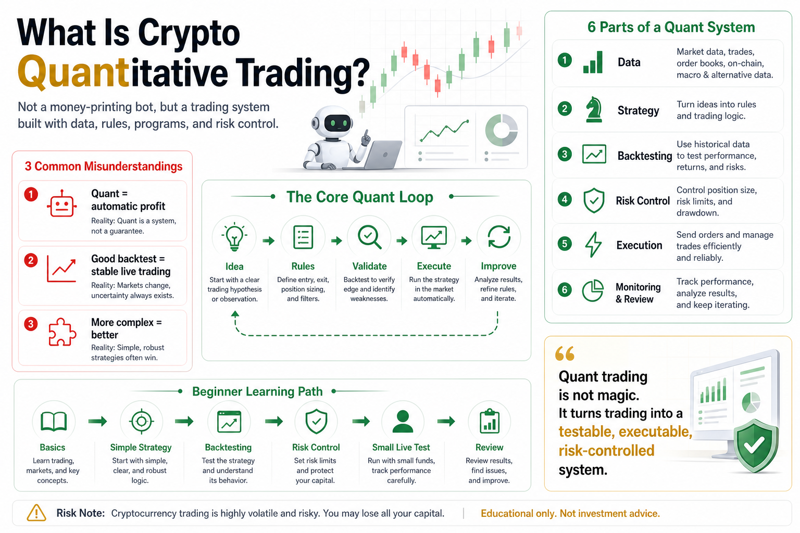

# What Is Crypto Quantitative Trading?

When many people first hear the phrase “crypto quantitative trading,” three ideas immediately come to mind:

Bots, automation, and passive income.

It sounds advanced. It also sounds tempting.

Just connect a trading bot to an exchange API, let it run 24 hours a day, and the account should grow by itself.

But if that is how you understand quant trading, you are already starting from the wrong place.

Crypto quantitative trading is not a money printer.

It is not a guaranteed-profit tool.

It is not a way to hand your account to a bot and stop thinking.

At its core, it is much simpler:

Use data to study market behavior, use rules to define a strategy, use programs to execute trades, and use risk control to protect the account.

That may sound less exciting than a profit screenshot, but it is the real foundation of quant trading.

## 1. Quant Trading Is Not About Predicting the Future

Many beginners believe quant trading is powerful because it can predict prices.

They want to know:

- Will Bitcoin rise tomorrow?
- Will Ethereum break out next week?
- Is this altcoin about to pump?
- Is now the perfect bottom?

But real quantitative trading is not about predicting the future with a magic formula.

The future cannot be predicted with certainty. This is especially true in crypto, where volatility is high, news moves fast, and market emotion changes quickly.

What quant trading really does is turn a trading idea into something testable, executable, and reviewable.

For example:

If Bitcoin breaks above its 20-day high and volume expands, buy.

If price falls below a moving average or the loss reaches a preset limit, exit.

If account drawdown exceeds a threshold, pause trading.

This is not fortune telling.

It is building a response system inside an uncertain market.

Quant trading does not make you right all the time. It helps you avoid being destroyed when you are wrong.

## 2. Manual Trading vs. Quantitative Trading

Manual trading depends on human decisions.

You watch the chart, analyze the market, place orders, cut losses, add positions, and take profit based on your current judgment.

The problem is that humans are emotional.

When price rises, greed appears.

When price falls, fear appears.

After several wins, overconfidence appears.

After several losses, revenge trading appears.

Quantitative trading works differently.

It defines the decision process before the market moves.

You write down:

- When can I buy?
- When must I avoid buying?
- How much can I buy?
- What happens if I am wrong?
- When do I take profit?
- When should the system stop trading?

Manual trading is often real-time decision-making.

Quant trading is pre-defined decision-making plus disciplined execution.

It does not guarantee every trade will be profitable, but it reduces the damage caused by emotion.

## 3. What Makes Up a Crypto Quant System?

A complete crypto quant system usually includes six parts.

### 1. Data

There is no quant trading without data.

Common data includes:

- Candlestick data
- Volume
- Order book data
- Funding rates
- Trade records
- Account balances
- Historical orders
- News or sentiment data

For beginners, candlesticks and volume are usually enough.

Do not chase complexity too early. Complex data does not automatically create a better strategy.

### 2. Strategy

The strategy is the brain of the system.

It answers one question:

Under what conditions should the system trade?

Common strategy types include:

- Moving average strategies
- Breakout strategies
- Grid strategies
- Trend-following
- Mean reversion
- Arbitrage
- Multi-factor models

But the name of the strategy is not the key.

The logic is the key.

Two strategies can both be called “moving average strategies,” but different parameters, timeframes, coins, and position sizing rules can produce very different results.

The important questions are:

Why might this strategy work?

In what market environment does it work?

How much can it lose when it fails?

### 3. Backtesting

Backtesting means running a strategy on historical data to see how it would have performed.

It helps answer:

- Did the strategy make money historically?
- What was the maximum drawdown?
- How long was the worst losing streak?
- What were the win rate and payoff ratio?
- Which market environments helped the strategy?
- Which environments hurt it?

But backtesting is not a guarantee.

A strategy that performed well in history may fail in live trading.

The backtest may be overfitted. Fees may be underestimated. Slippage may be ignored. Liquidity may be insufficient. Parameters may be tuned too perfectly to past data.

A backtest only says:

This idea may be worth further study.

It does not say:

This will make money in the future.

### 4. Risk Control

Risk control is the braking system.

Without it, even a good strategy can fail during extreme market conditions.

Crypto needs strong risk control because large moves are normal.

A basic risk framework should include:

- Maximum loss per trade
- Maximum position size per coin
- Maximum total account exposure
- Maximum drawdown limit
- Stop-loss rules
- Pause rules after consecutive losses
- Circuit breakers during abnormal markets
- Handling of API or server failures

Many beginners are excited about strategies but careless about risk control.

In live trading, survival often depends more on risk control than on the strategy itself.

### 5. Execution

Execution turns strategy signals into real orders.

It includes:

- Connecting to exchange APIs
- Reading account balances
- Fetching market data
- Detecting signals
- Sending orders
- Checking order status
- Recording logs

Execution may sound like a technical detail, but it directly affects results.

Latency, API limits, failed orders, slippage, partial fills, and exchange downtime can all turn a beautiful backtest into a weak live result.

That is why quant trading is not just “write a strategy.”

It is a full trading system.

### 6. Monitoring and Review

A trading bot is not something you turn on and forget.

Once live trading begins, you must monitor:

- Account balance
- Strategy status
- Order execution
- Abnormal profit and loss
- Drawdown
- Server health
- Exchange API status

You also need regular review.

Quant trading is not a one-time project. It is a continuous improvement process.

Going live is the beginning, not the end.

## 4. The Basic Quant Trading Loop

The simplest quant workflow looks like this:

Start with a trading idea.

Collect historical data.

Convert the idea into clear rules.

Backtest the rules.

Add fees, slippage, and risk control.

Test with small capital.

Monitor live performance.

Review and improve.

This is the basic loop.

The key point is:

Quant trading does not start with “make money immediately.”

It starts with “verify whether an idea is reliable.”

Without verification, putting money into the market is just gambling with extra steps.

## 5. Why Crypto Is Suitable for Quant Research

Crypto has several features that make it suitable for quantitative trading.

First, the market runs 24/7.

Humans cannot monitor markets all day, but programs can.

Second, data is relatively accessible.

Many exchanges provide APIs for market data, account data, and order execution.

Third, volatility is high.

Volatility means risk, but it also creates room for trend, breakout, grid, and arbitrage strategies.

Fourth, market participants are often emotional.

Emotional markets can create overreactions, short-term mispricing, and behavioral patterns that quantitative research can study.

But these advantages also carry risk.

A 24/7 market means risk is also 24/7.

High volatility can magnify losses.

Easy API access means a program mistake can cause damage quickly.

Crypto is suitable for quant trading, but that does not mean it is easy.

## 6. Common Misunderstandings

The first misunderstanding:

Quant trading means automatic profit.

Automation is only the execution method. If a strategy loses money, automation simply makes it lose money automatically.

The second misunderstanding:

More complex strategies are better.

Complex strategies are easier to overfit and harder to understand. Beginners should start with simple and explainable strategies.

The third misunderstanding:

A profitable backtest is enough for live trading.

Backtesting is only the first gate. You still need out-of-sample testing, small-capital live testing, and risk stress testing.

The fourth misunderstanding:

A bot can run without monitoring.

Any automated system needs monitoring. Markets change, exchanges fail, servers break, and code can have bugs.

The fifth misunderstanding:

Quant trading removes risk.

Quant trading does not remove risk. It helps you identify, measure, and control risk more clearly.

## 7. How Beginners Should Start

If you are new, do not start with a complex system.

Start in the right order.

First, understand trading basics.

Learn spot trading, futures, leverage, fees, slippage, candlesticks, volume, position sizing, and stop-losses.

Second, study one simple strategy.

A moving average strategy is enough for learning.

The goal is not to get rich from moving averages. The goal is to understand how a strategy moves from idea to rules, from rules to backtesting, and from backtesting to live testing.

Third, learn backtesting.

Backtesting lets you see historical performance, drawdown, losing streaks, and the effect of fees.

Fourth, add risk control.

Every strategy must answer one question first:

What happens when it loses?

Fifth, test with small capital.

The goal of early live trading is not immediate profit. It is to check whether the system runs correctly and whether execution matches the plan.

Sixth, record and review.

Track what happens, find problems, and improve slowly.

Quant learning is not about speed.

It is about closing the loop:

Idea, validation, execution, monitoring, review.

## 8. The Real Value Is Systematic Thinking

Many people study quant trading because they want a bot.

But the deeper value is systematic thinking.

Once you begin thinking quantitatively, your trading habits change:

- You stop entering trades purely by feeling.
- You stop reacting emotionally to every candle.
- You stop looking only at profit and start studying drawdown.
- You stop blindly trusting signals.
- You stop treating one lucky win as skill.
- You start caring about long-term statistics.
- You start respecting risk and execution discipline.

This is the real transformation.

Quant trading does not turn you into someone who predicts the future.

It helps you move from emotional trading toward rule-based trading.

## Conclusion

So what is crypto quantitative trading?

It is a trading engineering process that uses data and rules to build a system, programs to execute it, risk control to protect it, and review to improve it.

It is not mysterious.

It is not effortless.

It requires data, strategy, code, risk control, and patience.

If you treat it as a guaranteed-profit machine, you will be disappointed.

If you treat it as systematic training, it can bring you closer to mature trading.

Do not begin by asking:

Is there a bot that can make money for me?

Begin by asking:

Can I turn a trading idea into a system that is testable, executable, and risk-controlled?

That question is the real starting point of crypto quantitative trading.

> Risk warning: This article is for educational purposes only and does not constitute investment advice. Quantitative trading can still involve losses, drawdowns, system failures, and exchange risks. Only trade with capital you can afford to lose.

