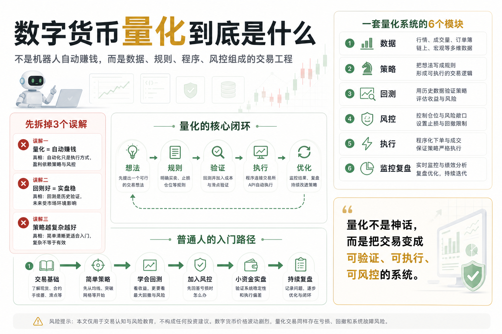

# 数字货币量化到底是什么

很多人第一次听到“数字货币量化”，脑子里会自动浮现三个词：

机器人、自动赚钱、躺着收益。

听起来很高级，也很诱人。

好像只要买一个程序，接上交易所 API，让机器人 24 小时运行，账户就会自己增长。

但如果你真的这样理解量化，那从一开始就走偏了。

数字货币量化不是印钞机，也不是稳赚工具，更不是把交易交给机器人以后人就可以不管了。

它的本质其实很朴素：

用数据发现规律，用规则表达策略，用程序执行交易，用风控控制风险。

这句话听起来没有暴富故事刺激，但它才是量化交易真正的地基。

## 一、先说清楚：量化不是预测未来

很多新手以为量化很厉害，是因为它能预测币价。

比如：

- 明天 BTC 会不会涨？
- ETH 下周能不能突破？
- 某个山寨币是不是要起飞？
- 现在是不是抄底机会？

但真正的量化交易，并不是靠神秘公式预测未来。

市场未来无法被精确预测，尤其是数字货币市场，波动更大，消息更多，情绪更极端。

量化真正做的事情，是把一个交易想法变成可验证、可执行、可复盘的规则。

例如：

如果 BTC 价格突破过去 20 天高点，并且成交量放大，就买入；

如果价格跌破某条均线，或者亏损达到设定比例，就卖出；

如果账户回撤超过某个阈值，就暂停交易。

这不是预测未来，而是在不确定的市场里建立一套应对机制。

量化不是让你永远判断正确，而是让你在判断错误时不要死掉。

## 二、人工交易和量化交易的区别

人工交易靠人做决定。

你看盘、分析、下单、止损、加仓、减仓，所有动作都由你当下的判断完成。

问题是，人会被情绪影响。

上涨时容易贪婪，觉得还能涨；

下跌时容易恐惧，明明该止损却舍不得；

连续赚钱时容易膨胀，加大仓位；

连续亏钱时容易上头，想马上翻本。

量化交易的不同之处在于，它把这些动作提前规则化。

不是临场拍脑袋，而是提前写清楚：

- 什么条件可以买？
- 什么条件不能买？
- 每次买多少？
- 错了怎么止损？
- 盈利后怎么退出？
- 连续亏损时要不要暂停？

人工交易更像“现场决策”。

量化交易更像“提前制定作战规则，然后严格执行”。

它不保证每一次都赚钱，但它能减少临场情绪对交易的破坏。

## 三、数字货币量化由哪些部分组成？

一套完整的数字货币量化系统，通常至少包括六个部分。

### 1. 数据

没有数据，就没有量化。

常见数据包括：

- K 线数据
- 成交量
- 订单簿
- 资金费率
- 成交明细
- 账户资产
- 历史订单
- 新闻和情绪数据

最基础的新手策略，通常先从 K 线和成交量开始。

不要一上来就追求复杂数据。复杂不等于有效，简单策略如果逻辑清楚，也可以作为很好的训练起点。

### 2. 策略

策略是量化系统的大脑。

它回答的是：

什么时候做什么交易？

常见策略包括：

- 均线策略
- 突破策略
- 网格策略
- 趋势跟踪
- 均值回复
- 套利策略
- 多因子策略

但要注意，策略名字不重要，策略逻辑才重要。

同样叫“均线策略”，不同参数、不同周期、不同币种、不同仓位管理，结果可能完全不同。

新手最容易犯的错，是听到一个策略名字就以为找到了赚钱密码。

真正重要的是：这个策略为什么可能有效？在什么市场环境下有效？失效时会亏多少？

### 3. 回测

回测是把策略放到历史数据里跑一遍，看看过去表现如何。

它可以帮你回答：

- 策略过去赚不赚钱？
- 最大回撤有多大？
- 连续亏损最长多久？
- 胜率和盈亏比如何？
- 哪些行情下表现好？
- 哪些行情下容易失效？

但回测不是保证书。

过去赚钱，不代表未来一定赚钱。

很多策略回测很好看，一上实盘就变形。原因可能是过拟合、手续费没算、滑点没算、成交量不足、参数被历史行情“训练”得太完美。

所以，回测只能证明一个策略“值得进一步研究”，不能证明它“未来一定赚钱”。

### 4. 风控

风控是量化系统的刹车。

没有风控，再好的策略也可能死在一次极端行情里。

数字货币市场最需要风控，因为这里经常出现剧烈波动。

风控至少要包括：

- 单笔最大亏损
- 单币种最大仓位
- 总账户最大仓位
- 最大回撤限制
- 止损规则
- 连续亏损暂停
- 异常行情熔断
- API 或服务器异常处理

很多人研究策略很兴奋，研究风控很敷衍。

但在实盘里，真正决定你能不能长期活下来的，往往不是策略，而是风控。

### 5. 执行

执行就是把策略信号变成真实订单。

比如：

- 连接交易所 API
- 查询账户余额
- 获取最新行情
- 判断是否触发信号
- 发送买卖订单
- 检查订单是否成交
- 记录交易日志

执行看起来只是技术问题，但它会直接影响交易结果。

比如网络延迟、API 限流、订单未成交、滑点过大、交易所异常，都可能让回测里的收益在实盘里消失。

这也是为什么量化不是“写个策略就完事”，而是一套完整系统。

### 6. 监控和复盘

机器人不是开起来就不用管。

实盘运行后，必须持续监控：

- 账户余额是否正常
- 策略是否还在运行
- 订单是否成交
- 收益曲线是否异常
- 回撤是否超过预期
- 服务器是否稳定
- 交易所接口是否正常

同时还要定期复盘。

量化不是一次性工程，而是持续优化工程。

策略上线只是开始，不是结束。

## 四、一个最简单的量化交易流程

如果把数字货币量化拆成一条线，它大概是这样：

提出交易想法；

获取历史数据；

写成明确规则；

用历史数据回测；

加入手续费、滑点和风控；

小资金实盘测试；

监控运行结果；

持续复盘和优化。

这就是量化的基本闭环。

注意这里有一个重点：

量化交易不是从“马上实盘赚钱”开始，而是从“验证一个想法是否靠谱”开始。

没有验证，就直接上钱，本质上还是赌博。

## 五、数字货币为什么适合做量化？

数字货币市场有几个特点，让它天然适合量化研究。

第一，市场 24 小时运行。

人工不可能全天候盯盘，但程序可以持续监控行情。

第二，数据相对容易获取。

很多交易所提供 API，可以获取行情、账户、订单等数据。

第三，波动大。

波动意味着风险，也意味着策略空间。趋势、突破、套利、网格等策略都有发挥场景。

第四，市场参与者情绪化明显。

情绪化市场容易出现追涨杀跌、过度反应和短期错价，这些都可能成为量化研究的对象。

但这些优势反过来也代表风险。

24 小时市场会让风险 24 小时存在；

波动大会让收益变大，也会让亏损变大；

API 方便交易，也意味着程序错误可能更快造成损失。

所以，数字货币适合量化，但不代表新手可以轻松量化赚钱。

## 六、新手最容易误解量化的地方

第一个误解：以为量化等于自动赚钱。

自动化只是执行方式，不是盈利来源。一个亏钱策略自动运行，只会自动亏钱。

第二个误解：以为策略越复杂越好。

复杂策略更容易过拟合，也更难解释。新手应该先把简单策略理解透。

第三个误解：以为回测赚钱就可以实盘。

回测只是第一关，后面还有样本外验证、小资金实盘、风控压力测试。

第四个误解：以为机器人可以完全不管。

任何自动交易系统都需要监控。市场会变，交易所会异常，服务器会出问题，代码也可能有 bug。

第五个误解：以为量化能消灭风险。

量化不能消灭风险，只能更清楚地识别、衡量和控制风险。

## 七、普通人该怎么开始学习数字货币量化？

如果你是新手，不建议一开始就追求复杂系统。

正确顺序应该是：

第一步，理解交易基础。

先搞清楚现货、合约、杠杆、手续费、滑点、K 线、成交量、仓位、止损这些基本概念。

第二步，学习一个简单策略。

比如均线策略。

不是为了靠均线赚钱，而是为了理解一个策略从想法到规则、从规则到回测、从回测到实盘的完整过程。

第三步，学会回测。

回测能让你看到策略过去的表现，也能让你第一次直观看到最大回撤、连续亏损和手续费的影响。

第四步，加入风控。

任何策略都必须先回答：亏损时怎么办？

第五步，小资金实盘。

不要一开始就重仓。实盘的目标不是立刻赚钱，而是验证系统是否稳定、执行是否准确、心理是否能承受波动。

第六步，持续记录和复盘。

记录每一次策略运行结果，观察问题在哪里，逐步改进。

量化学习最重要的不是快，而是闭环。

你能不能把一个想法完整走完：提出、验证、执行、监控、复盘。

这才是真正的入门。

## 八、量化的终点不是机器人，而是系统化思维

很多人以为学习量化，是为了拥有一个交易机器人。

但更重要的，其实是建立系统化思维。

当你开始用量化方式看交易，你会慢慢改变几个习惯：

- 不再凭感觉开仓；
- 不再因为一根 K 线情绪失控；
- 不再只看收益，不看回撤；
- 不再迷信消息和喊单；
- 不再把一次赚钱当成能力；
- 开始关注长期统计结果；
- 开始重视风险和执行纪律。

这才是量化真正改变人的地方。

它不是让你变成预测大师，而是让你从情绪化交易者，逐渐变成规则化交易者。

## 九、结语：量化不是神话，是一套交易工程

数字货币量化到底是什么？

一句话总结：

数字货币量化，就是用数据和规则建立交易系统，并用程序执行、风控保护、复盘优化的一套交易工程。

它不神秘，也不轻松。

它需要数据，需要策略，需要代码，需要风控，也需要长期耐心。

如果你把它当成稳赚机器，迟早会失望；

如果你把它当成系统化训练，它会让你离成熟交易更近一步。

从今天开始，不要再问：

“有没有一个机器人能帮我自动赚钱？”

而要开始问：

“我能不能把一个交易想法，变成可验证、可执行、可控制风险的系统？”

这个问题，才是数字货币量化真正的起点。

> 风险提示：本文仅用于交易认知与风险教育，不构成任何投资建议。数字货币价格波动剧烈，量化交易也存在亏损、回撤、系统故障、交易所异常等风险，请只使用自己能够承受损失的资金参与。
