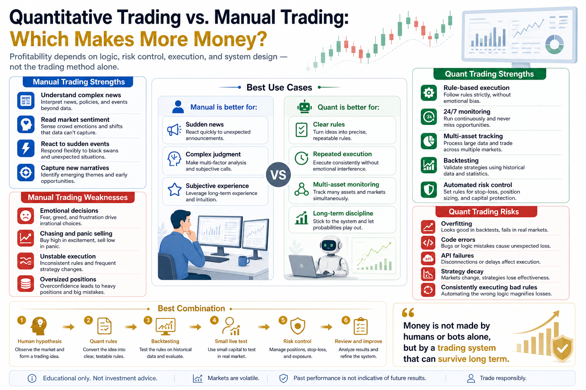

# Quantitative Trading vs. Manual Trading: Which Makes More Money?

Many beginners ask the same question:

Which makes more money, quantitative trading or manual trading?

It sounds like a simple question, but there is a hidden misunderstanding behind it.

Many people assume that the trading method itself determines profitability.

If you use quant trading, you must be more advanced.

If you trade manually and have enough experience, you must be more flexible than a bot.

But the real answer is not that simple.

Quantitative trading and manual trading are not naturally better or worse. They are suited to different markets, strategies, and people.

What really determines profit is not whether you trade manually or with code.

It is whether you have clear logic, stable execution, proper risk control, and the ability to review and improve over time.

## 1. What Is Manual Trading?

Manual trading means humans make the main trading decisions.

You watch the market, read news, analyze charts, judge sentiment, and decide when to buy, sell, add, reduce, stop out, or wait.

Manual trading has clear advantages:

- It can understand complex context.
- It can react to sudden news.
- It can combine macro conditions with market sentiment.
- It can adapt during extreme events.
- It can respond quickly to new narratives and hot sectors.

For example, if a major policy announcement appears or an exchange suddenly faces risk, a human trader may understand the meaning faster than a simple model.

That is the strength of human judgment.

Humans can combine experience, context, language, and intuition. They can notice things that are not yet captured in structured data.

But manual trading also has a major weakness:

Humans are emotional.

When price rises, greed appears.

When price falls, fear appears.

When a position is stuck, people hold and hope.

When they lose, they want revenge.

When they win, they become overconfident.

Many manual traders do not fail because they have no analytical ability.

They fail because their execution is unstable.

They know they should cut losses, but they hesitate.

They know they should not chase, but they fear missing out.

They know their position is too large, but they want to recover losses quickly.

The biggest enemy of manual trading is not always the market.

Often, it is the trader.

## 2. What Is Quantitative Trading?

Quantitative trading turns trading logic into clear rules, tests those rules with data, and executes them with programs.

It is not “a bot that automatically makes money.”

It is the systematization of a trading idea.

For example:

Buy when price rises above the 20-day moving average and volume increases.

Sell when price falls below the moving average or loss reaches a preset level.

Pause trading when account drawdown exceeds a threshold.

These rules can be executed by code and tested on historical data.

The strengths of quant trading are:

- Stable execution
- Less emotional interference
- 24/7 market monitoring
- Multi-asset tracking
- Backtesting with historical data
- Precise trade records
- Easier review and optimization

This matters especially in crypto because the market runs 24 hours a day.

Humans cannot watch every candle, but programs can.

If the market breaks out at midnight, triggers a stop-loss, or creates an arbitrage opportunity, a quant system can act according to rules.

But quant trading is not perfect.

Its weaknesses include:

- Dependence on historical data
- Difficulty understanding complex sudden events
- Risk of overfitting
- Code errors
- Exchange API failures
- Strategy decay over time

A bad strategy executed manually may lose several times and then stop.

A bad strategy automated by code may lose consistently and efficiently.

Quant trading is not a guaranteed-profit machine. It only executes your rules more consistently.

If the rules are wrong, quant trading will consistently execute wrong rules.

## 3. Profitability Depends on the Scenario

Instead of asking “which makes more money,” ask:

In which situations does manual trading have an advantage?

In which situations does quant trading have an advantage?

### Sudden News and Narrative Shifts: Manual Trading Can Be Stronger

Policy changes, project failures, exchange risks, new narratives, and sudden events often require context.

In these cases, manual traders may have an advantage.

Humans can interpret meaning.

The same news can matter differently depending on timing, market structure, and project background.

If a quant system does not have the right data or rules, it may not understand the change quickly.

For trades that depend heavily on interpretation, manual trading can be more flexible.

### High-Frequency Execution and Multi-Asset Monitoring: Quant Trading Can Be Stronger

If the trading logic is clear and requires monitoring many assets, quant trading has a clear advantage.

Examples include:

- Multi-coin breakout monitoring
- Grid trading
- Funding rate arbitrage
- Cross-exchange spread monitoring
- Trend-following signals
- Automated stop-loss and take-profit execution

These tasks are tiring for humans and easy to miss.

Programs do not get tired. They do not sleep. They do not forget.

If the rules are clear, a quant system can execute them consistently.

### Complex Judgment: Manual Trading Is More Flexible

Some market conditions cannot be captured by a simple indicator.

For example:

The emotional bubble near the end of a bull market.

The difference between a bear market rally and a true reversal.

The impact of regulation on different assets.

Changes in project fundamentals.

These situations often require experience and judgment.

A skilled manual trader may find opportunities that a model cannot yet understand.

### Discipline and Long-Term Consistency: Quant Trading Is More Stable

If a strategy has clear logic, enough data, and repeatable signals, quant trading is often more suitable.

The reason is simple:

Humans drift. Programs do not.

A person may follow the plan today, hesitate tomorrow, and chase the market the day after.

A quant system does not change its rules because of emotion.

Its strength is not that every trade wins.

Its strength is consistent execution over time.

Long-term trading results depend heavily on consistency.

## 4. Where Manual Trading Fails

The biggest problem in manual trading is instability.

Many traders can explain the market well, but their actions change once money is on the line.

Common problems include:

- No fixed entry or exit rules
- Position size changes with emotion
- Stop-loss rules are repeatedly broken
- Chasing after price rises
- Adding to losing positions
- Revenge trading after losses
- Oversizing after several wins

Manual trading is hard because you are the strategist, the executor, and the person bearing the emotional pressure.

When your account balance moves, staying rational becomes difficult.

Many manual traders do not lose to quant systems.

They lose to emotion and inconsistent execution.

## 5. Where Quant Trading Fails

Quant trading has its own failure patterns.

The most common mistake is treating backtesting as the future.

Many strategies look excellent on historical data but fail in live trading.

Possible reasons include:

- Overfitted parameters
- Ignored fees
- Ignored slippage
- Poor liquidity assumptions
- Too little historical data
- Market structure changes
- Strategy only worked in one special period

Another risk is overconfidence in automation.

Because the system runs by itself, people assume it is reliable.

But real quant trading requires continuous monitoring.

Strategies decay. Servers fail. APIs rate-limit. Orders may not fill. Exchanges can become abnormal.

Quant trading is not something you turn on and forget.

It is a trading engineering process that must be managed.

## 6. The Best Answer: Manual and Quant Are Not Enemies

Mature traders do not treat manual and quantitative trading as complete opposites.

A better approach is:

Humans design the logic.

Quant systems test, execute, and control risk.

For example, a trader may form a hypothesis:

When Bitcoin breaks out of a long consolidation range, trend continuation may become more likely.

Then quant methods can:

- Convert the hypothesis into rules
- Backtest the rules on historical data
- Execute the rules with position sizing and stop-loss control

This combines human strength with system strength.

Humans understand complex reality.

Programs execute clear rules.

Humans ask questions.

Programs test them.

Humans design systems.

Programs reduce emotional interference.

That is the most valuable reason for ordinary traders to learn quant thinking.

Not to replace human judgment, but to reduce human mistakes.

## 7. How Beginners Should Choose

If you are a beginner, do not start by arguing whether manual or quant trading is more profitable.

Ask yourself three questions.

First, do I have stable trading rules?

If you cannot clearly define when to buy, when to sell, and what to do when wrong, both manual and quant trading can lose money.

Second, do I have execution discipline?

If you often chase, panic, change plans, or revenge trade, you need rule-based structure first.

Third, can I verify a strategy?

If a strategy only feels right but has no data validation, it is still just an idea.

A better learning path for ordinary traders is:

- Use manual trading to understand the market.
- Turn trading ideas into rules.
- Backtest those rules.
- Add position sizing and risk control.
- Use small capital for automated execution.

This path is much more reliable than buying a random bot at the beginning.

## Conclusion

So which makes more money, quantitative trading or manual trading?

There is no absolute answer.

A skilled manual trader can make money.

A mature quant system can also make money.

A person without rules can lose manually.

A bad strategy can lose automatically.

What determines profitability is not whether you click the order button yourself or let code send the order.

What matters is:

Does your strategy have logic?

Is your risk controlled?

Is your execution stable?

Can your system improve over time?

Manual trading is better at understanding complex change.

Quant trading is better at executing clear rules consistently.

For most people, the best direction is not choosing one side.

Use manual thinking to build understanding.

Use quantitative systems to build discipline.

The money is not made by humans or bots alone.

It is made by a trading system that can survive long enough to compound.

> Risk warning: This article is for educational purposes only and does not constitute investment advice. Digital assets are highly volatile. Both manual and quantitative trading can lose money. Only trade with capital you can afford to lose.

