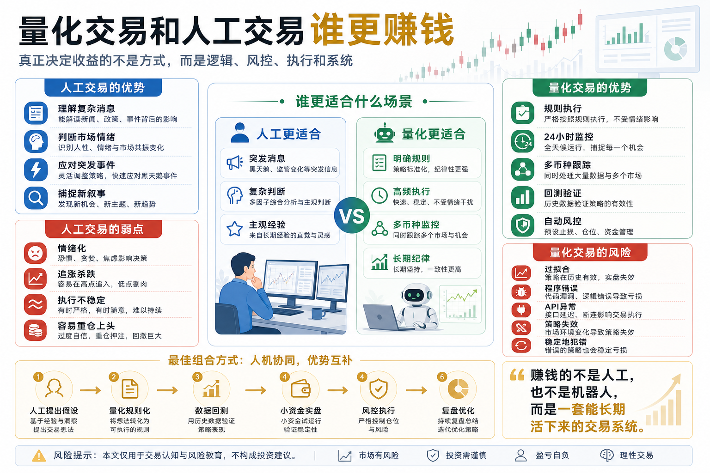

# 量化交易和人工交易谁更赚钱

很多人刚接触数字货币交易时，都会问一个问题：

量化交易和人工交易，到底谁更赚钱？

这个问题听起来很直接，但它背后其实藏着一个误区。

很多人以为，交易方式本身决定收益。

好像只要用了量化，就一定比人工更先进；

或者只要自己看盘经验足够多，就一定比机器人更灵活。

但真实情况不是这样。

量化交易和人工交易，不是谁天然更赚钱，而是谁更适合某种市场、某种策略、某种人。

真正决定收益的，不是“人工”还是“量化”，而是：

你有没有清晰的逻辑、稳定的执行、合理的风控，以及长期复盘能力。

## 一、先定义清楚：什么是人工交易？

人工交易，就是由人来完成主要判断和决策。

你自己看行情、读消息、分析K线、判断市场情绪，然后决定买入、卖出、加仓、减仓、止损或观望。

人工交易的优势很明显：

- 能理解复杂语境；
- 能快速判断突发消息；
- 能结合宏观环境和市场情绪；
- 能在极端行情中临时调整；
- 对新项目、新叙事、新热点反应更快。

比如某个突发政策消息出现，或者某个交易所突然出问题，人工交易者可能会更快理解事件性质，并做出主观判断。

这就是人的优势。

人有综合判断能力，有经验，有语感，也能识别一些数据之外的变化。

但人工交易也有明显缺点。

最大的问题是：人会情绪化。

涨了会贪；

跌了会怕；

套了会扛；

亏了会急；

赚了会膨胀。

很多人工交易者不是没有判断力，而是执行不稳定。

明明知道该止损，却舍不得；

明明知道不能追高，却怕错过；

明明知道仓位太重，却总想一把赚回来。

所以人工交易最大的敌人，不一定是市场，而是自己。

## 二、什么是量化交易？

量化交易，是把交易逻辑写成明确规则，再用数据验证，用程序执行。

它不是“机器人自动赚钱”，而是把人的交易想法系统化。

比如一个简单规则：

当价格站上20日均线，并且成交量放大时买入；

当价格跌破20日均线，或者亏损超过设定比例时卖出；

当账户回撤超过某个阈值时暂停交易。

这些规则可以被程序执行，也可以被历史数据回测。

量化交易的优势在于：

- 执行稳定；
- 不受情绪影响；
- 可以24小时运行；
- 可以同时监控多个币种；
- 可以用历史数据验证策略；
- 可以精确记录每一次交易；
- 可以更容易复盘和优化。

尤其在数字货币市场，24小时运行是很重要的。

人不可能全天盯盘，但程序可以。

当市场半夜突破、插针、触发止损或出现套利机会时，量化系统能按照规则执行。

但量化交易也不是万能的。

量化的缺点在于：

- 依赖历史数据；
- 很难理解复杂突发事件；
- 容易过拟合；
- 程序可能出错；
- 交易所API可能异常；
- 策略失效时，如果不监控，会持续亏损。

一个错误策略，人工执行可能亏几次就停下来；

一个错误策略，程序执行可能会稳定地亏下去。

所以量化不是稳赚机器，它只是更稳定地执行你的规则。

如果规则本身是错的，量化只会更稳定地犯错。

## 三、谁更赚钱，取决于交易场景

如果只问“谁更赚钱”，这个问题太粗。

更准确的问题应该是：

在哪种场景下，人工更有优势？

在哪种场景下，量化更有优势？

### 1. 短线情绪和突发消息：人工更有优势

突发消息、政策变化、项目暴雷、交易所风险、热门叙事爆发，这些场景往往需要综合判断。

这时人工交易者可能更有优势。

因为人能理解消息背后的语境。

同样一句话，不同时间、不同市场环境、不同项目背景，意义可能完全不同。

量化系统如果没有相关数据和规则，很难立刻判断这种变化。

所以在高度依赖信息解读的交易中，人工交易更灵活。

### 2. 高频执行和多币种监控：量化更有优势

如果交易逻辑很明确，需要持续监控大量币种，量化优势就很明显。

比如：

- 多币种突破监控；
- 网格交易；
- 资金费率套利；
- 跨交易所价差监控；
- 趋势跟踪信号；
- 止盈止损自动执行。

这些事情人工做会很累，也容易漏。

程序不会累，不会困，不会忘记。

只要规则清楚，量化系统可以长期稳定执行。

### 3. 主观判断复杂的行情：人工更灵活

有些行情不是单靠指标能判断的。

比如牛市末期的情绪泡沫、熊市反弹的真假、监管消息对不同币种的影响、项目基本面变化等。

这些内容往往需要经验、判断和理解。

人工交易者如果能力强，可能能抓住量化模型暂时看不懂的机会。

### 4. 纪律执行和长期统计：量化更稳定

如果一个策略逻辑清楚、数据足够、交易频率稳定，量化通常更适合。

原因很简单：

人会变形，程序不会。

人今天心情好，可能敢开仓；

明天亏了钱，可能不敢执行；

后天看到别人赚钱，又可能追高。

量化系统不会因为情绪改变规则。

它的优势不是每次都赚，而是长期执行一致。

而交易长期能不能赚钱，很大程度上取决于一致性。

## 四、人工交易真正输在哪里？

人工交易最大的问题，不是不会分析，而是不稳定。

很多人看盘时说得头头是道，但真正下单时完全变形。

常见问题包括：

- 没有固定买卖标准；
- 仓位随情绪变化；
- 止损规则经常被破坏；
- 看到上涨就追；
- 看到亏损就补；
- 连续亏损后想翻本；
- 连续盈利后开始重仓。

人工交易最难的地方，是你既是策略制定者，又是执行者，还是风险承受者。

当钱真正波动时，人很难保持冷静。

所以很多人工交易者不是输给量化，而是输给自己的情绪和执行。

## 五、量化交易真正输在哪里？

量化交易也有自己的失败方式。

最常见的是把回测当成未来。

很多策略在历史数据上看起来很漂亮，但一到实盘就失效。

原因可能是：

- 参数过拟合；
- 忽略手续费；
- 忽略滑点；
- 没考虑流动性；
- 样本时间太短；
- 市场结构已经变化；
- 策略只适合某一段特殊行情。

量化交易还有一个风险：让人产生过度信任。

因为程序在自动运行，人容易以为系统很可靠。

但真正的量化交易必须持续监控。

策略会失效，服务器会故障，API会限流，订单可能不成交，交易所可能异常。

量化交易不是把系统打开就完事，而是建立一套持续管理的交易工程。

## 六、最好的答案：人工和量化不是对立关系

真正成熟的交易者，不会把人工和量化完全对立。

更好的方式是：人工负责判断方向和设计逻辑，量化负责验证、执行和风控。

比如：

人工提出一个交易假设：

“BTC突破长期震荡区间后，趋势延续概率会提高。”

然后量化来做三件事：

- 把假设变成规则；
- 用历史数据回测；
- 实盘中严格执行止损和仓位控制。

这样，人的优势和程序的优势就结合起来了。

人负责理解复杂世界；

程序负责执行明确规则。

人负责提出问题；

程序负责验证问题。

人负责设计系统；

程序负责减少情绪干扰。

这才是普通人学习量化最有价值的地方。

不是为了取代人，而是为了帮人减少犯错。

## 七、新手应该怎么选择？

如果你是新手，不建议一开始就纠结“人工更赚钱还是量化更赚钱”。

你应该先问自己三个问题。

第一，我有没有稳定的交易规则？

如果你连什么时候买、什么时候卖、亏损怎么办都说不清，人工和量化都会亏。

第二，我有没有执行纪律？

如果你经常追涨杀跌、频繁改计划、亏损后上头，那么你需要先规则化。

第三，我有没有能力验证策略？

如果一个策略只是你觉得有用，但没有数据验证，那它还只是想法，不是系统。

对普通人来说，更适合的学习路径是：

- 先用人工理解市场；
- 再把交易想法写成规则；
- 用回测验证规则；
- 加入仓位和风控；
- 最后用小资金自动执行。

这条路径比一开始就买机器人靠谱得多。

## 八、结论：更赚钱的不是方式，而是系统

量化交易和人工交易谁更赚钱？

答案是：

没有绝对答案。

高手人工交易可以赚钱；

成熟量化系统也可以赚钱；

没有规则的人，人工会亏；

错误策略自动化后，量化也会亏。

真正决定收益的，不是你用手下单，还是用程序下单。

真正决定收益的是：

你的策略有没有逻辑；

你的风险有没有控制；

你的执行是否稳定；

你的系统是否能持续优化。

人工交易的优势是理解复杂变化；

量化交易的优势是稳定执行规则。

普通人最好的方向，不是二选一，而是用人工建立认知，用量化建立纪律。

记住一句话：

赚钱的不是人工，也不是机器人，而是一套能长期活下来的交易系统。

> 风险提示：本文仅用于交易认知与风险教育，不构成任何投资建议。数字货币价格波动剧烈，人工交易和量化交易都可能产生亏损，请只使用自己能够承受损失的资金参与。

