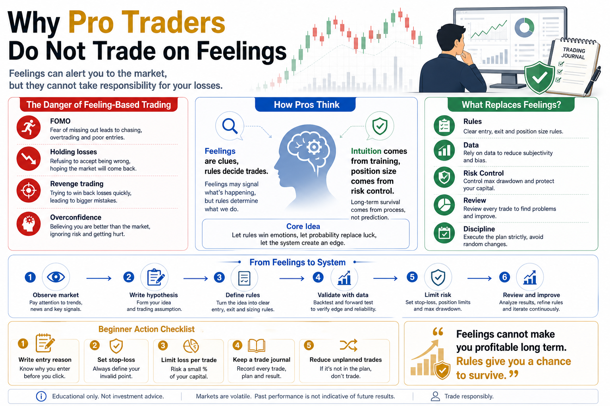

# Why Pro Traders Do Not Trade on Feelings

Many beginners say the same thing before entering a trade:

“I feel like it will go up.”

Or:

“I feel like this is probably the bottom.”

That sounds natural.

When people face uncertainty, they want something to rely on. Even if that “something” is only a feeling, it can make the trade feel more comfortable.

But mature traders rarely use feelings as their trading basis.

Not because they have no feelings.

They do.

The difference is that they know feelings can alert you to something, but they cannot take responsibility for your losses.

In crypto, prices move fast, sentiment changes fast, and information spreads fast. If every trade is driven by feelings, your account will rise and fall with your emotions.

One major difference between beginners and experienced traders is this:

Pros do not let feelings decide entries, position size, exits, or stop-losses.

They rely on rules, data, risk control, and review.

## 1. Why Feelings Are Dangerous

The biggest problem with feelings is that they often look like judgment.

When price rises for several candles, you feel the market is strong.

When price falls quickly, you feel an opportunity has arrived.

When a coin breaks out after a long range, you feel it is about to start a big move.

After several losses, you feel the next trade should win.

These feelings are real.

But real does not mean reliable.

Many feelings are simply emotions wearing the clothes of analysis.

Fear of missing out becomes “this is an opportunity.”

Refusing to cut loss becomes “it will bounce back.”

Wanting revenge becomes “this setup is strong.”

Overconfidence after several wins becomes “I understand the market.”

If you cannot separate judgment from emotion, you will easily treat impulse as trading logic.

That is the danger of feeling-based trading.

It makes you believe you are analyzing the market when you are actually just rationalizing emotion.

## 2. The Market Punishes Traders Without Rules

Crypto markets give strong feedback.

Prices can rise fast and fall fast.

This environment easily stimulates feelings.

A large green candle makes people feel the trend is confirmed.

A large red candle makes people feel everything is collapsing.

A chat group full of bullish messages makes people feel they cannot miss out.

A growing unrealized loss makes people feel they must add more to lower the average cost.

But the market does not move because of your feelings.

It moves according to supply and demand, liquidity, capital flows, sentiment, and market structure.

Traders without rules are easily pulled around by the market.

They chase when price rises.

They sell near lows when price drops.

They overtrade during ranges.

They double down after losses.

Eventually, they are not trading the market.

They are being led by it.

Pros do not ignore feelings because feelings are completely useless.

They avoid relying on feelings because feelings are too easy for the market to manipulate.

## 3. Pros Have Intuition, But It Comes from Training

We need to separate two ideas:

Feeling and intuition.

A beginner’s feeling often comes from emotion.

A professional’s intuition often comes from long-term training.

After seeing many market cycles, reviewing many trades, and experiencing different conditions, a trader may develop useful intuition.

For example:

- A strong volume spike may feel more dangerous than attractive.
- A low-volume pullback may suggest the trend is not over.
- Extreme market excitement may signal overheating.
- A certain breakout pattern may look like a false breakout.

But pros do not immediately go all in because of intuition.

They use rules to verify it.

Intuition says:

This deserves attention.

Rules decide:

Can I trade it?

How much can I trade?

Where am I wrong?

That is the difference.

Beginners treat feelings as conclusions.

Pros treat intuition as a clue.

## 4. Rules Make Trading Repeatable

To make money over time, you do not only need to be right once.

You need a process that can be repeated and improved.

Feeling-based trading is not repeatable.

Today you feel comfortable buying at one level. Tomorrow the same setup appears, but you hesitate.

Today you stop out when wrong. Tomorrow you hold and hope.

Today your position is small. Next week, after a few wins, you suddenly increase size.

This makes review almost impossible.

Every trade has a different reason.

You do not know whether a profit came from skill or luck.

You do not know whether a loss came from bad logic or bad execution.

Rules make trading repeatable.

For example:

- Only enter when price breaks a defined range.
- Never risk more than a fixed percentage per trade.
- Set a stop-loss before entry.
- Pause after several consecutive losses.
- Do not trade when emotions are out of control.

These rules may look simple, but they move you from emotional trading toward system trading.

Only repeatable trading can be optimized.

## 5. Data Shows Your Real Ability

Feeling-based trading also distorts memory.

People remember the times they were right and forget the times they were wrong.

Maybe you once bought a coin by feeling and it pumped.

That memory becomes powerful.

You start telling yourself:

My feeling is actually pretty accurate.

But you may forget the many times your feeling was wrong.

Data breaks this illusion.

If you record every trade, you can see:

- The win rate of feeling-based entries
- Average profit
- Average loss
- Maximum drawdown
- Which trades followed the plan
- Which trades came from impulse
- Which losses could have been avoided

Many people avoid trade journals because data destroys fantasy.

But trading progress begins when you are willing to face real data.

Pros do not worship feelings because they trust long-term statistics more.

## 6. Risk Control Matters More Than Feeling Right

Even if your feeling is right, that does not mean you should take a large position.

The market is cruel because you can feel right many times, but one oversized wrong trade can destroy most of the account.

Experienced traders do not mainly ask:

Am I right?

They ask:

How much will I lose if I am wrong?

That is risk-control thinking.

Feeling-based traders think about profit first.

Mature traders think about risk first.

Before entering, risk control should answer:

- What is the maximum loss on this trade?
- Is the position too large?
- Where is the stop-loss?
- What happens after several losses in a row?
- What happens if the market moves violently?
- Can the account survive the drawdown?

These questions matter far more than “I feel it will go up.”

You cannot control where the market goes.

But you can control how much you lose.

## 7. How Beginners Can Stop Trading on Feelings

First, write down your reason before entering.

If you cannot clearly explain why you are buying, do not trade.

Writing forces you to separate logic from impulse.

Second, set a stop-loss before every trade.

Do not wait until the loss becomes painful before deciding what to do.

Before entering, know where your idea is wrong.

Third, limit loss per trade.

Never allow one trade to decide the survival of your account.

For beginners, the first goal is not to make a huge profit in one trade.

It is to avoid a huge loss in one trade.

Fourth, keep a trading journal.

Record entry reason, position size, stop-loss, result, and review.

Over time, you will see whether you are trading a system or trading emotion.

Fifth, reduce unplanned trades.

If an opportunity is not part of your plan, even if it rises, it is not your money.

The market has opportunities every day, but your capital and attention are limited.

## 8. The Value of Quant Thinking

Learning quantitative thinking does not mean humans should have no judgment.

It means turning vague judgment into testable rules.

For example, you say:

I feel this coin is about to break out.

Quant thinking asks:

What exactly counts as a breakout?

Which price level?

Should volume confirm it?

When do you enter?

How much do you buy?

Where do you stop out if it fails?

How did similar signals perform historically?

That is the value of quant thinking.

It does not reject observation.

It asks you to turn observation into rules, then test those rules with data.

When feelings become rules, trading can improve.

## Conclusion

Why do pro traders not trade on feelings?

Because they know feelings are easily polluted by emotion.

Feelings can be alerts, but they are not a system.

Feelings can make you notice an opportunity, but they should not decide position size.

Feelings can trigger observation, but they cannot replace stop-losses.

Mature trading is not about removing all human judgment.

It is about forcing judgment to pass through rules, data, and risk control.

Beginners ask:

I feel it will go up. Should I buy?

Pros ask:

Does this signal match my rules? If I am wrong, how much will I lose?

Those two questions lead to very different trading outcomes.

Remember this:

Feelings cannot make you profitable over the long run. Rules give you a chance to survive long enough to improve.

> Risk warning: This article is for educational purposes only and does not constitute investment advice. Digital assets are highly volatile. Manual judgment, quantitative strategies, and automated systems can all lose money. Only trade with capital you can afford to lose.

