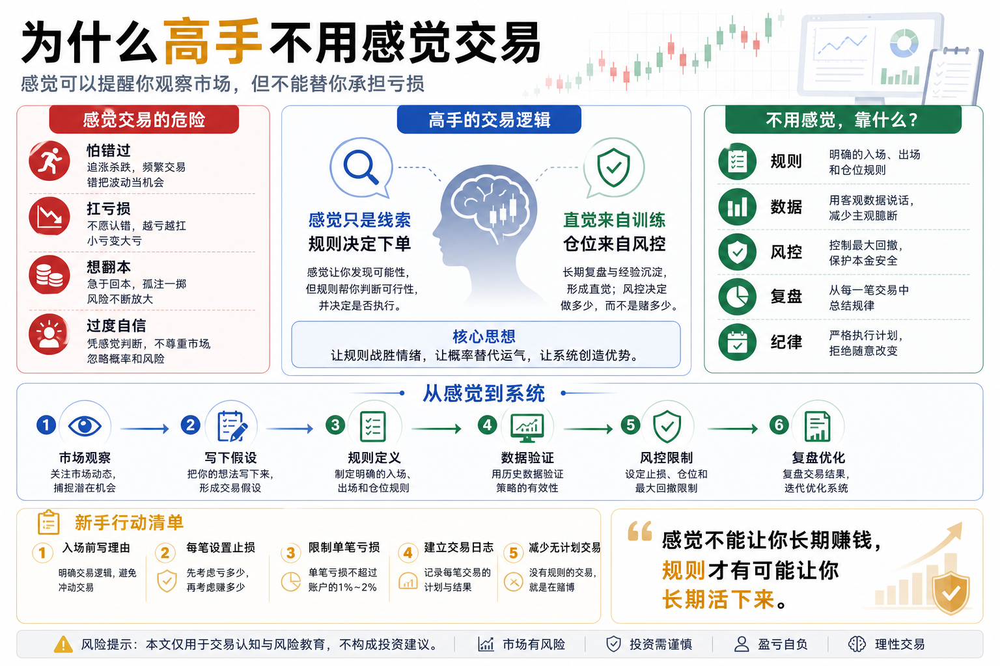

# 为什么高手不用感觉交易

很多新手做交易时，最常说的一句话是：

“我感觉要涨。”

或者：

“我感觉这里差不多到底了。”

听起来很自然。

因为人在面对不确定性时，总想找到一个判断依据。哪怕这个依据只是感觉，也会让自己下单时更安心一点。

但真正成熟的交易者，很少把“感觉”当成交易依据。

不是因为他们没有感觉。

而是因为他们知道：感觉可以提醒你观察市场，但不能替你承担亏损。

在数字货币市场里，价格波动快、情绪变化快、消息传播快。如果每一次交易都靠感觉，你的账户就会跟着情绪一起上下震荡。

高手和新手最大的区别之一，就是高手不会让感觉决定仓位、进出场和止损。

他们靠的是规则、数据、风险控制和复盘。

## 一、感觉为什么这么危险？

感觉最大的问题，是它经常很像判断。

当价格连续上涨时，你会感觉市场很强；

当价格快速下跌时，你会感觉机会来了；

当一个币横盘很久后突然拉升时，你会感觉它要启动；

当你亏了几次以后，你会感觉下一次应该赢。

这些感觉都很真实。

但真实不代表可靠。

很多感觉其实只是情绪的包装。

怕错过，被包装成“机会来了”；

不愿止损，被包装成“还会反弹”；

想翻本，被包装成“这次把握很大”；

连续赚钱后的膨胀，被包装成“我看懂市场了”。

如果你分不清判断和情绪，就很容易把冲动当成交易逻辑。

这就是感觉交易最危险的地方。

它让你以为自己在分析，其实只是在合理化情绪。

## 二、市场专门惩罚没有规则的人

数字货币市场有一个特点：它经常给你强烈反馈。

涨起来很快，跌起来也很快。

这种市场很容易刺激人的感觉。

一根大阳线，会让人觉得趋势确认；

一根大阴线，会让人觉得世界末日；

一个群里都在喊多，会让人觉得自己不能错过；

一个账户浮亏扩大，会让人觉得必须补仓摊低成本。

但市场不会因为你的感觉而改变方向。

它只会按照供需、流动性、资金情绪和市场结构运行。

没有规则的人，最容易被市场带节奏。

涨的时候追进去；

跌的时候割在低点；

震荡的时候频繁交易；

亏损的时候加倍下注；

最后发现自己不是在交易，而是在被市场牵着走。

高手不靠感觉，不是因为感觉完全没用，而是因为他们知道感觉太容易被市场操控。

## 三、高手也有直觉，但直觉来自训练

这里要区分两个概念：

感觉和直觉。

新手的感觉，通常来自情绪。

高手的直觉，往往来自长期训练。

一个交易者看过大量行情，经历过多轮牛熊，复盘过很多交易，他确实可能在某些时刻形成直觉。

比如：

- 看到某种放量拉升，感觉风险大于机会；
- 看到某种缩量回调，知道趋势可能还没结束；
- 看到市场极度亢奋，意识到情绪已经过热；
- 看到某类突破，知道可能是假突破。

但高手不会因为直觉就立刻重仓。

他们会用规则验证直觉。

直觉只是提醒：

这里值得观察。

规则才决定：

能不能下单、下多少、错了怎么办。

这就是高手和新手的区别。

新手把感觉当结论。

高手把直觉当线索。

## 四、规则让交易变得可重复

交易想长期赚钱，最重要的不是一次看对，而是能不能重复做对。

感觉交易最大的问题，是不可重复。

你今天感觉这个位置可以买，明天同样的位置可能又不敢买；

你今天亏损愿意止损，明天亏损可能又想扛单；

你今天仓位很轻，后天因为心情好可能突然重仓。

这样就无法复盘。

因为每一次交易的原因都不一样。

你不知道赚钱是因为策略有效，还是运气好；

也不知道亏钱是因为逻辑错了，还是执行变形。

规则的价值，就是让交易变得可重复。

比如：

- 只有价格突破某个区间才开仓；
- 每次单笔亏损不超过账户的某个比例；
- 入场前必须设置止损；
- 连续亏损几次后暂停交易；
- 不在情绪失控时下单。

这些规则看起来普通，但它们能让你从“凭感觉交易”变成“按系统交易”。

交易只有可重复，才有可能被优化。

## 五、数据让你看清真实水平

感觉交易还有一个问题：它会扭曲记忆。

人很容易记住自己判断对的时候，忘记自己判断错的时候。

比如你曾经凭感觉买中过一个上涨的币，这个记忆会非常深。

以后你会不断告诉自己：

“我的感觉其实挺准。”

但你可能忘了，自己也凭感觉买错过很多次。

数据会打破这种幻觉。

如果你认真记录每一笔交易，就会看到：

- 凭感觉开仓的胜率是多少；
- 平均盈利是多少；
- 平均亏损是多少；
- 最大回撤是多少；
- 哪些交易来自计划，哪些来自冲动；
- 哪些亏损本来可以避免。

很多人不愿意记录交易，是因为数据会让幻想破灭。

但交易进步的开始，恰恰是敢于面对真实数据。

高手不迷信感觉，是因为他们更相信长期统计结果。

## 六、风控比感觉更重要

即使你感觉对了，也不代表你可以重仓。

市场最残酷的地方在于：

你可以连续很多次感觉对，但只要一次重仓错了，就可能亏掉大部分本金。

所以高手更关心的不是：

“我是不是看对了？”

而是：

“如果我看错了，会亏多少？”

这就是风控思维。

感觉交易者通常先想收益；

成熟交易者通常先想风险。

在实盘中，风控至少要回答：

- 这笔交易最多亏多少？
- 仓位是否过重？
- 止损在哪里？
- 如果连续亏损怎么办？
- 如果行情突然剧烈波动怎么办？
- 账户最大回撤能不能承受？

这些问题，比“我感觉会涨”重要得多。

因为你不能控制市场怎么走，但你可以控制自己亏多少。

## 七、普通人怎么摆脱感觉交易？

第一，入场前写下理由。

如果你连为什么买都写不清楚，就不要下单。

写下来，是为了逼自己区分逻辑和冲动。

第二，每笔交易提前设置止损。

不要等亏损扩大以后再想怎么办。

交易前就要知道自己错了在哪里退出。

第三，限制单笔亏损。

不要让任何一笔交易决定账户生死。

新手最重要的目标不是一把赚大钱，而是避免一把亏大钱。

第四，建立交易日志。

记录入场原因、仓位、止损、结果和复盘。

持续记录后，你会看到自己到底是在交易系统，还是在交易情绪。

第五，减少无计划交易。

如果一个机会没有进入你的交易计划，就算它涨了，也不是你的钱。

市场每天都有机会，但你的资金和精力是有限的。

## 八、量化思维的价值：把感觉变成规则

学习量化，不是为了让人完全没有判断。

而是把模糊判断变成可验证规则。

比如你说：

“我感觉这个币要突破。”

量化思维会追问：

什么叫突破？

突破哪个价格？

成交量要不要配合？

突破后什么时候买？

买多少？

失败后怎么止损？

历史上类似信号表现如何？

这就是量化思维的价值。

它不是否定你的观察，而是要求你把观察变成规则，再用数据验证。

当感觉被规则化，交易才有机会进步。

## 九、结语：高手不是没有感觉，而是不被感觉控制

为什么高手不用感觉交易？

因为他们知道，感觉太容易被情绪污染。

感觉可以作为提醒，但不能作为系统。

感觉可以让你注意到机会，但不能决定仓位。

感觉可以引发观察，但不能替代止损。

真正成熟的交易，不是完全没有主观判断，而是让主观判断接受规则、数据和风控的约束。

新手问：

“我感觉会涨，要不要买？”

高手问：

“这个信号是否符合规则？如果错了，我最多亏多少？”

这两个问题，决定了完全不同的交易命运。

记住一句话：

感觉不能让你长期赚钱，规则才有可能让你长期活下来。

> 风险提示：本文仅用于交易认知与风险教育，不构成任何投资建议。数字货币价格波动剧烈，任何人工判断、量化策略和自动交易系统都可能产生亏损，请只使用自己能够承受损失的资金参与。

