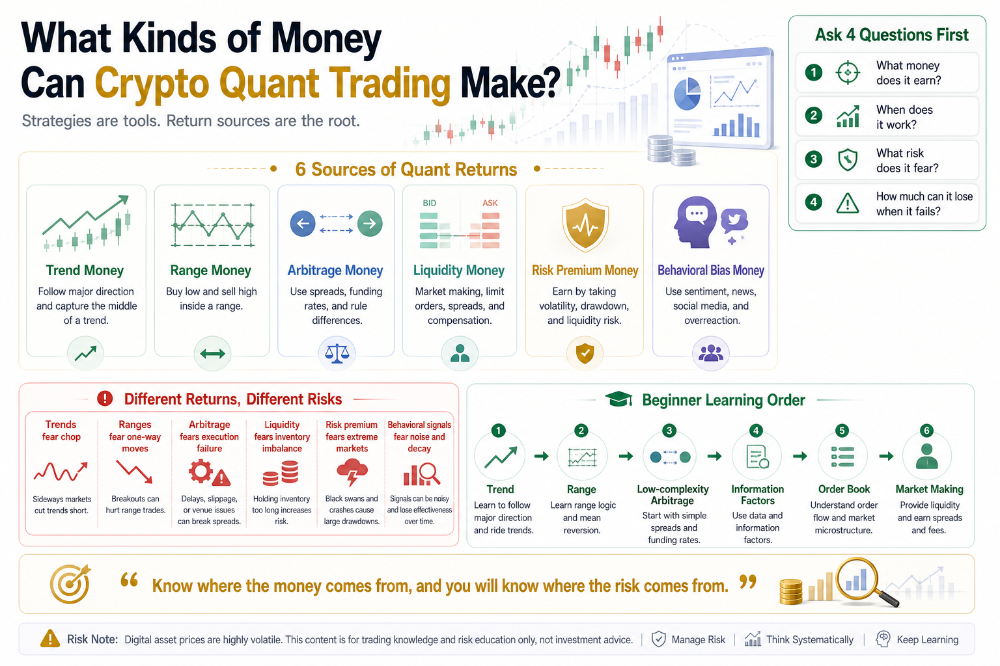

# What Kinds of Money Can Crypto Quant Trading Make?

When many people hear “crypto quantitative trading,” their first thought is simple:

Is there a bot that can automatically make money?

That idea is common, but dangerous.

It makes quant trading sound too mysterious and makes profit sound too easy.

Real quantitative trading does not create profit from nothing.

It looks for return sources in the market that can be defined, tested, repeated, and controlled for risk.

In other words, the right question is not:

Is there a guaranteed-profit program?

The right question is:

What kinds of money exist in the market, and which of them can be captured with rules and systems?

If you do not understand this, learning more strategy names will not help much.

Strategies are tools.

Return sources are the root.

## 1. Trend Money

Trend money is the easiest to understand.

When price rises, you follow the rise. When price weakens, you exit. In futures markets, some strategies may even short downtrends.

The core idea is:

Sometimes the market keeps moving in one direction.

During a bull market, Bitcoin or Ethereum may rise for a long time.

When a hot sector breaks out, related tokens may continue moving higher.

During a bear market, prices may continue falling.

Trend strategies do not try to buy the exact bottom or sell the exact top.

They try to capture the middle part of a meaningful move.

Common methods include:

- Moving average trends
- Breakout strategies
- Donchian channels
- Momentum strategies
- CTA-style trend following

Trend money looks attractive, but it has a cost.

The biggest cost is sideways markets.

Price breaks out, you buy, and then it falls back.

Price breaks down, you exit, and then it rises again.

Trend strategies often take many small losses and rely on a few large trends to make money.

Beginners often find this uncomfortable.

Trend strategies do not make money every day. They use discipline to wait for large moves.

## 2. Range-Bound Money

Range-bound money is the opposite of trend money.

It comes from price moving back and forth within a range.

When the market has no clear direction, trend strategies may struggle, while grid trading and mean-reversion strategies may work better.

The core idea is:

After price moves too far away, it may return toward a more normal level.

Common methods include:

- Grid trading
- Mean reversion
- Bollinger Band strategies
- RSI overbought and oversold signals
- Spread reversion

For example, a strategy may buy near the lower part of a range and sell near the upper part.

If the market keeps ranging, the strategy may repeatedly capture small moves.

But the risk is very clear:

It fears one-way trends.

If you use a long grid strategy and the market suddenly falls continuously, the system may buy more and more while the position becomes heavier.

Without risk control, one strong downtrend can erase many small grid profits.

So range-bound money is not risk-free money.

It simply has a different risk shape.

Trend strategies fear sideways markets.

Range strategies fear one-way breakouts.

## 3. Arbitrage Money

Arbitrage money sounds the safest.

It is not purely betting on direction. It uses differences between markets, prices, rules, and funding costs.

Common crypto arbitrage includes:

- Cross-exchange arbitrage
- Spot-futures basis arbitrage
- Funding rate arbitrage
- Triangular arbitrage
- Term-structure arbitrage
- Stablecoin spread arbitrage

For example, the same coin may trade cheaper on Exchange A and more expensive on Exchange B. If the difference remains profitable after fees, slippage, and transfer costs, there may be an arbitrage opportunity.

Another example is funding rate arbitrage. If perpetual futures funding is high, a trader may buy spot and short futures to collect funding.

The advantage is that arbitrage usually depends less on predicting direction.

But arbitrage is not risk-free.

Risks include:

- The spread disappears quickly
- Fees consume profit
- Slippage is larger than expected
- Transfers are delayed
- Withdrawals are limited
- Futures liquidation risk
- Spreads widen during extreme markets
- API or execution failure

Many beginners think arbitrage means risk-free profit.

That is wrong.

Real arbitrage earns money from execution quality, capital efficiency, and risk control.

If you are slow, expensive, or unstable, the opportunity you see may already be gone.

## 4. Liquidity Money

Liquidity money comes from providing market depth.

In traditional finance, this is close to market making.

In crypto, some strategies place orders near the bid and ask, earn bid-ask spreads, collect rebates, or capture small price differences.

The source of this money is simple:

The market needs someone to provide the other side of trades.

When others urgently buy, you may provide sell orders.

When others urgently sell, you may provide buy orders.

You earn spreads and liquidity compensation.

Common forms include:

- Market making
- High-frequency limit orders
- Order book strategies
- Spread capture
- Liquidity rebates

But these strategies are technically demanding.

They require low latency, stable systems, order management, inventory control, and hedging.

If risk is not controlled, problems appear quickly:

- Earn small spreads, lose on large direction moves
- Inventory becomes unbalanced in a one-way market
- Orders are not canceled fast enough
- Faster traders take advantage of you
- Limit orders become falling-knife entries during extreme moves

Liquidity money is not suitable for most beginners at the start.

It looks small and steady, but behind it is serious system capability.

## 5. Risk Premium Money

Some returns come from taking risks that others do not want to take.

This is risk premium.

Examples include:

- Holding more volatile assets
- Taking liquidity risk
- Taking maturity mismatch risk
- Taking funding rate fluctuation risk
- Accepting large drawdowns in extreme markets
- Enduring short-term strategy failure

There is no free high return in the market.

If a strategy appears to generate high returns for a long time, it must be carrying some kind of risk.

The key question is:

Do you know what risk you are taking?

Many people lose money because they think they are earning strategy alpha, when they are actually being paid for risk exposure.

Holding altcoins heavily during a bull market may look like a strong strategy.

But in reality, it may simply be exposure to higher volatility and deeper drawdowns.

If you do not know where your return comes from, you will be shocked when the hidden risk appears.

Experienced traders do not only ask about returns.

They ask:

Where does this money come from?

What risk am I taking?

How can this risk hurt the account in extreme conditions?

## 6. Information and Behavioral Bias Money

Markets are not perfectly rational.

This is especially true in crypto, where emotion, news, narratives, social media, and crowd behavior can strongly influence price.

Some quant strategies study:

- News sentiment
- Social media heat
- Search trends
- On-chain flows
- Whale behavior
- Retail chasing and panic selling
- Market overreaction

This money comes from behavioral bias.

For example, after a news event, the market may overreact in the short term.

Or social media attention may surge before short-term capital chases a theme.

Or panic may become excessive and create a rebound opportunity.

These strategies sound advanced, but they are hard.

Information is noisy and decays quickly.

A sentiment signal that works today may stop working tomorrow.

Social media heat may be fake.

By the time news appears, price may already have reacted.

Information and behavioral bias money tests your ability to process data, filter signals, and validate quickly.

## 7. Do Not Mix Different Return Sources

One big beginner mistake is mixing different return sources together.

They use trend strategies in sideways markets.

They use grid strategies to hold through one-way crashes.

They treat arbitrage as risk-free.

They treat high returns as proof of skill.

They treat lucky profits as ability.

Different money has different market conditions and risk structures.

Trend money needs directional moves.

Range money needs back-and-forth movement.

Arbitrage money needs spreads and execution.

Liquidity money needs system capability.

Risk premium money requires drawdown tolerance.

Behavioral bias money requires signal quality.

If you do not know what kind of money you are trying to earn, you will not know when to stop, when to size up, or when a strategy has stopped working.

## 8. What Should Beginners Study First?

Beginners should not start with complex arbitrage, market making, or high-frequency strategies.

A better order is:

First, understand trend money.

Trend strategies are clear and useful for learning signals, stops, position sizing, and backtesting.

Second, understand range-bound money.

Grid and mean-reversion strategies help you understand that every strategy needs the right environment.

Third, observe lower-complexity arbitrage.

Funding rate arbitrage and spot-futures basis are worth studying, but do not rush into large live positions.

Fourth, study advanced areas later.

Information factors, order books, and market making can come after you understand the basics.

Learning quant trading is not about chasing the most advanced strategy.

It is about understanding where returns come from and where risks hide.

## Conclusion

What kinds of money can crypto quant trading make?

Broadly, there are six:

Trend money, range-bound money, arbitrage money, liquidity money, risk premium money, and information or behavioral bias money.

Each has opportunity.

Each has a cost.

No return source works forever.

No strategy fits every market.

Mature quant thinking does not begin with excitement over a strategy name.

It begins with questions:

What kind of money does this strategy earn?

In what market environment does it work?

What risk does it fear most?

How much can the account lose when it fails?

If you cannot answer these questions, do not rush into live trading.

Remember:

Strategies are tools. Return sources are the root. If you know where the money comes from, you can better understand where the risk comes from.

> Risk warning: This article is for educational purposes only and does not constitute investment advice. Digital assets are highly volatile. Any quantitative strategy can fail and cause losses. Only trade with capital you can afford to lose.

