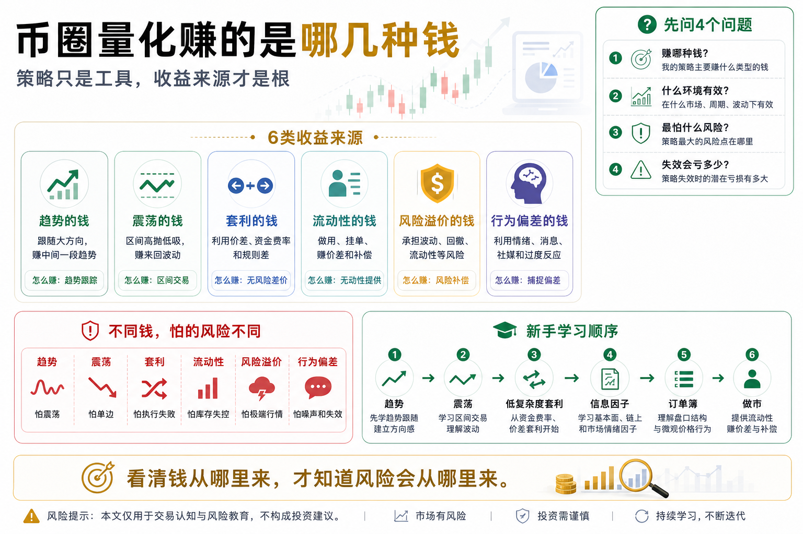

# 币圈量化赚的是哪几种钱

很多人一听到“币圈量化”，第一反应就是：

是不是有一个机器人，开起来就能自动赚钱？

这个想法很常见，也很危险。

因为它把量化想得太神秘，也把赚钱想得太简单。

真正的量化交易不是凭空变出收益，而是在市场里寻找可重复、可验证、可控制风险的收益来源。

换句话说，量化不是问：

“有没有一个稳赚程序？”

而是问：

“市场里到底有哪些钱，是可以用规则和系统去捕捉的？”

如果这个问题想不清楚，后面学再多策略名字都没有用。

因为策略只是工具，收益来源才是根。

## 一、第一种钱：趋势的钱

趋势的钱，是最容易理解的一种。

价格上涨时跟随上涨，价格下跌时及时退出，甚至在合约市场里做空下跌趋势。

这类策略的核心逻辑是：

市场有时候会沿着一个方向持续运动。

比如牛市里，BTC 或 ETH 可能持续上涨很长时间；

某个热点板块爆发时，相关代币可能连续走强；

熊市下跌阶段，价格也可能持续走弱。

趋势策略不试图买在最低点，也不要求卖在最高点。

它赚的是中间那一段相对确定的趋势。

常见方法包括：

- 均线趋势；
- 突破策略；
- 唐奇安通道；
- 动量策略；
- CTA 趋势跟踪。

趋势的钱看起来很美，但它也有代价。

最大的代价是：震荡行情会反复打脸。

价格刚突破，你买进去，结果又跌回来；

价格刚跌破，你卖出去，结果又涨回去。

所以趋势策略经常会经历小亏很多次，然后靠少数大趋势赚钱。

新手最难接受的，就是这种“不舒服”的收益结构。

趋势策略不是天天赚钱，而是用纪律等待真正的大行情。

## 二、第二种钱：震荡的钱

和趋势的钱相反，震荡的钱赚的是价格来回波动。

当市场没有明显方向，而是在某个区间里上下波动时，趋势策略容易亏，但网格、均值回复类策略可能更适合。

这类策略的核心逻辑是：

价格偏离太多后，可能会回到相对合理的位置。

常见方法包括：

- 网格交易；
- 均值回复；
- 布林带策略；
- RSI 超买超卖；
- 价差回归。

比如价格跌到区间下沿附近买入，涨到区间上沿附近卖出。

如果市场一直震荡，这种策略会不断吃到来回波动的钱。

但它的风险也非常明显：

最怕单边行情。

如果你用网格在震荡区间里做多，结果市场突然一路下跌，网格会越买越多，仓位越来越重。

如果没有风控，震荡策略可能在一次单边下跌中把之前赚的钱全部吐回去。

所以震荡的钱不是低风险的钱。

它只是风险表现形式不同。

趋势策略怕来回震荡；

震荡策略怕单边突破。

## 三、第三种钱：套利的钱

套利的钱，听起来最稳。

因为它不是单纯赌涨跌，而是利用市场之间的价格差、规则差、资金成本差来赚钱。

币圈常见套利包括：

- 跨交易所套利；
- 现货和合约价差套利；
- 资金费率套利；
- 三角套利；
- 期限结构套利；
- 稳定币价差套利。

比如同一个币在 A 交易所价格更低，在 B 交易所价格更高，如果扣除手续费、滑点、转账成本后仍有利润，就可能存在套利机会。

再比如永续合约资金费率很高时，做多现货、做空合约，赚取资金费率。

套利的优势是，它通常不完全依赖方向判断。

但套利也不是无风险。

它的风险包括：

- 价差消失太快；
- 手续费吃掉利润；
- 滑点超预期；
- 转账延迟；
- 交易所提现限制；
- 合约爆仓风险；
- 极端行情下价差扩大；
- API 或系统执行失败。

很多新手以为套利就是“无风险收益”，这是误解。

真正的套利赚的是执行能力、资金效率和风险控制的钱。

如果你反应慢、成本高、系统不稳定，看到的套利机会很可能只是别人剩下的残影。

## 四、第四种钱：流动性的钱

流动性的钱，简单说，就是为市场提供买卖深度。

在传统金融里，这接近做市。

在币圈里，有些策略会在买一卖一附近挂单，赚取买卖价差，或者通过提供流动性获得返佣、手续费收益、价差收益。

这类钱的来源是：

市场需要有人提供交易对手方。

别人急着买，你挂卖单；

别人急着卖，你挂买单；

你赚的是价差和流动性补偿。

常见形式包括：

- 做市策略；
- 高频挂单；
- 订单簿策略；
- 价差捕捉；
- 流动性返佣。

但这类策略对技术要求很高。

它需要低延迟、稳定系统、订单管理、库存控制、风险对冲。

如果控制不好，很容易出现：

- 赚小价差，亏大方向；
- 单边行情中库存失控；
- 撤单不及时；
- 被更快的对手吃掉；
- 极端行情下挂单变成接刀。

所以流动性的钱，不适合大多数新手一开始就做。

它看起来赚得细，但背后是很强的系统能力。

## 五、第五种钱：风险溢价的钱

有些钱来自你承担了别人不愿意承担的风险。

这类收益可以理解为风险溢价。

比如：

- 持有波动更大的资产；
- 承担流动性不足风险；
- 承担期限错配风险；
- 承担合约资金费率波动；
- 承担极端行情下的回撤；
- 承担策略短期失效。

在市场里，没有白拿的高收益。

如果某个策略长期收益看起来很高，背后一定有某种风险。

区别只在于：

你是否知道自己承担的是什么风险。

很多人亏钱，是因为他们以为自己赚的是策略的钱，其实赚的是风险暴露的钱。

牛市里重仓山寨币，看起来像策略很强；

但本质可能只是承担了更高波动和更大回撤。

如果你不知道收益来自哪里，就很容易在风险爆发时措手不及。

高手不会只问收益率。

高手会问：

这笔钱是从哪里来的？

我承担了什么风险？

这个风险在极端情况下会怎么伤害账户？

## 六、第六种钱：信息和行为偏差的钱

市场不是完全理性的。

尤其在币圈，情绪、消息、热点、社媒、群体行为会对价格产生巨大影响。

有些量化策略会研究：

- 新闻情绪；
- 社媒热度；
- 搜索趋势；
- 链上资金流；
- 大户行为；
- 散户追涨杀跌；
- 市场过度反应。

这类钱来自市场参与者的行为偏差。

比如，某个消息发布后，市场短期过度反应，价格偏离合理区间；

或者社媒热度突然上升，短期资金开始追逐热点；

又或者恐慌情绪过度释放，产生短线反弹机会。

这类策略听起来很高级，但也很难。

因为信息本身噪声很大，而且衰减很快。

今天有效的情绪信号，明天可能就失效；

一个平台上的热度，也可能只是刷量；

新闻出现时，价格可能已经提前反应。

所以信息和行为偏差的钱，考验的是数据处理、信号过滤和快速验证能力。

## 七、这些钱不能混在一起看

很多新手学策略时，最大的问题是把不同收益来源混在一起。

比如拿趋势策略去震荡行情里跑；

拿网格策略去扛单边下跌；

把套利当成无风险；

把高收益当成策略强；

把运气赚到的钱当成能力。

不同的钱，有不同的市场环境和风险结构。

趋势的钱需要大行情；

震荡的钱需要区间波动；

套利的钱需要价差和执行；

流动性的钱需要系统能力；

风险溢价的钱需要承受回撤；

行为偏差的钱需要信号质量。

如果你不知道自己赚的是哪一种钱，就很难知道什么时候该停、什么时候该加、什么时候策略已经失效。

## 八、新手应该先研究哪几种钱？

对新手来说，不建议一开始就追求复杂套利、做市或高频策略。

更合理的顺序是：

第一，先理解趋势的钱。

因为趋势策略逻辑清楚，适合学习信号、止损、仓位和回测。

第二，再理解震荡的钱。

通过网格、均值回复，你会理解“策略适合环境”这件事。

第三，再接触低复杂度套利。

比如资金费率套利、现货合约价差观察，但一开始不要重仓实盘。

第四，最后再研究信息因子、订单簿、做市等更复杂方向。

学习量化不是一上来追求高级，而是先搞清楚收益从哪里来，风险在哪里。

## 九、结语：先问收益来源，再谈策略

币圈量化赚的是哪几种钱？

大致可以分成：

趋势的钱、震荡的钱、套利的钱、流动性的钱、风险溢价的钱、信息和行为偏差的钱。

每一种钱都有机会，也都有代价。

没有一种收益来源永远有效；

也没有一种策略适合所有行情。

真正成熟的量化思维，不是看到一个策略名字就兴奋，而是先问：

它赚的到底是哪一种钱？

它在什么市场环境下有效？

它最怕什么风险？

它失效时账户会亏多少？

如果这些问题回答不清楚，就不要急着实盘。

记住一句话：

策略只是工具，收益来源才是根；看清钱从哪里来，才知道风险会从哪里来。

> 风险提示：本文仅用于交易认知与风险教育，不构成任何投资建议。数字货币价格波动剧烈，任何量化策略都可能失效并产生亏损，请只使用自己能够承受损失的资金参与。

