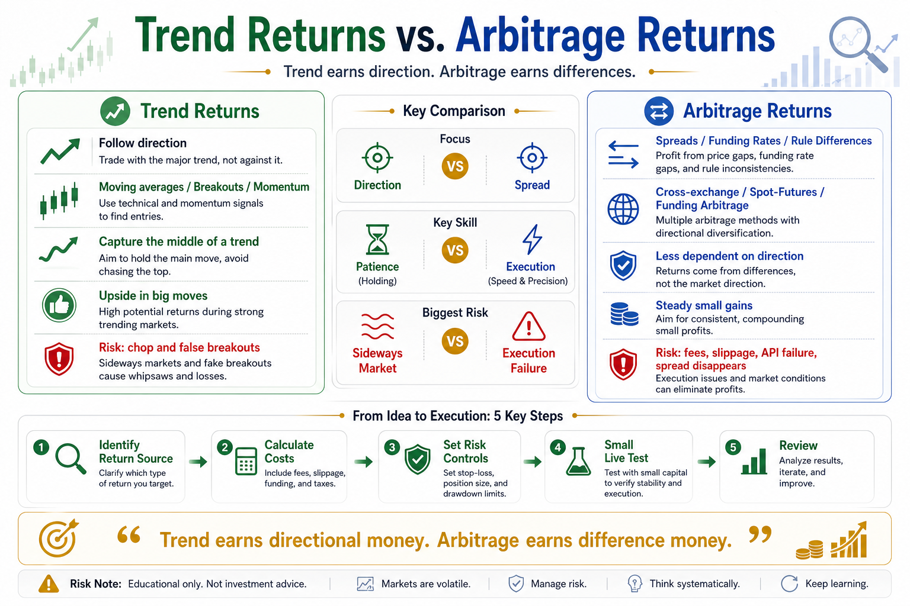

# Trend Returns vs. Arbitrage Returns

When people learn quantitative trading, they often call everything a “strategy.”

But the name of a strategy is not the most important thing.

The real question is:

What kind of return does it try to capture?

In crypto quant trading, two return sources are often confused: trend returns and arbitrage returns.

One earns from direction.

The other earns from differences.

One depends on the market moving in a sustained direction. The other depends on temporary inconsistencies between markets, prices, or funding costs.

If you cannot separate these two, you may use the wrong strategy, misunderstand risk, or treat a directional bet as low-risk arbitrage.

## 1. What Are Trend Returns?

Trend returns come from price moving in one direction for a meaningful period.

If price rises, you go long and hold.

If price weakens, you exit or, in futures markets, go short.

A trend strategy does not need to buy the exact bottom or sell the exact top.

It tries to capture the middle part of a move.

Common trend methods include:

- Moving average trends
- Breakout strategies
- Momentum strategies
- Donchian channels
- CTA-style trend following

The logic is simple:

Markets sometimes have momentum.

Strong assets may stay strong.

Weak assets may stay weak.

Capital flow can continue in one direction for a while.

## 2. The Cost of Trend Returns

Trend strategies fear sideways markets.

When price has no clear direction and moves inside a range, trend strategies can lose repeatedly.

Price breaks out, you buy, and then it falls back.

Price breaks down, you sell, and then it rebounds.

After several false moves, fees, slippage, and stop-losses slowly hurt the account.

This is why trend strategies often have an uncomfortable return structure:

Many small losses, and a few large wins.

Beginners often dislike this.

They want a strategy that makes money every day. But trend strategies require discipline during boring or painful periods.

If you cannot accept small losses, you may never stay long enough to catch the big move.

## 3. What Are Arbitrage Returns?

Arbitrage returns come from inconsistencies.

They do not mainly depend on predicting direction.

They use price differences, funding rate differences, rule differences, or term-structure differences.

Common crypto arbitrage includes:

- Cross-exchange arbitrage
- Spot-futures basis arbitrage
- Funding rate arbitrage
- Triangular arbitrage
- Stablecoin spread arbitrage
- Term-structure arbitrage

For example, the same coin may be cheaper on Exchange A and more expensive on Exchange B. If the spread remains profitable after fees, slippage, and transfer costs, there may be an arbitrage opportunity.

Another example is funding rate arbitrage. If perpetual futures funding is high, a trader may buy spot and short futures to collect funding.

The essence of arbitrage is compensation for temporary market imbalance.

## 4. Is Arbitrage Really Low Risk?

Arbitrage is often more stable than pure directional betting, but it is not risk-free.

Its biggest risks are often execution risks.

Examples include:

- The spread disappears quickly
- Fees are higher than expected
- Slippage consumes profit
- Transfers are delayed
- Withdrawals are paused
- API orders fail
- Margin becomes insufficient
- Spreads widen during extreme markets

Many beginners see the word “arbitrage” and think it means guaranteed profit.

That is dangerous.

Real arbitrage earns money from execution speed, cost control, capital allocation, and system stability.

Without those abilities, arbitrage can still lose.

## 5. The Biggest Difference

Trend returns focus on direction.

Arbitrage returns focus on spreads.

A trend strategy asks:

Will this market keep rising or falling?

An arbitrage strategy asks:

Is the difference between markets, prices, or funding costs large enough to cover cost and risk?

Trend returns depend more on market environment.

Arbitrage returns depend more on execution quality.

Trend strategies may make large profits in bull markets but suffer in choppy markets.

Arbitrage strategies usually earn smaller profits per trade, but stable execution can compound small edges.

Neither is always better.

The key is knowing what money you are trying to earn.

## 6. Common Beginner Mistakes

The first mistake is treating trend trading as arbitrage.

If a coin is rising strongly and you chase it, that is not arbitrage.

It is directional trading.

If direction is wrong, you lose.

The second mistake is treating arbitrage as risk-free.

People see a spread but ignore fees, slippage, capital lock-up, and extreme scenarios.

The third mistake is using trend psychology in arbitrage.

Arbitrage is supposed to capture small spreads. But greed makes people hold longer, turning a spread trade into a directional risk.

The fourth mistake is using arbitrage psychology in trend trading.

Trend trading needs winners to run, but beginners often take profit too early.

They hold losses but cut winners.

## 7. How Beginners Should Understand Them

A simple distinction:

Trend returns are earned by taking directional risk.

Arbitrage returns are earned by capturing differences.

For beginners, it is usually better to understand trend first, then arbitrage.

Trend strategies help train basic skills:

- Signals
- Stop-losses
- Position sizing
- Backtesting
- Emotional control

Arbitrage looks stable, but it requires stronger systems, capital management, execution, and attention to detail.

If your foundation is weak, starting with complex arbitrage can be dangerous.

## Conclusion

Trend returns and arbitrage returns are different because their sources are different.

Trend earns from direction.

Arbitrage earns from differences.

Trend fears choppy markets.

Arbitrage fears execution failure.

Trend requires patience for large moves.

Arbitrage requires fast, stable, low-cost execution.

Quant trading is not about mixing strategy names together.

It is about understanding the return source and risk structure behind each strategy.

Remember:

Trend earns directional money. Arbitrage earns difference money. Know the source of return, and you will know what risk to defend against.

> Risk warning: This article is for educational purposes only and does not constitute investment advice. Crypto markets are highly volatile. Both trend and arbitrage strategies can lose money. Only trade with capital you can afford to lose.

