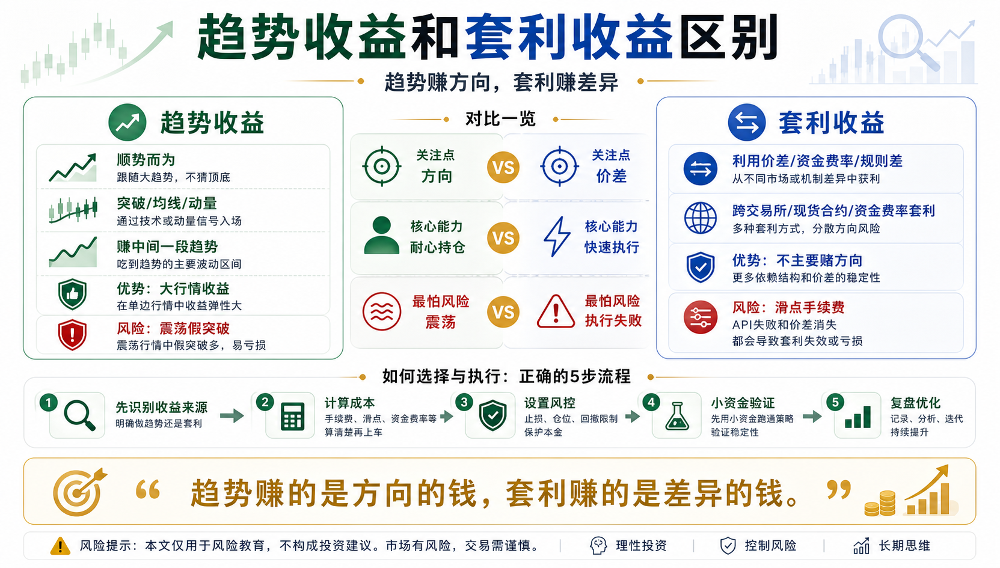

# 趋势收益和套利收益区别

很多人学习量化时，会把所有赚钱方式都叫“策略”。

但真正重要的不是策略名字，而是它赚的到底是哪一种钱。

在币圈量化里，最容易被混淆的两类收益，是趋势收益和套利收益。

一个赚方向的钱，一个赚价差的钱。

一个依赖市场走出大行情，一个依赖不同市场之间出现不一致。

如果你分不清这两种收益来源，就很容易用错策略、误判风险，甚至把高风险交易误以为低风险套利。

## 一、什么是趋势收益？

趋势收益，就是市场沿着一个方向持续运动时，你顺着这个方向赚到的钱。

价格上涨，你做多并持有；

价格下跌，你退出，或者在合约市场里做空。

趋势策略不追求买在最低点，也不追求卖在最高点。

它赚的是中间那一段趋势。

常见趋势策略包括：

- 均线趋势；
- 突破策略；
- 动量策略；
- 唐奇安通道；
- CTA 趋势跟踪。

趋势收益的本质，是相信市场在某些阶段会出现惯性。

强者可能继续强；

弱者可能继续弱；

资金流入的方向可能持续一段时间。

## 二、趋势收益的代价是什么？

趋势收益最怕震荡。

当价格没有明确方向，只是在一个区间里来回波动时，趋势策略很容易连续亏小钱。

刚突破就买入，结果是假突破；

刚跌破就卖出，结果又反弹；

来回几次后，账户被手续费、滑点和止损慢慢消耗。

所以趋势策略的收益结构通常是：

小亏很多次，靠少数大趋势赚钱。

这很反人性。

新手总希望策略每天都赚钱，但趋势策略经常需要忍受一段难看的时期。

如果你受不了连续小亏，就很难坚持到真正的大行情。

## 三、什么是套利收益？

套利收益，赚的是市场之间的不一致。

它不主要依赖方向判断，而是利用价差、资金费率、规则差、期限结构差来赚钱。

常见套利包括：

- 跨交易所价差套利；
- 现货和合约价差套利；
- 资金费率套利；
- 三角套利；
- 稳定币价差套利；
- 期限结构套利。

比如同一个币在 A 交易所价格低，在 B 交易所价格高，扣除成本后仍有利润，这就是价差套利机会。

再比如永续合约资金费率很高时，可以做多现货、做空合约，赚取资金费率。

套利收益的本质，是市场短暂不平衡带来的补偿。

## 四、套利真的低风险吗？

套利通常比单纯猜方向更稳，但不等于无风险。

套利最大的风险，经常不在方向，而在执行。

比如：

- 价差很快消失；
- 手续费超过预期；
- 滑点吃掉利润；
- 转账延迟；
- 提现暂停；
- API 下单失败；
- 合约保证金不足；
- 极端行情下价差反而扩大。

很多新手看到“套利”两个字，就以为是稳赚。

这是非常危险的误解。

真正的套利赚的是执行效率、成本控制、资金调度和系统稳定性的钱。

如果你没有这些能力，套利也会亏。

## 五、趋势收益和套利收益最大的区别

趋势收益关心的是方向。

套利收益关心的是价差。

趋势策略问：

这个市场会不会继续涨或继续跌？

套利策略问：

两个市场之间的价格差、资金成本差、规则差是否足够覆盖成本和风险？

趋势收益更依赖行情；

套利收益更依赖执行。

趋势策略可能在大牛市里赚很多，但在震荡期连续受伤。

套利策略通常单次收益不高，但如果系统稳定、资金效率高，可以积累小利润。

两者没有绝对好坏。

关键是你知道自己赚的是什么钱。

## 六、新手最容易犯的错

第一个错：把趋势策略当套利。

比如看到某个币涨得强，就说“这是机会”，然后重仓追进去。

但这不是套利，这是方向交易。

方向错了，就会亏。

第二个错：把套利当无风险。

只看到价差，不计算手续费、滑点、资金占用和极端情况。

结果看起来有利润，实盘却赚不到钱。

第三个错：用趋势心态做套利。

套利本来赚小价差，但人一贪，就想多拿一会儿。

最后价差回归没赚到，方向风险反而暴露出来。

第四个错：用套利心态做趋势。

趋势策略需要让利润奔跑，但新手一有小利润就急着落袋。

最后亏损拿得住，盈利拿不住。

## 七、普通人应该怎么理解这两类收益？

如果你是新手，建议先用一句话区分：

趋势收益，是承担方向波动，换取大行情收益。

套利收益，是利用市场不一致，换取价差或资金成本收益。

学习顺序上，建议先理解趋势，再理解套利。

因为趋势策略更适合训练基础能力：

- 信号；
- 止损；
- 仓位；
- 回测；
- 情绪控制。

套利看起来稳，但对系统、资金、执行和细节要求更高。

如果基础不牢，一开始就追求套利，反而容易踩坑。

## 八、结语：先分清钱从哪里来

趋势收益和套利收益的区别，本质是收益来源不同。

趋势赚方向；

套利赚不一致。

趋势怕震荡；

套利怕执行失败。

趋势需要耐心等待大行情；

套利需要快速、稳定、低成本地执行。

量化交易不是把所有策略混在一起，而是先看清每个策略背后的收益来源和风险结构。

记住一句话：

趋势赚的是方向的钱，套利赚的是差异的钱；分清收益来源，才知道该防什么风险。

> 风险提示：本文仅用于交易认知与风险教育，不构成任何投资建议。数字货币价格波动剧烈，趋势策略和套利策略都可能产生亏损，请只使用自己能够承受损失的资金参与。

