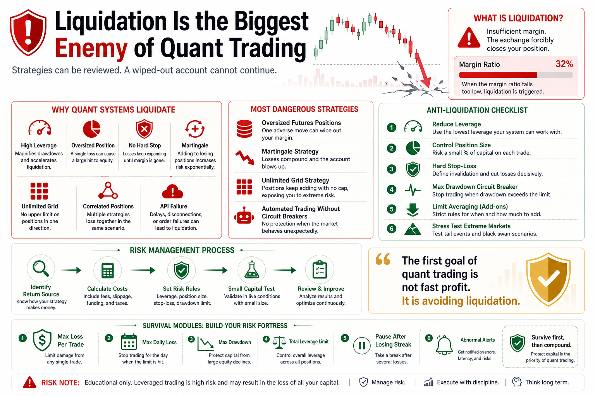

# Liquidation Is the Biggest Enemy of Quant Trading

Many people think the biggest enemy of quantitative trading is strategy failure.

Others think it is bad market conditions, poor parameters, or a weak trading bot.

But in live trading, the most dangerous enemy is often one thing:

Liquidation.

A losing strategy can be reviewed.

Bad parameters can be improved.

Bad market conditions can be avoided.

But once liquidation wipes out the account, the system no longer has a chance to improve.

The first goal of quant trading is not to win every trade.

It is to prevent one mistake from destroying the account.

## 1. What Is Liquidation?

Liquidation usually happens in leveraged trading.

When your margin is no longer enough to support your losses, the exchange forcibly closes your position.

In simple terms, before you decide whether to stop out, the system has already removed you from the trade.

Crypto markets move fast.

One sharp drop or spike can destroy a highly leveraged position.

In futures trading, liquidation is not rare. For many beginners, it is a common ending.

## 2. Why Can Quant Systems Be Liquidated?

Many people think quant systems are rational, so they should not be liquidated.

That is wrong.

A quant system only follows rules.

If the rules do not contain strong risk control, the program can consistently lead the account toward liquidation.

Common causes include:

- Excessive leverage
- Oversized positions
- No hard stop-loss
- Grid systems that keep buying lower
- Martingale systems that keep adding
- Multiple correlated positions
- Liquidity disappearing in extreme markets
- API failures that prevent stops from executing

Humans may stop trading because of fear.

Programs will not.

If there is no circuit breaker, the system keeps executing.

## 3. Why Liquidation Is Worse Than Normal Loss

A normal loss is a drawdown.

If capital remains, you can adjust, reduce size, and improve.

Liquidation is different.

It removes your ability to continue.

Worse, liquidation often does not happen because your direction was completely wrong.

It happens because your position and leverage were too aggressive.

Sometimes the market only moves normally, but your account cannot survive the move.

You may even be right about the larger direction but die from short-term volatility.

That is the cruelty of leverage.

The market does not need to prove you wrong forever.

It only needs to knock you out first.

## 4. Strategies That Easily Cause Liquidation

First, oversized futures strategies.

If position size is too large, even a good signal cannot survive a sharp reverse move.

Second, martingale strategies.

Adding after losses may lower average cost, but it concentrates risk into one future extreme event.

Third, unlimited grids.

Grid trading feels comfortable in ranges. But during a one-way decline, it keeps buying until capital cannot support the position.

Fourth, correlated multi-asset positions.

You may think buying many coins is diversified. In extreme markets, they may all fall together.

Fifth, automated systems without circuit breakers.

If the system keeps trading during abnormal markets, API issues, or account errors, the risk becomes serious.

## 5. How to Prevent Liquidation

First, reduce leverage.

Beginners should avoid leverage or use only very low leverage.

If a strategy cannot make money without leverage, leverage will only expose the weakness faster.

Second, control position size.

No single trade or coin should decide the survival of the account.

Position sizing matters more than prediction.

Third, use hard stop-losses.

Do not keep stop-losses only in your mind.

Live systems need system-level stop-loss and maximum loss rules.

Fourth, set drawdown circuit breakers.

If account drawdown exceeds a threshold, the system must pause trading.

Survive first, review later.

Fifth, avoid unlimited adding.

Any averaging, grid, or martingale logic must have maximum position and maximum loss boundaries.

Sixth, test extreme scenarios.

Do not only test normal markets.

Ask: what happens if the market falls 20% in one hour?

## 6. A Quant System Needs Survival Modules

A live quant system cannot only have entry logic.

It needs survival modules.

At minimum:

- Maximum loss per trade
- Maximum daily loss
- Maximum account drawdown
- Maximum position per asset
- Total leverage limit
- Pause after consecutive losses
- Abnormal market circuit breaker
- API failure alerts
- Warning before forced liquidation

These modules do not directly increase profit.

But they keep the system alive.

And in trading, staying alive is already an edge.

## Conclusion

Quant trading is not about chasing one huge win.

It is about building a system that can keep improving.

As long as the account survives, strategies can be adjusted, parameters can be improved, and experience can compound.

Liquidation resets everything.

The biggest danger is not missing an opportunity.

It is losing the right to keep trading.

Remember:

The first goal of quant trading is not to make money fast. It is to avoid liquidation. Only survival makes compounding possible.

> Risk warning: This article is for educational purposes only and does not constitute investment advice. Leveraged crypto trading is extremely risky and can lead to rapid loss of capital.

