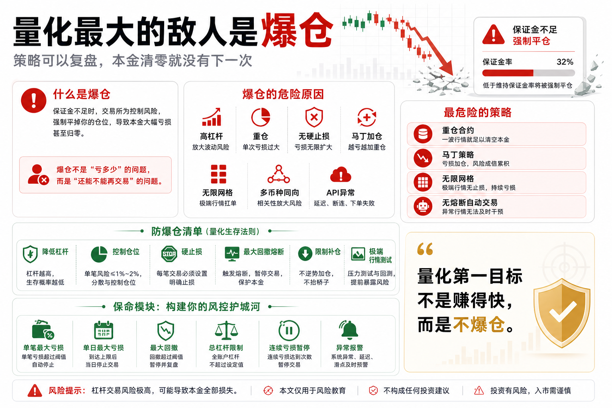

# 量化最大的敌人是爆仓

很多人以为量化交易最大的敌人是策略失效。

也有人觉得是行情不好、参数不准、机器人不够聪明。

但在实盘里，真正最致命的敌人往往只有一个：

爆仓。

策略亏损还可以复盘；

参数不佳还可以优化；

行情不好还可以暂停；

但一旦爆仓，本金没了，系统也就没有继续迭代的机会了。

量化交易最重要的不是每次都赚钱，而是避免一次错误把账户清零。

## 一、什么是爆仓？

爆仓通常发生在杠杆交易中。

当你的保证金不足以支撑亏损，交易所会强制平掉你的仓位。

简单说，就是你还没来得及决定要不要止损，系统已经替你强制出局。

在数字货币市场，价格波动很快。

一根急跌或急拉，就可能让高杠杆仓位瞬间被打穿。

尤其在合约市场里，爆仓不是少见事件，而是很多新手的常见结局。

## 二、为什么量化也会爆仓？

很多人以为量化系统很理性，所以不会爆仓。

这是误解。

量化只是按照规则执行。

如果规则里没有足够的风控，程序会非常稳定地把你带向爆仓。

常见原因包括：

- 杠杆过高；
- 仓位过重；
- 没有硬止损；
- 网格越跌越买；
- 马丁不断加仓；
- 策略同时开多个相关币种；
- 极端行情下流动性消失；
- API 异常导致止损失败。

人工交易会因为害怕而停手，程序不会。

如果你没有设置熔断，它会继续执行。

## 三、爆仓为什么比普通亏损更可怕？

普通亏损只是账户回撤。

只要本金还在，就还能调整策略、降低仓位、重新开始。

爆仓不同。

爆仓会让你失去继续参与的资格。

更可怕的是，爆仓常常不是因为方向错得多离谱，而是因为仓位和杠杆太激进。

很多时候，价格只是正常波动，但你的账户承受不了。

你可能看对了大方向，却死在短期波动里。

这就是杠杆的残酷。

市场不需要证明你完全错了。

它只需要先把你打出局。

## 四、哪些策略最容易引发爆仓？

第一，重仓合约策略。

如果仓位太重，再好的信号也扛不住一次剧烈反向波动。

第二，马丁策略。

亏损后不断加仓，看起来可以摊低成本，但本质是把风险集中到未来一次极端行情里。

第三，无限网格。

网格在震荡中表现舒服，但遇到单边下跌时，会不断买入，直到资金承受不了。

第四，多币种同向策略。

你以为分散买了很多币，其实它们在极端行情里高度相关，一起下跌。

第五，没有熔断机制的自动交易。

当行情异常、API 异常或账户异常时，系统还继续下单，就非常危险。

## 五、如何防止爆仓？

第一，降低杠杆。

新手最好先不用杠杆，或者只用非常低的杠杆。

如果一个策略不加杠杆都不能赚钱，加杠杆只会让问题更快暴露。

第二，控制仓位。

不要让单笔交易或单个币种决定账户生死。

仓位管理比预测更重要。

第三，设置硬止损。

不要只在心里止损。

实盘必须有系统层面的止损和最大亏损限制。

第四，设置最大回撤熔断。

当账户回撤超过某个阈值，系统必须暂停交易，先保命再复盘。

第五，避免无限加仓。

任何补仓、网格、马丁，都必须有最大仓位和最大亏损边界。

第六，做极端行情测试。

不要只看正常行情。

要问自己：如果一小时跌 20%，系统会怎样？

## 六、量化系统必须有保命模块

一套实盘量化系统，不能只有开仓逻辑。

它必须有保命模块。

至少包括：

- 单笔最大亏损；
- 单日最大亏损；
- 总账户最大回撤；
- 单币种最大仓位；
- 总杠杆限制；
- 连续亏损暂停；
- 异常行情熔断；
- API 异常报警；
- 强制平仓前预警。

这些模块不会让你多赚钱，但能让你活下来。

而在交易里，活下来本身就是优势。

## 七、结语：不爆仓，才有复利

量化交易不是为了追求一次暴利，而是为了建立长期可迭代的系统。

只要账户还在，策略可以改，参数可以调，经验可以积累。

但爆仓会让一切归零。

所以量化最大的敌人不是错过机会，而是失去继续交易的资格。

记住一句话：

量化的第一目标不是赚得快，而是不爆仓；只有活下来，复利才有意义。

> 风险提示：本文仅用于交易认知与风险教育，不构成任何投资建议。数字货币杠杆交易风险极高，可能导致本金快速损失，请谨慎参与。

