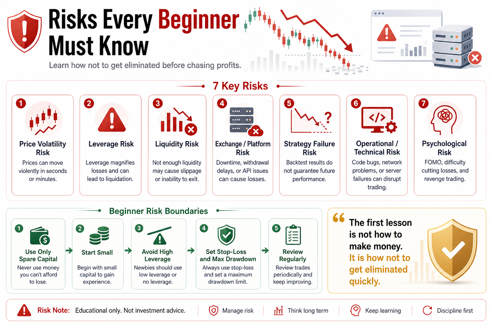

# Risks Every Beginner Must Know

Many beginners enter crypto and see only opportunity.

Large moves, easy access, 24/7 trading, new narratives, and constant market heat make it feel like money is everywhere.

But the first lesson in crypto should not be how to make money.

It should be how not to be eliminated by risk.

In this market, profits can come fast.

Losses can come faster.

If you do not know where the risks are, the market may eventually take back everything you earned.

## 1. Price Volatility Risk

Crypto is highly volatile.

A 20% daily rise can happen.

A 20% daily drop can also happen.

This volatility creates two illusions:

When price rises, beginners feel smart.

When price falls, they think it is only a temporary pullback.

But the market does not stop because of your feelings.

If your position is too large, a normal move can create a large drawdown.

Before every trade, ask:

Can I survive the opposite move?

## 2. Leverage Risk

Leverage magnifies profit and loss.

Beginners are attracted to leverage because they see people make big money with small capital.

But leverage also reduces your margin for error.

You may be roughly right about direction, but short-term volatility can liquidate you first.

Beginners should not start with high-leverage futures.

If you cannot handle spot volatility, futures will expose the problem faster.

## 3. Liquidity Risk

Many small coins rise quickly but have poor liquidity.

Buying may be easy.

Selling may not be.

During volatile markets, order books can become thin and slippage can increase suddenly.

You may set a stop-loss price, but the actual fill can be much worse.

That is liquidity risk.

Do not only look at price increase.

Look at volume, order book depth, and trading cost.

An opportunity without liquidity may be a trap.

## 4. Exchange and Platform Risk

Crypto trading depends on exchanges.

But exchanges are not risk-free.

Problems can include:

- Downtime
- Price wicks
- API failures
- Withdrawal pauses
- Risk-control limits
- Account abnormalities
- Platform-level failure

If all your capital is on one platform, you become vulnerable.

Do not give trading bots withdrawal permission.

API keys should only have necessary permissions.

If the bot only needs to trade, it should not be able to withdraw.

## 5. Strategy Risk

A strategy does not make you safe.

Strategies can fail.

A strategy that worked in the past may not work in the future.

Market structure, participants, fees, volatility, and liquidity can all change.

A beautiful backtest does not guarantee stable live performance.

Beginners must understand:

A strategy is not armor.

Every strategy needs a failure plan.

## 6. Operational and Technical Risk

Quant trading also has technical risks.

Examples include:

- Code bugs
- Duplicate orders
- Unfilled orders
- Network failure
- Server downtime
- Data delay
- API rate limits
- Time synchronization errors

These are not market risks, but they can still cause real losses.

Automated systems need logs, alerts, exception handling, and manual intervention plans.

## 7. Psychological Risk

Many beginners lose not because they lack tools, but because they lose control.

Common behaviors include:

- Fear of missing out
- Refusing to stop-loss
- Revenge trading
- Oversizing after wins
- Anxiety when others profit
- Checking the account constantly

Psychological risk is hidden, but powerful.

If you cannot control yourself, even a good strategy becomes hard to execute.

## 8. How Beginners Can Build Risk Boundaries

First, only trade with money you can afford to lose.

Do not borrow money. Do not use living expenses. Do not risk family security.

Second, start with small capital.

The beginner goal is not to make a fortune. It is to learn the market at low cost.

Third, avoid high leverage.

Understand spot before futures.

Fourth, every strategy needs stop-loss and maximum drawdown limits.

A strategy without risk control is not a real strategy.

Fifth, review regularly.

Every loss should teach you something.

## Conclusion

Crypto has many opportunities, but risk is everywhere.

Beginners who only look at return and ignore risk will eventually be educated by the market.

Mature traders are not the ones who take the biggest bets.

They are the ones who know which money not to chase.

Remember:

The first lesson for beginners is not how to make money. It is how not to get eliminated quickly.

> Risk warning: This article is for educational purposes only and does not constitute investment advice. Digital assets are highly volatile. Understand the risks before participating.

