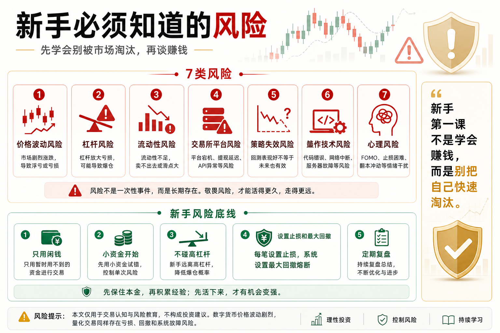

# 新手必须知道的风险

很多新手进入币圈时，只看到机会。

涨幅大、交易方便、24小时运行、故事多、热点多，好像到处都是赚钱机会。

但币圈真正应该先学的，不是怎么赚钱，而是怎么避免被风险淘汰。

因为在这个市场里，赚钱可能很快，亏钱也可能更快。

如果你不知道风险在哪里，赚到的钱迟早可能还给市场。

## 一、价格波动风险

数字货币最大的特点，就是波动剧烈。

一天上涨 20% 很常见；

一天跌去 20% 也并不稀奇。

这种波动会让新手产生两种错觉：

涨的时候觉得自己很厉害；

跌的时候觉得只是暂时回调。

但市场不会因为你的感觉而停止波动。

如果仓位太重，一次普通波动就可能让账户大幅回撤。

所以新手必须先接受：

币圈不是低波动市场。

任何交易前，都要先问自己能不能承受反向波动。

## 二、杠杆风险

杠杆会放大收益，也会放大亏损。

很多新手被高杠杆吸引，是因为看到别人用小资金赚大钱。

但他们忽略了另一面：

高杠杆会大幅压缩容错空间。

你可能方向大体没错，但短期价格波动就足以让你爆仓。

新手最不应该一开始就碰高杠杆合约。

如果你连现货波动都承受不了，合约只会更快暴露问题。

## 三、流动性风险

很多小币种看起来涨得快，但流动性很差。

买的时候容易，卖的时候未必卖得出去。

尤其在行情剧烈波动时，盘口可能很薄，滑点会突然变大。

你以为自己设置了止损价，但真正成交价格可能差很多。

这就是流动性风险。

新手不要只看涨幅，也要看成交量、盘口深度和交易成本。

没有流动性的机会，很多时候不是机会，而是陷阱。

## 四、交易所和平台风险

币圈交易离不开交易所。

但交易所并不是绝对安全的。

可能出现：

- 宕机；
- 插针；
- API 异常；
- 提现暂停；
- 风控限制；
- 账户异常；
- 极端情况下平台风险。

如果你的全部资金都放在一个平台，一旦平台出问题，你会非常被动。

所以要分散平台风险，并且不要给交易机器人开提现权限。

API 只给必要权限，能交易就不要能提现。

## 五、策略风险

很多人以为有策略就安全。

其实策略也会失效。

一个策略过去有效，不代表未来一直有效。

市场环境变化、参与者变化、手续费变化、流动性变化，都可能让策略表现变差。

回测漂亮，也不等于实盘稳定。

新手必须知道：

策略不是护身符。

任何策略都要有失效预案。

## 六、操作和技术风险

量化交易还会遇到技术问题。

比如：

- 代码 bug；
- 下单重复；
- 订单未成交；
- 网络中断；
- 服务器宕机；
- 数据延迟；
- API 限流；
- 时间同步错误。

这些问题看起来不像市场风险，但一样会造成真实亏损。

所以自动交易系统必须有日志、报警、异常处理和人工介入机制。

## 七、心理风险

很多新手亏钱，不是因为不懂技术，而是因为心理失控。

常见表现包括：

- 怕错过；
- 不愿止损；
- 亏损后想翻本；
- 连续盈利后重仓；
- 看到别人赚钱就焦虑；
- 一天看无数次账户。

心理风险很隐蔽，但破坏力很大。

如果你无法控制自己，就算有策略，也很难执行。

## 八、新手如何建立风险底线？

第一，只用能承受损失的钱。

不要借钱交易，不要用生活费交易，不要用影响家庭安全的钱交易。

第二，先小资金。

新手阶段的目标不是赚大钱，而是用小成本认识市场。

第三，不碰高杠杆。

先理解现货，再理解合约。

第四，任何策略都要设止损和最大回撤。

没有风控的策略，不是真策略。

第五，定期复盘。

每一次亏损都要知道原因。

## 九、结语：风险意识比赚钱冲动更重要

币圈的机会很多，但风险也很密集。

新手如果只看收益，不看风险，迟早会被市场教育。

真正成熟的交易者，不是最敢冲的人，而是最知道哪些钱不能赚的人。

记住一句话：

新手第一课不是学会赚钱，而是学会别把自己快速淘汰。

> 风险提示：本文仅用于交易认知与风险教育，不构成任何投资建议。数字货币价格波动剧烈，参与前请充分理解风险。

