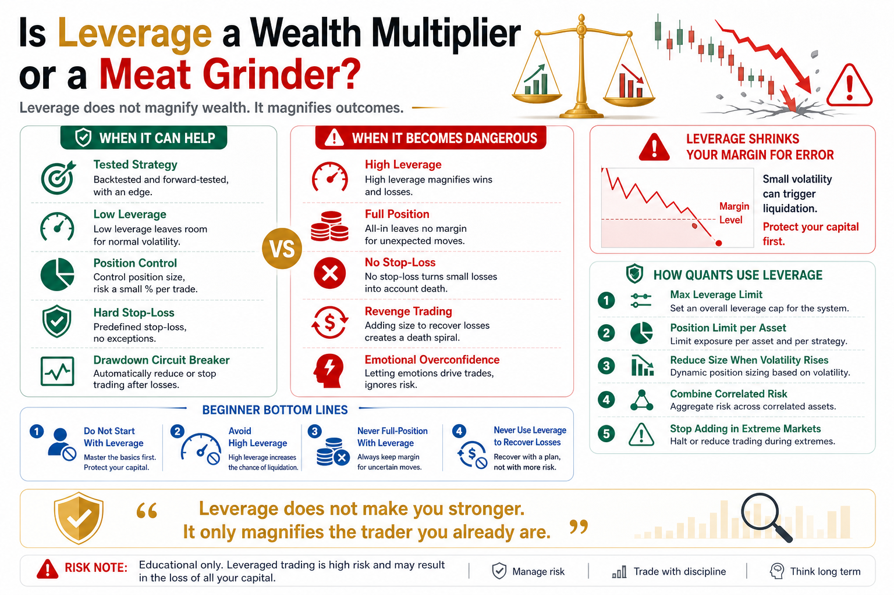

# Is Leverage a Wealth Multiplier or a Meat Grinder?

Leverage is one of the most tempting tools in crypto.

It makes small capital look powerful.

It makes people believe that one correct call can double an account quickly.

So beginners often ask:

Is leverage a wealth multiplier or a meat grinder?

The answer is:

For traders with a system, leverage is a risk tool.

For traders without a system, leverage is a meat grinder.

## 1. Leverage Does Not Magnify Wealth. It Magnifies Outcomes.

People say leverage magnifies profit.

That is only half true.

Leverage magnifies outcomes.

If you are right, it magnifies profit.

If you are wrong, it magnifies loss.

If your position sizing is reasonable, it may improve capital efficiency.

If your position sizing is reckless, it accelerates liquidation.

Leverage itself is not good or evil.

It simply exposes the real quality of your trading system faster.

If your strategy is unstable without leverage, leverage will not make it stronger.

It will make it break faster.

## 2. Leverage Shrinks Your Margin for Error

Without leverage, a short-term adverse move may still leave room to adjust.

With high leverage, a small adverse move can trigger forced liquidation.

At 10x leverage, a roughly 10% adverse move may put the position near liquidation.

At 20x, 50x, or 100x, the margin for error becomes tiny.

Crypto can move several percent in a day easily.

High leverage is not just trading the market.

It is betting your survival against random volatility.

Many traders are not completely wrong about direction.

They are simply too leveraged to survive until the market proves them right.

## 3. Why Beginners Are Hurt by Leverage

First, beginners overestimate their judgment.

After a few wins, they believe they understand the market.

Second, beginners oversize.

Because their capital is small, they want larger positions to speed up returns.

Third, beginners refuse to stop-loss.

They hope price will come back, while leverage expands the loss quickly.

Fourth, beginners revenge trade.

After losing, they want to win it back. After winning, they want to double down.

Leverage magnifies these human weaknesses.

The market may only need to make you lose a little.

Leverage helps you lose a lot.

## 4. When Does Leverage Make Sense?

Leverage is not always forbidden.

But it needs three conditions.

First, you have a tested strategy.

If the strategy cannot perform without leverage, leverage is meaningless.

Second, you have clear risk control.

Maximum loss per trade, total exposure, and maximum drawdown must be defined in advance.

Third, you know what happens in extreme conditions.

What if price moves sharply against you?

What if slippage increases?

What if the stop-loss does not fill?

Can the account survive?

If you cannot answer these questions, do not use leverage.

## 5. How Quant Systems Should Use Leverage

Mature quant systems do not treat leverage as a get-rich tool.

They treat it as a capital efficiency tool.

A serious system may:

- Limit maximum leverage
- Limit position size per asset
- Use hard stop-losses
- Set account drawdown circuit breakers
- Combine risk across correlated assets
- Reduce exposure when volatility rises
- Avoid adding during extreme markets

The goal is not to maximize exposure.

The goal is to keep risk inside a survivable range.

Professional leverage use asks about loss first and profit second.

## 6. Bottom Lines for Ordinary Traders

First, do not start with leverage.

Understand spot market volatility first.

Second, avoid high leverage.

If you must use leverage, start very low.

Third, never combine full position with leverage.

That gives your account to one market move.

Fourth, always use stop-losses.

Leveraged trading without a stop-loss is waiting for liquidation.

Fifth, never use leverage to recover losses.

Adding leverage after losing is one of the most dangerous emotional behaviors.

## Conclusion

So is leverage a wealth multiplier or a meat grinder?

It depends on the user.

With strategy, risk control, and discipline, leverage may improve capital efficiency.

Without rules, stop-losses, or emotional control, leverage can destroy an account quickly.

Remember:

Leverage does not make you stronger. It only magnifies the trader you already are.

> Risk warning: This article is for educational purposes only and does not constitute investment advice. Leveraged crypto trading is extremely risky and may lead to rapid capital loss or liquidation.

