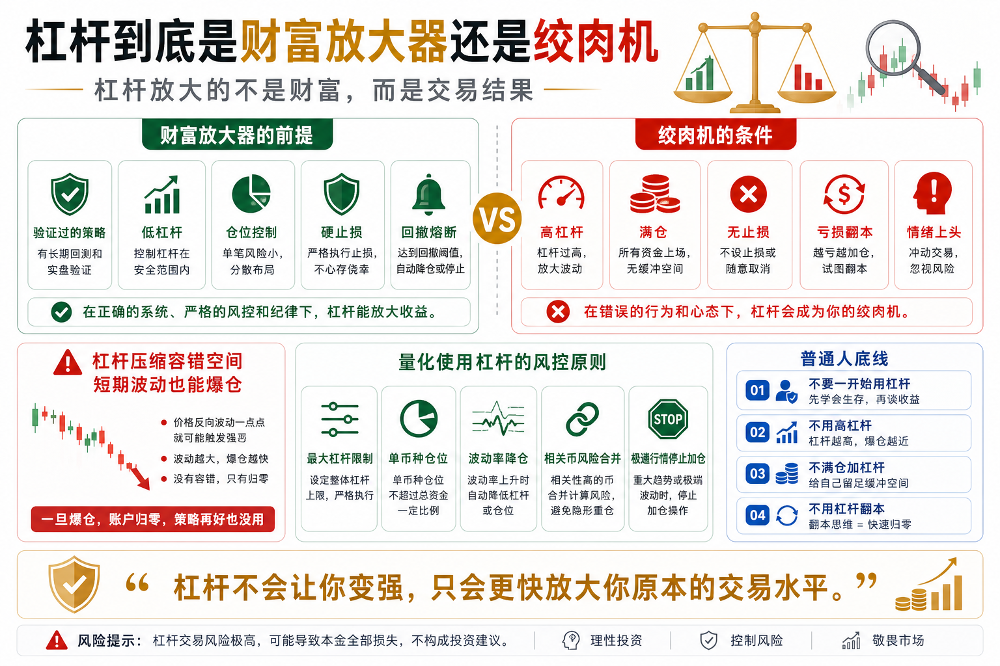

# 杠杆到底是财富放大器还是绞肉机

杠杆是币圈最有诱惑力的工具之一。

它让小资金看起来也能做大交易。

也让很多人误以为，只要方向判断对一次，就能快速翻倍。

所以很多新手会问：

杠杆到底是财富放大器，还是绞肉机？

答案是：

对有系统的人，杠杆是风险工具；

对没有系统的人，杠杆就是绞肉机。

## 一、杠杆放大的不是财富，而是结果

很多人说杠杆放大收益。

这句话只说对了一半。

杠杆放大的不是收益，而是结果。

你判断对了，它放大利润；

你判断错了，它放大亏损；

你仓位合理，它提高资金效率；

你仓位失控，它加速爆仓。

杠杆本身没有善恶。

它只是让你的交易系统更快暴露真实水平。

如果你的策略本来就不稳定，加杠杆不会让它变强，只会让它更快崩溃。

## 二、杠杆最可怕的是压缩容错空间

不用杠杆时，市场短期反向波动，你还有调整空间。

用了高杠杆后，价格只需要小幅反向波动，就可能触发强平。

比如 10 倍杠杆，理论上价格反向波动 10% 左右，就可能接近清算；

20 倍、50 倍甚至 100 倍，容错空间更小。

币圈一天波动几个百分点很正常。

所以高杠杆不是在交易行情，而是在和随机波动赌命。

很多人方向并不是完全看错，而是杠杆太高，没等行情证明自己对，就先被市场扫出局。

## 三、为什么新手特别容易被杠杆伤害？

第一，新手容易高估自己的判断。

刚赚几次，就觉得自己看懂市场。

第二，新手喜欢重仓。

因为本金小，所以总想用更大仓位加速收益。

第三，新手不愿止损。

亏损后总希望价格回来，结果亏损被杠杆迅速放大。

第四，新手容易上头。

亏了想翻本，赚了想加倍。

杠杆会放大这些人性弱点。

市场本来只需要让你亏一点，杠杆会帮你亏很多。

## 四、杠杆什么时候才有意义？

杠杆不是完全不能用。

但它必须建立在三个前提上。

第一，你有经过验证的策略。

如果策略不加杠杆都不能稳定，杠杆没有意义。

第二，你有明确的风控。

每笔最多亏多少、总仓位多少、最大回撤多少，都必须提前规定。

第三，你知道极端情况下会发生什么。

比如行情瞬间反向波动、滑点变大、止损未成交，你的账户能不能承受？

如果这些问题没有答案，就不要碰杠杆。

## 五、量化系统如何使用杠杆？

成熟的量化系统不会把杠杆当暴富工具。

它会把杠杆当资金效率工具。

比如：

- 限制最大杠杆倍数；
- 限制单币种仓位；
- 设置强制止损；
- 设置账户回撤熔断；
- 对相关币种做风险合并；
- 在波动率升高时自动降仓；
- 避免在极端行情中继续加仓。

量化系统使用杠杆的重点，不是把收益拉满，而是让风险在可承受范围内。

真正专业的杠杆使用，是先问亏损，再谈收益。

## 六、普通人使用杠杆的底线

第一，不要一开始就用杠杆。

先用现货理解市场波动。

第二，不要用高杠杆。

如果一定要用，也应该从极低杠杆开始。

第三，不要满仓加杠杆。

满仓加杠杆，是把账户交给一次波动。

第四，必须有止损。

没有止损的杠杆交易，本质是在等待爆仓。

第五，不要用杠杆翻本。

亏损后加杠杆，是最危险的情绪交易。

## 七、结语：杠杆先考验风险，再放大收益

杠杆到底是财富放大器还是绞肉机？

它取决于使用者。

有策略、有风控、有纪律的人，可能把杠杆当资金效率工具；

没有规则、没有止损、情绪交易的人，杠杆会把账户快速送进绞肉机。

记住一句话：

杠杆不会让你变强，它只会更快放大你原本的交易水平。

> 风险提示：本文仅用于交易认知与风险教育，不构成任何投资建议。杠杆交易风险极高，可能导致本金快速损失甚至爆仓，请谨慎参与。

