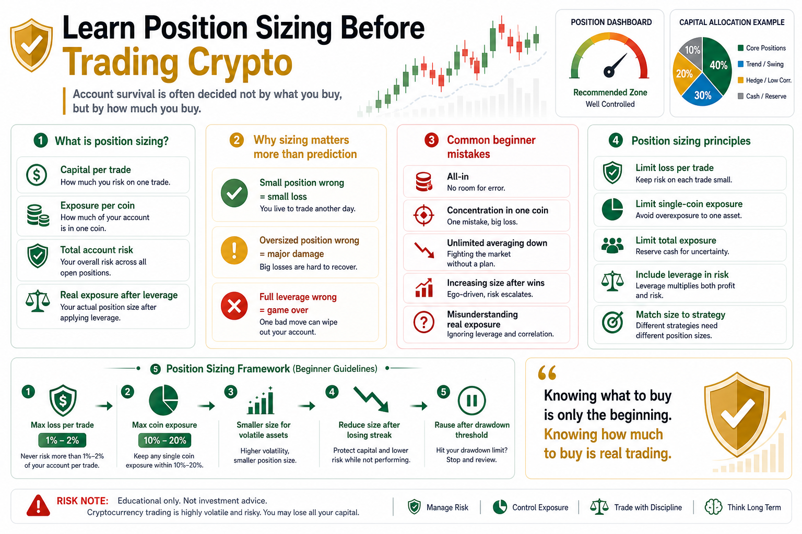

# Learn Position Sizing Before Trading Crypto

Many beginners enter crypto and immediately ask what to buy.

Bitcoin or Ethereum?

Majors or altcoins?

Spot or futures?

But what often determines account survival is not what you buy.

It is how much you buy.

That is position sizing.

Direction matters in trading, but position sizing matters more.

Being wrong is not fatal.

Being oversized can be.

## 1. What Is Position Sizing?

Position sizing means the percentage of capital allocated to a trade or asset.

If your account has $100,000 and you buy $10,000 of Bitcoin, the position is 10%.

If you buy $50,000, it is 50%.

If leverage is added, the actual risk exposure may be even higher.

Position management decides:

How much capital to use per trade.

How much to allocate to one coin.

How much total exposure the account can carry.

At what loss level you must reduce or exit.

## 2. Why Position Sizing Matters More Than Prediction

No one is right every time.

Even strong traders make mistakes.

If each trade is small, one wrong call is a small loss.

If one trade is oversized, one mistake can damage the account.

If you are fully invested with leverage, one mistake can end the game.

Trading is not about always predicting correctly.

It is about keeping losses controllable when you are wrong.

The purpose of position sizing is survival during mistakes.

## 3. Common Beginner Mistakes

First, going all in.

Beginners see an opportunity and commit all capital, leaving no room to adjust.

Second, concentrating in one coin.

They believe strongly in one asset and place too much capital there.

But single-coin risk in crypto is high.

Third, averaging down without limits.

They keep buying as price falls until the position becomes too large.

Fourth, increasing size after wins.

After a few profitable trades, confidence rises and the next trade becomes too large.

One loss can erase many wins.

Fifth, misunderstanding real exposure.

With leverage, the capital used may look small, but actual risk can be large.

## 4. Basic Principles

First, limit loss per trade.

No single trade should lose a large percentage of the account.

Second, limit exposure to one coin.

No matter how good an asset looks, it should not decide the account’s fate.

Third, limit total exposure.

In broad market crashes, many coins fall together.

Fourth, include leverage in risk calculations.

Do not only look at margin. Look at actual exposure.

Fifth, match position size to strategy.

Trend, grid, and arbitrage strategies require different position structures.

## 5. A Simple Beginner Framework

Beginners can start conservatively:

- Maximum loss per trade: 1% to 2% of account
- Maximum position per coin: 10% to 20%
- Avoid staying fully invested for long periods
- Use smaller size for futures and volatile altcoins
- Reduce size after consecutive losses
- Pause trading after a drawdown threshold

These numbers are not universal rules.

They are boundaries that help you think about risk.

Position sizing is not designed to limit success.

It is designed to prevent one mistake from destroying the account.

## 6. Position Size and Psychology

The heavier the position, the easier it is for emotions to break.

With a small loss, you can review calmly.

With a large loss, you become anxious and check charts constantly.

With a full-position loss, rational thinking disappears.

Many people think their psychology is weak.

Often, their position size is simply too large.

Good position sizing is also emotional management.

## 7. How Quant Systems Manage Position Size

A quant system must turn position sizing into rules.

For example:

- Allocate based on signal strength
- Adjust size based on volatility
- Reduce size during drawdown
- Control exposure per coin and total account
- Reduce frequency after consecutive losses
- Respect a maximum risk budget

The clearer the sizing rules, the less emotional interference.

Professional quant trading is not only about when to enter.

It is about how much to enter.

## Conclusion

Before trading crypto, learn position sizing.

The market will not give you safety just because you believe in a coin.

Directions can be wrong.

Strategies can fail.

Markets can become extreme.

Exchanges can have issues.

Position management leaves room to survive uncertainty.

Remember:

Knowing what to buy is only the beginning. Knowing how much to buy is when real trading begins.

> Risk warning: This article is for educational purposes only and does not constitute investment advice. Digital assets are highly volatile. Participate only according to your own risk tolerance.

