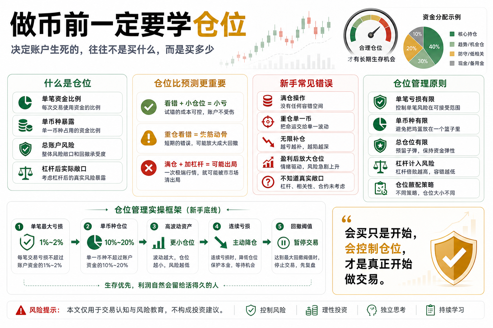

# 做币前一定要学仓位

很多新手进入币圈后，最关心的是买什么。

买 BTC 还是 ETH？

买主流币还是山寨币？

买现货还是合约？

但真正决定账户生死的，往往不是你买了什么，而是你买了多少。

这就是仓位。

在交易里，方向判断很重要，但仓位管理更重要。

看错方向不可怕，仓位失控才可怕。

## 一、什么是仓位？

仓位，就是你投入到某笔交易或某类资产里的资金比例。

比如你账户有 10 万元，买入 1 万元 BTC，这笔仓位就是 10%。

如果你买入 5 万元，就是 50%。

如果再加杠杆，实际风险暴露可能更高。

仓位管理，就是决定：

每次交易用多少钱；

单个币种最多放多少钱；

总账户最多暴露多少风险；

亏损到什么程度必须减仓或退出。

## 二、为什么仓位比预测更重要？

因为没有人能每次预测正确。

再好的交易者，也会看错。

如果你每次只用小仓位，看错一次只是小亏；

如果你一次重仓，看错一次可能伤筋动骨；

如果你满仓加杠杆，看错一次可能直接出局。

交易不是比谁预测最准，而是比谁在错误时亏得可控。

仓位管理的核心意义，就是让你在判断错误时还能活下来。

## 三、新手最常见的仓位错误

第一，满仓。

看到机会就把所有资金打进去，完全没有调整空间。

第二，重仓单一币种。

以为自己很看好，所以集中下注。但币圈单币风险非常高。

第三，亏损后补仓没有上限。

越跌越买，最后仓位越来越重，心理压力越来越大。

第四，盈利后突然放大仓位。

连续赚几次后，以为自己状态很好，于是下一笔重仓，结果一次亏回去。

第五，不知道实际风险暴露。

尤其加杠杆后，表面仓位不大，实际风险已经很高。

## 四、仓位管理的基本原则

第一，单笔亏损要有限。

不要让任何一笔交易亏掉账户的大比例资金。

第二，单币种仓位要有限。

再看好的币，也不要让它决定账户命运。

第三，总仓位要有限。

市场整体下跌时，多币种可能一起跌。

第四，杠杆要算进风险。

不能只看本金投入，还要看实际敞口。

第五，仓位要和策略匹配。

趋势策略、网格策略、套利策略，适合的仓位结构不同。

## 五、一个简单的新手仓位框架

新手可以先用保守框架：

- 单笔交易最大亏损不超过账户 1% 到 2%；
- 单个币种仓位不超过账户 10% 到 20%；
- 总风险资产仓位不要长期满仓；
- 合约和高波动山寨币用更小仓位；
- 连续亏损后自动降低仓位；
- 账户回撤达到阈值后暂停交易。

这些数字不是固定答案，而是帮助你建立风险边界。

仓位不是为了限制收益，而是为了防止一次错误毁掉账户。

## 六、仓位和心态的关系

仓位越重，心态越容易变形。

小仓位亏损，你还能冷静复盘；

重仓亏损，你会焦虑、失眠、频繁看盘；

满仓亏损，你很容易失去理性。

很多人以为自己心态差，其实是仓位太重。

仓位合理，心态自然稳定很多。

仓位管理不是数学问题，也是心理管理。

## 七、量化系统如何管理仓位？

量化系统必须把仓位写成规则。

比如：

- 根据信号强弱分配仓位；
- 根据波动率调整仓位；
- 根据账户回撤降低仓位；
- 控制单币种和总账户暴露；
- 连续亏损后自动降频或暂停；
- 不允许超过最大风险预算。

仓位规则越清楚，系统越不容易被情绪干扰。

量化交易真正专业的地方，不是只会开仓，而是知道每次该开多少。

## 八、结语：先学仓位，再谈赚钱

做币前一定要学仓位。

因为市场不会因为你看好某个币就给你安全边际。

方向会错，策略会失效，行情会极端，交易所也可能异常。

仓位管理就是给这些不确定性留下生存空间。

记住一句话：

会买只是开始，会控制仓位，才是真正开始做交易。

> 风险提示：本文仅用于交易认知与风险教育，不构成任何投资建议。数字货币价格波动剧烈，请根据自身风险承受能力谨慎参与。

