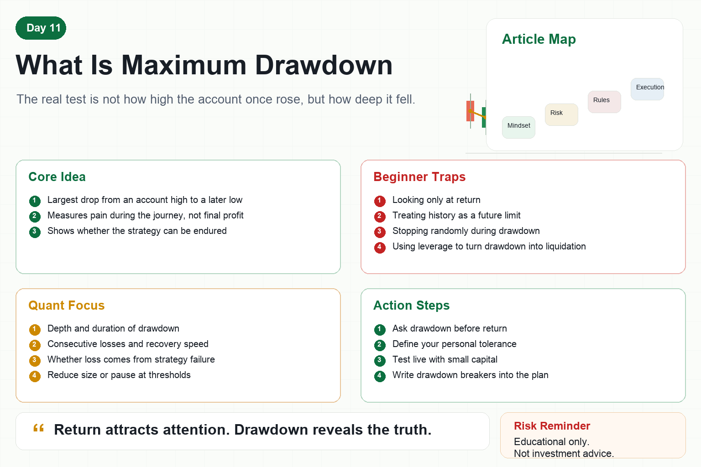

# What Is Maximum Drawdown

Many beginners judge a strategy by one number: return.

What is the annual return?

Can it double in a month?

Does the equity curve keep rising?

But experienced traders usually ask a different question first.

What is the maximum drawdown?

Return tells you how much a strategy may make.

Drawdown tells you how difficult the journey may become.

Looking at return without drawdown is like looking at speed without brakes.

In crypto, that is dangerous.

## 1. What Is Maximum Drawdown?

Maximum drawdown is the largest decline from a previous account high to a later low.

Suppose an account rises from $100,000 to $150,000, then falls to $120,000.

The drawdown is from $150,000 to $120,000, or 20%.

If it later rises to $180,000 and falls to $108,000, that drawdown is 40%.

Maximum drawdown is the worst decline among all such declines.

It does not ask whether the strategy eventually made money.

It asks how much pain the account had to endure along the way.

## 2. Why Drawdown Matters More Than Return

Many strategies look profitable at the end but are extremely volatile in the middle.

On a chart, you see the final result.

In live trading, you must experience every decline.

A 20% drawdown may still feel manageable.

A 40% drawdown makes you question the strategy.

A 60% drawdown forces many people to stop.

An 80% drawdown may be impossible to sit through, even if the strategy later recovers.

Whether a strategy can make money is one question.

Whether a trader can keep executing it is another.

Maximum drawdown connects those two questions.

## 3. Common Beginner Mistakes

First, looking only at final return.

A backtest may look beautiful at the end while hiding long periods of loss.

Second, treating historical drawdown as a future limit.

A historical 30% drawdown does not mean future drawdown cannot exceed 30%.

Third, using too much size.

The same strategy can feel acceptable with small size and unbearable with large size.

Fourth, stopping the strategy randomly during drawdown.

Without rules, emotions will make the decision.

Fifth, adding leverage to drawdown.

A strategy that could recover without leverage may be liquidated with leverage.

## 4. How Quant Systems Use Drawdown

A mature quant system does not only chase a nice equity curve.

It tracks:

- Maximum daily loss
- Consecutive losing periods
- Maximum drawdown
- Drawdown duration
- Recovery speed
- Whether losses come from the same risk source

Drawdown is not just one number.

It is a risk signal system.

If the drawdown comes from normal volatility, position sizing may handle it.

If it comes from strategy failure, the system may need to pause, review, or be rebuilt.

## 5. What Beginners Should Do

First, ask about maximum drawdown before return.

Second, define your psychological limit in advance.

If you can only tolerate a 20% drawdown, do not run a strategy that historically fell close to 40%.

Third, test with small capital.

Live drawdown feels harder than backtest drawdown.

Fourth, set a drawdown circuit breaker.

For example, reduce size or pause trading after a predefined threshold.

Fifth, write drawdown rules into the trading plan.

Without a drawdown plan, there is no real risk control.

## Conclusion

Maximum drawdown is not a cold statistic.

It asks whether you can survive when the account falls from its high.

Many people lose not because a strategy never made money, but because they were unprepared when drawdown arrived.

Remember:

Return attracts attention. Drawdown reveals the truth.

> Risk warning: This article is for educational purposes only and does not constitute investment advice. Crypto assets are highly volatile, and any strategy can experience unexpected drawdowns.
