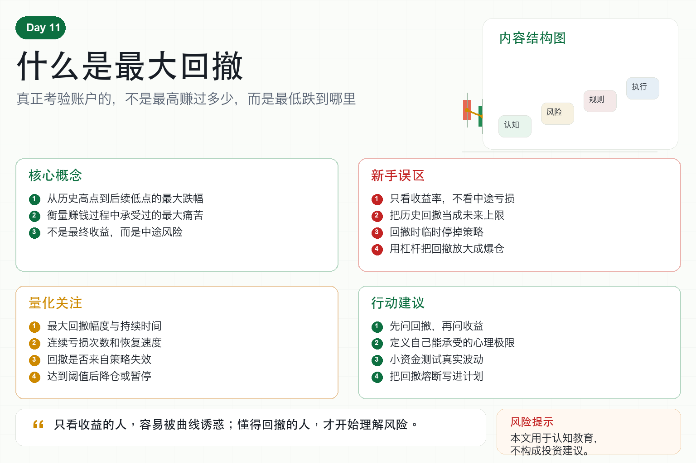

# 什么是最大回撤

很多新手看一个策略，第一眼只看收益率。

年化多少？

一个月能不能翻倍？

净值曲线是不是一直向上？

但真正专业的人，往往会先问另一个问题：最大回撤是多少？

因为收益告诉你可能赚多少，回撤告诉你中途可能多难受。

如果你只看收益，不看回撤，就像只看车速，不看刹车。

在数字货币市场里，这非常危险。

## 一、什么是最大回撤？

最大回撤，指的是账户从某个历史高点跌到后面低点的最大跌幅。

比如账户从 10 万涨到 15 万，后来跌到 12 万。

这段回撤就是从 15 万跌到 12 万，跌了 20%。

如果之后又涨到 18 万，再跌到 10.8 万，那这段回撤是 40%。

最大回撤，就是所有回撤里最严重的一次。

它衡量的不是你最终有没有赚钱，而是赚钱过程中曾经承受过多大的下跌。

## 二、为什么最大回撤比收益更重要？

因为很多策略看起来收益很高，但中途波动极大。

你看到的是最后的盈利结果。

真实交易时，你要经历中间每一次下跌。

20% 回撤，你可能还能冷静；

40% 回撤，你会开始怀疑策略；

60% 回撤，很多人已经不敢继续执行；

80% 回撤，即使最后能涨回来，大多数人也扛不到那一天。

策略能不能赚钱是一回事。

交易者能不能坚持执行，是另一回事。

最大回撤，就是连接这两件事的关键指标。

## 三、新手最容易犯的错误

第一，只看最终收益。

回测图最后很漂亮，但中间可能有很长时间在亏损。

第二，把历史回撤当成未来上限。

历史最大回撤 30%，不代表未来一定不会超过 30%。

第三，仓位过重。

同样的策略，小仓位回撤可控，重仓后回撤会让人崩溃。

第四，回撤时随意停掉策略。

如果你没有提前定义规则，回撤发生时一定会被情绪支配。

第五，用杠杆放大回撤。

一个原本可以修复的策略，加杠杆后可能直接爆仓。

## 四、量化系统如何看待回撤？

成熟的量化系统不会只追求收益曲线好看。

它会同时关注：

- 单日最大亏损；
- 连续亏损次数；
- 最大回撤幅度；
- 回撤持续时间；
- 回撤后的恢复速度；
- 回撤是否来自同一种风险。

因为回撤不是一个数字，而是一整套风险信号。

如果回撤来自正常波动，可以通过仓位控制承受。

如果回撤来自策略失效，就必须暂停、复盘、甚至重写策略。

## 五、普通人应该怎么用最大回撤？

第一，看策略前先问最大回撤。

不要只问收益率。

第二，预设自己能承受的心理极限。

如果你最多只能接受 20% 回撤，就不要运行历史回撤接近 40% 的策略。

第三，用小资金测试真实回撤。

实盘回撤往往比回测更难受。

第四，设置回撤熔断。

比如账户回撤达到某个阈值后，自动降低仓位或暂停交易。

第五，把回撤写进交易计划。

没有回撤计划，就没有真正的风控。

## 六、结语：收益是诱惑，回撤是真相

最大回撤不是一个冷冰冰的指标。

它是在问你：当账户从高点往下掉时，你还能不能按规则活下来？

很多人亏钱，不是因为策略从来没有赚钱，而是因为回撤来临时没有准备。

记住一句话：

只看收益的人，容易被曲线诱惑；懂得回撤的人，才开始理解风险。

> 风险提示：本文仅用于交易认知与风险教育，不构成任何投资建议。数字货币价格波动剧烈，任何策略都可能发生超预期回撤。
