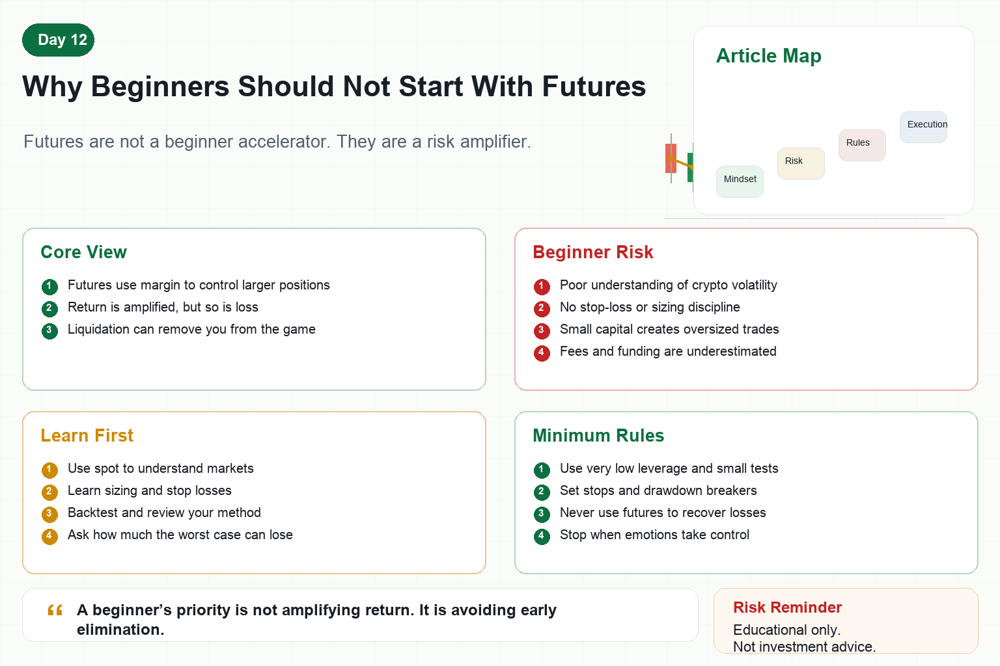

# Why Beginners Should Not Start With Futures

Many beginners are attracted to futures as soon as they enter crypto.

The reason is simple.

If spot rises 5%, you make 5%.

With 10x leverage, it looks like you can make 50%.

People with small capital are especially tempted by this idea.

But futures do not only amplify return.

They amplify volatility, mistakes, emotions, and the speed of loss.

That is why beginners should not start with futures.

## 1. What Are Futures?

Futures allow you to trade a larger position with margin.

You do not need to provide the full value of the position.

This is leverage.

Leverage improves capital efficiency, but it also increases risk exposure.

If you are right, profit comes faster.

If you are wrong, loss comes faster too.

More importantly, futures have liquidation.

When losses reach a threshold, the exchange can force-close the position.

That is not just a normal loss.

It is being removed from the game.

## 2. Why Beginners Should Avoid Starting With Futures

First, beginners do not yet understand volatility.

A few percent move in crypto can happen quickly.

With high leverage, normal volatility can become fatal.

Second, beginners often lack stop-loss discipline.

In futures, refusing to stop does not simply mean losing more.

It may mean liquidation.

Third, beginners tend to oversize.

Small capital creates the desire to amplify results.

Fourth, beginners usually lack a trading system.

Without entry rules, exit rules, and position rules, futures trading becomes emotional trading.

Fifth, beginners underestimate fees and funding rates.

Frequent trades and long holding periods can slowly drain the account.

## 3. The Most Dangerous Part

The most dangerous part is not being wrong.

It is having too little room for error.

With spot, a wrong entry can sometimes be managed if size is reasonable.

With high leverage, a small adverse move can trigger liquidation.

Many traders are not completely wrong on direction.

They are simply too leveraged to survive the path.

The market removes them first, then later moves in the direction they expected.

That is the cruelty of futures.

## 4. What Beginners Should Learn First

First, learn spot trading.

Use spot to understand volatility, trends, ranges, and drawdowns.

Second, learn position sizing.

Without sizing, futures only speed up losses.

Third, learn stop losses.

A stop loss is not surrender. It defines the loss boundary.

Fourth, learn backtesting and review.

You need to know whether your method has long-term edge.

Fifth, learn risk control.

Every strategy must answer: how much can it lose in a bad scenario?

## 5. When Futures May Be Considered

Futures are not forbidden forever.

But several conditions should be met:

- A strategy that has been executed consistently
- Clear stop-loss and position rules
- Awareness of maximum drawdown and extreme risk
- Very low leverage
- Small-capital testing first
- No revenge trading with futures
- No trading when emotions are out of control

Without these conditions, futures are not a tool.

They are a trap.

## 6. How Quant Systems Handle Futures

A mature quant system treats futures as a high-risk module.

It limits maximum leverage, position size, daily loss, and account drawdown.

It monitors margin ratio, funding rates, slippage, and abnormal orders.

It may automatically reduce size when volatility rises.

This tells us something important.

Professional systems do not use futures for excitement.

They use them to improve capital efficiency under strict control.

## Conclusion

Futures create an illusion for beginners: if the direction is right, money will come quickly.

But the market tests position size, discipline, and psychology first.

Without a system, futures do not make you professional.

They simply settle your mistakes faster.

Remember:

A beginner's priority is not amplifying return. It is avoiding early elimination.

> Risk warning: This article is for educational purposes only and does not constitute investment advice. Futures and leveraged trading are extremely risky and may cause rapid loss or liquidation.
