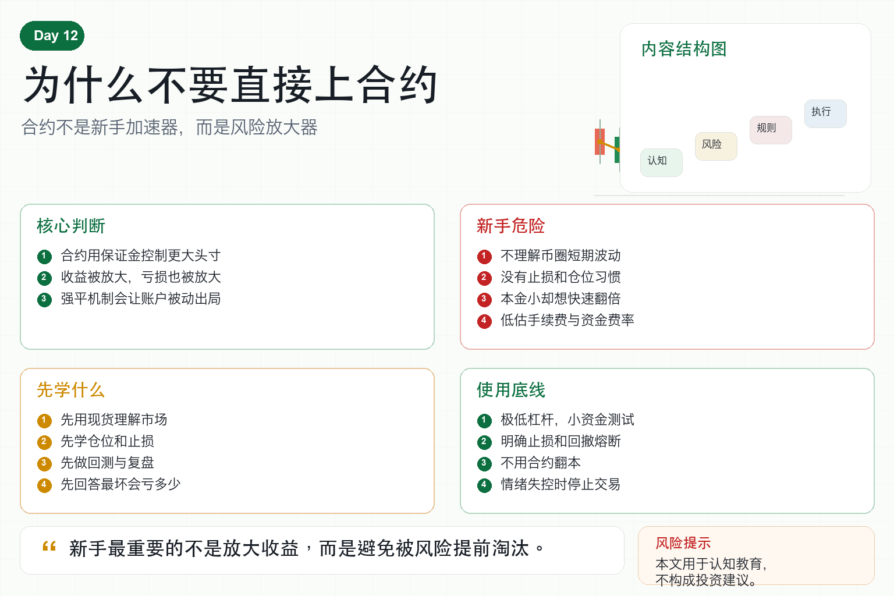

# 为什么不要直接上合约

很多新手刚进币圈，就被合约吸引。

原因很简单。

现货涨 5%，你只赚 5%。

合约加 10 倍，看起来就能赚 50%。

本金小的人，最容易被这种想象打动。

但合约真正放大的，不只是收益。

它放大的是波动、错误、情绪和亏损速度。

所以新手最该记住的一句话是：不要一开始就直接上合约。

## 一、合约到底是什么？

合约交易，本质上是用保证金交易一个更大的头寸。

你不用拿出全部资金，也能控制更大的仓位。

这就是杠杆。

杠杆让资金效率提高，也让风险暴露变大。

如果方向对，你赚得更快。

如果方向错，你亏得也更快。

更重要的是，合约存在强平机制。

亏损达到一定程度后，交易所会强制平仓。

这不是普通亏损，而是账户被动出局。

## 二、为什么新手不适合直接做合约？

第一，新手还不理解波动。

币圈短时间波动几个百分点很正常。

但在高杠杆下，这种普通波动就可能变成致命波动。

第二，新手还没有止损习惯。

合约里，不止损往往不是亏多一点，而是直接爆仓。

第三，新手容易重仓。

因为本金小，所以想用杠杆快速放大结果。

第四，新手没有交易系统。

没有入场规则、出场规则、仓位规则，只靠感觉做合约，等于把账户交给情绪。

第五，新手低估手续费和资金费率。

频繁交易、长期持仓，都会不断消耗账户。

## 三、合约最危险的地方在哪里？

最危险的不是看错方向。

而是容错空间太小。

现货买错了，只要仓位不重，你还有等待、减仓、调整的空间。

合约用高杠杆后，价格只要反向波动一点，就可能触发强平。

很多人不是方向完全错了，而是杠杆太高，没有等到行情回来。

市场先把他清出去，后来才按他原来的判断走。

这就是合约最残酷的地方。

## 四、普通人应该先学什么？

第一，先学现货。

用现货理解价格波动、趋势、震荡和回撤。

第二，先学仓位。

如果不会控制仓位，合约只会加速亏损。

第三，先学止损。

止损不是认输，而是控制损失边界。

第四，先学回测和复盘。

你要知道自己的方法长期有没有优势。

第五，先学风控。

任何策略都要先回答：最坏情况会亏多少？

## 五、什么时候才可以考虑合约？

合约不是永远不能碰。

但至少要满足几个前提：

- 有稳定执行过的策略；
- 有明确的止损和仓位规则；
- 知道最大回撤和极端风险；
- 使用极低杠杆；
- 先用小资金测试；
- 不用合约翻本；
- 不在情绪失控时交易。

如果这些做不到，合约不是工具，而是陷阱。

## 六、量化系统如何处理合约？

成熟量化系统会把合约当成高风险模块。

它会限制最大杠杆、最大仓位、单日亏损和账户回撤。

它会监控保证金率、资金费率、滑点和异常订单。

它还会在波动率升高时自动降仓。

这说明一件事：专业系统使用合约，也不是为了刺激，而是为了可控地提高资金效率。

## 七、结语：先学活下来，再学放大收益

合约最容易给新手一种错觉：只要方向看对，就能快速赚钱。

但真实市场会先考验你的仓位、纪律和心态。

没有系统的人，合约不会让你更专业，只会让错误更快结算。

记住一句话：

新手最重要的不是放大收益，而是避免被风险提前淘汰。

> 风险提示：本文仅用于交易认知与风险教育，不构成任何投资建议。合约和杠杆交易风险极高，可能导致本金快速损失甚至爆仓。
