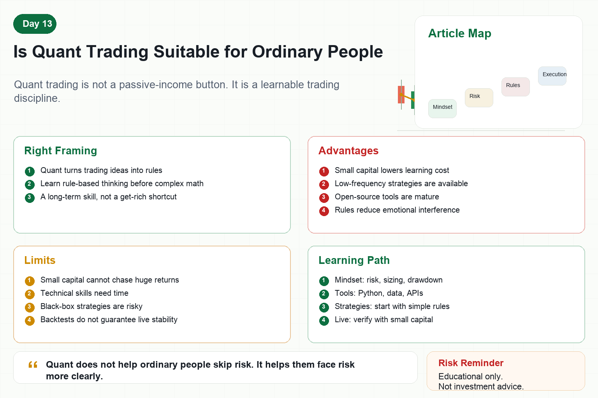

# Is Quant Trading Suitable for Ordinary People

When people hear “quant trading,” they often jump to two extremes.

Some think it is mysterious and only for PhDs or large institutions.

Others think it is easy and that buying a bot means passive income.

Both views are inaccurate.

So is quant trading suitable for ordinary people?

The answer is yes for learning quant thinking, but no for entering live trading with get-rich expectations and oversized positions.

## 1. Quant Is Not Magic

The essence of quant trading is turning trading ideas into rules.

When do you buy?

When do you sell?

How much do you buy?

At what loss do you exit?

What happens after consecutive losses?

If these questions are answered by feeling, it is discretionary trading.

If they are answered by data, rules, and code, it becomes quant trading.

For ordinary people, the first lesson is not complex math.

It is rule-based thinking.

## 2. Advantages Ordinary People Have

First, ordinary people can start small.

Small capital lowers the cost of learning.

Second, they can choose low-frequency strategies.

They do not need to compete with institutions on speed or high-frequency execution.

Third, open-source tools are widely available.

Python, exchange APIs, backtesting frameworks, and data tools are mature enough to learn from.

Fourth, quant rules can reduce emotional interference.

When rules are clear, price swings do not control every decision.

Fifth, quant becomes a long-term skill.

It improves data analysis, automation, and systems thinking beyond trading.

## 3. The Disadvantages Are Real

First, capital is limited.

Do not expect exaggerated returns from small capital in a short time.

Second, data and technical skills may be weak at first.

Many lessons must be learned slowly.

Third, time is fragmented.

Work and life can interrupt learning and system maintenance.

Fourth, beginners may buy black-box strategies.

If you cannot understand the logic, you cannot judge the risk.

Fifth, live trading is harder than backtesting.

A strategy that runs in a backtest may still fail operationally in production.

## 4. Who Is Suitable?

Suitable learners usually share several traits.

They are willing to study long term.

They accept gradual iteration.

They verify with small capital first.

They understand strategies can fail.

They value risk control more than huge returns.

When losses happen, they review instead of immediately chasing a new method.

If you only want an automatic money machine, quant is not suitable.

If you see trading as a system-building process, quant can fit well.

## 5. A Practical Learning Path

Stage one: build trading awareness.

Understand risk, position sizing, drawdown, leverage, and volatility.

Stage two: learn basic tools.

Python, data processing, simple backtesting, and exchange APIs.

Stage three: build simple strategies.

Moving averages, grids, trend following, or fixed allocation rules.

Stage four: test live with small capital.

The goal is system stability, not profit chasing.

Stage five: review and iterate.

Record every error, loss, and reason a strategy failed.

## 6. Quant Does Not Replace Thinking

Many people hope a bot will think for them.

But a bot only executes the rules you put into it.

If the rules are immature, automation only executes mistakes faster.

The real value of quant is that it forces vague ideas to become clear.

You cannot simply say “it feels bullish.”

You must define trend, breakout, stop loss, and pause conditions.

That clarity is the biggest benefit for ordinary learners.

## Conclusion

Can ordinary people do quant trading?

Yes.

But it should be treated as a long-term skill, not a shortcut to quick wealth.

Learn with small capital, use rules to constrain yourself, use systems to reduce emotion, and improve through review.

Remember:

Quant does not help ordinary people skip risk. It helps them face risk more clearly.

> Risk warning: This article is for educational purposes only and does not constitute investment advice. Quant strategies do not guarantee profits, and live trading can result in losses.
