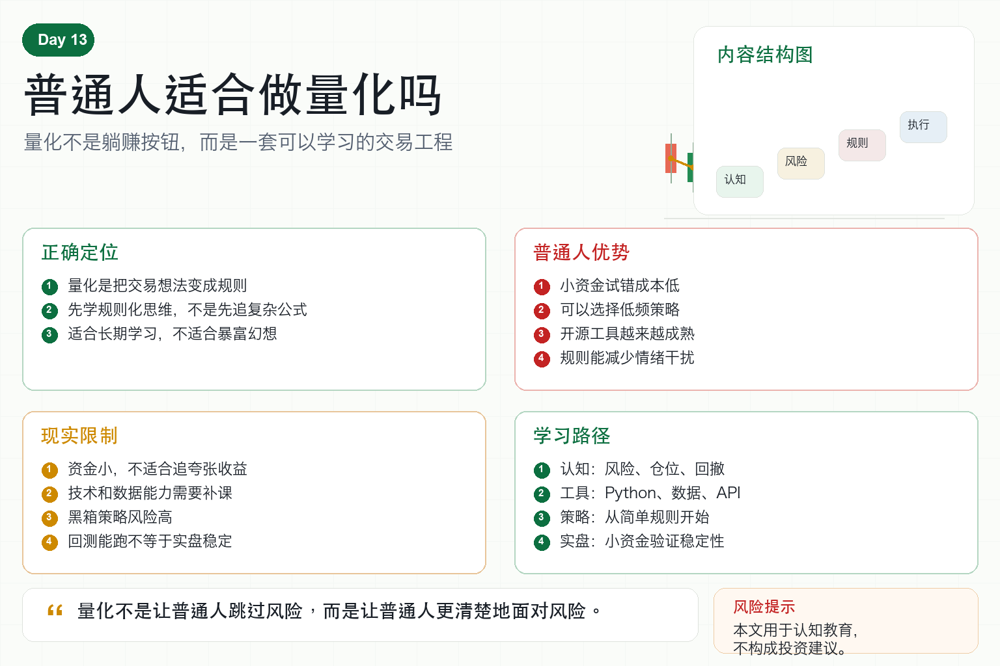

# 普通人适合做量化吗

很多人听到量化交易，会有两种极端想法。

一种人觉得它很神秘，只有数学博士和大机构才能做。

另一种人觉得它很简单，买个机器人就能躺着赚钱。

这两种看法都不准确。

普通人到底适不适合做量化？

答案是：适合学习量化思维，但不适合带着暴富幻想直接实盘重仓。

## 一、量化的本质不是神秘模型

量化交易的本质，是把交易想法变成规则。

什么时候买？

什么时候卖？

买多少？

亏多少退出？

连续亏损怎么办？

这些问题如果靠感觉回答，就是主观交易。

如果用数据、规则和程序回答，就是量化交易。

所以普通人学习量化，首先不是学习复杂公式，而是学习规则化思维。

## 二、普通人的优势在哪里？

第一，普通人可以从小资金开始。

小资金试错成本低，更适合学习。

第二，普通人可以选择低频策略。

不必和机构拼速度，也不必做高频交易。

第三，普通人可以用开源工具。

Python、交易所 API、回测框架和数据工具都越来越成熟。

第四，普通人可以用量化减少情绪干扰。

规则写清楚后，至少不会每天被涨跌牵着走。

第五，普通人可以把量化当长期能力。

它不仅服务交易，也训练数据分析、自动化和系统思维。

## 三、普通人的劣势也很明显

第一，资金规模小。

不要幻想短期靠小本金获得夸张收益。

第二，数据和技术能力有限。

很多坑需要慢慢补课。

第三，时间不连续。

工作、生活都会影响学习和维护系统。

第四，容易购买黑箱策略。

别人说能赚钱，但你看不懂逻辑，也无法判断风险。

第五，容易低估实盘复杂度。

回测能跑，不等于实盘能稳定运行。

## 四、什么样的人适合学量化？

适合的人通常有几个特征。

愿意长期学习；

愿意接受慢慢迭代；

愿意先做小资金验证；

能接受策略会失效；

重视风控胜过暴利；

遇到亏损愿意复盘，而不是马上换方法。

如果你只想找一个自动赚钱机器，量化并不适合你。

如果你愿意把交易当成系统工程，量化很适合你。

## 五、普通人学习量化的正确路径

第一阶段，建立交易认知。

先理解风险、仓位、回撤、杠杆和市场波动。

第二阶段，学习基础工具。

Python、数据处理、简单回测、交易所 API。

第三阶段，做简单策略。

比如均线、网格、趋势跟踪、定投规则。

第四阶段，小资金实盘。

先验证系统稳定性，而不是追求收益。

第五阶段，持续复盘迭代。

记录每一次异常、亏损和策略失效原因。

## 六、量化不是替代思考，而是强化思考

很多人希望机器人替自己赚钱。

但机器人只会执行你写进去的规则。

如果规则本身不成熟，自动化只会更快地执行错误。

量化真正有价值的地方，是逼你把模糊想法变清楚。

你不能只说“感觉要涨”。

你必须定义什么叫趋势、什么叫突破、什么叫止损、什么叫暂停。

这才是普通人学习量化最大的收获。

## 七、结语：普通人可以做，但要慢慢做

普通人适合做量化吗？

适合。

但前提是把它当作长期能力，而不是短期发财工具。

用小资金学习，用规则约束自己，用系统减少情绪，用复盘慢慢进步。

记住一句话：

量化不是让普通人跳过风险，而是让普通人更清楚地面对风险。

> 风险提示：本文仅用于交易认知与风险教育，不构成任何投资建议。量化策略不保证收益，实盘交易存在亏损风险。
