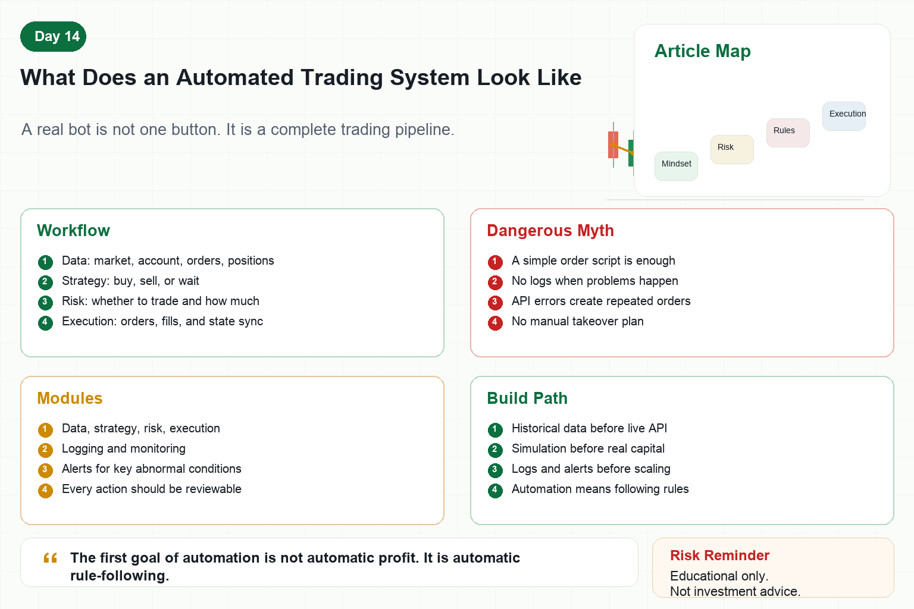

# What Does an Automated Trading System Look Like

Many people think an automated trading system is simply a bot.

Press start, and it buys, sells, and makes money automatically.

A real automated trading system is much more than an order script.

It is a pipeline.

Data comes in, signals are generated, risk checks run, orders are executed, status is synchronized, and monitoring watches for problems.

If you only write a script that can place orders, you do not have a system.

You have a dangerous button.

## 1. The Core Workflow

A basic automated trading system usually has six steps.

First, data collection.

The system needs market data, account data, order data, and position data.

Second, signal calculation.

The strategy decides whether to buy, sell, or wait.

Third, risk checks.

Before any order is sent, the system checks position size, leverage, loss limits, frequency, and account status.

Fourth, order execution.

The system sends instructions to the exchange API.

Fifth, state synchronization.

Was the order filled? Partially filled? Did the position change? The system must know.

Sixth, monitoring and alerts.

When something abnormal happens, the system must notify a human instead of failing silently.

## 2. Why an Order Script Is Not Enough

In live trading, the scariest problems are often not wrong signals.

They are wrong system states.

For example:

Market data is delayed, but the program keeps trading.

An order is not filled, but the system thinks it is.

A position changes, but the bot does not sync it.

An API error causes repeated orders.

The network disconnects without any alert.

The exchange rate limit makes orders fail.

A simple order script cannot handle these situations well.

The real challenge is making the system behave safely during abnormal conditions.

## 3. Basic Modules

First, the data module.

It collects candles, prices, volume, account data, and order information.

Second, the strategy module.

It converts market data into trading signals.

Third, the risk module.

It decides whether a signal can be executed and at what size.

Fourth, the execution module.

It places orders, cancels orders, and checks order status.

Fifth, the logging module.

It records every signal, order, fill, and error.

Sixth, the monitoring module.

It sends alerts through channels such as Telegram, email, or SMS.

## 4. Common Beginner Mistakes

First, no simulation environment.

Testing with real money from the start is expensive.

Second, no logs.

When something goes wrong, there is no evidence.

Third, no error handling.

An API error crashes the program or triggers repeated orders.

Fourth, no risk checks before execution.

Every signal becomes an order without safety validation.

Fifth, no manual takeover plan.

When the system fails, the trader does not know how to stop or recover it.

## 5. The Right Mental Model

Automation does not mean humans stop caring.

It means repetitive, clear, rule-based actions are handled by software.

Humans still design strategies, define risk boundaries, monitor systems, and review results.

A good trading system is like a disciplined executor.

It does not become excited or hopeful.

It follows rules and stops when abnormal conditions appear.

## 6. Building the First System

Step one: do not connect live APIs too early.

Use historical data to test strategy logic first.

Step two: run simulated trading.

Make sure signals, orders, and positions form a closed loop.

Step three: add logs and alerts.

Every important action must be traceable.

Step four: add risk thresholds.

Limit position size, total exposure, losses, and trade frequency.

Step five: test live with small capital.

Verify system stability before scaling.

## Conclusion

What does an automated trading system look like?

It is not a magic button.

It is a complete workflow.

A mature system does not only know when to trade.

It also knows when not to trade.

Remember:

The first goal of automation is not automatic profit. It is automatic rule-following.

> Risk warning: This article is for educational purposes only and does not constitute investment advice. Automated trading can lose money due to code, network, exchange, or strategy failures.
