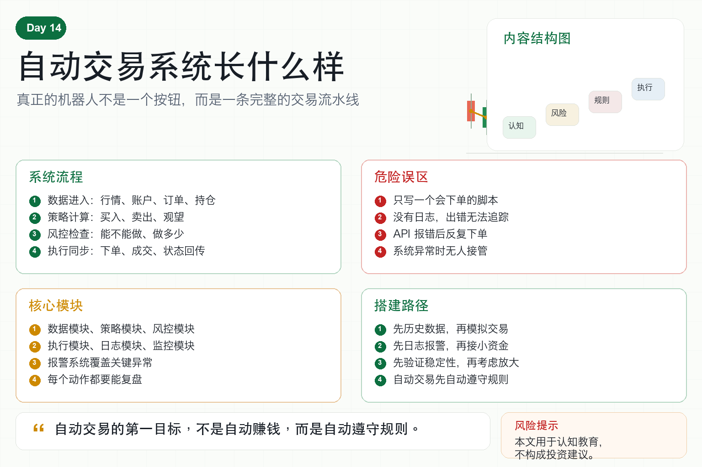

# 自动交易系统长什么样

很多人以为自动交易系统就是一个机器人。

点一下启动，它就自动买卖，自动赚钱。

但真正的自动交易系统，远不止一个下单程序。

它更像一条流水线。

从数据进入，到信号生成，到风控检查，到订单执行，再到监控报警，每一步都必须清楚。

如果只写一个会下单的脚本，那不是系统，只是一个危险的按钮。

## 一、自动交易系统的核心流程

一个最基本的自动交易系统，通常包含六个环节。

第一，数据获取。

系统需要拿到行情数据、账户数据、订单数据和持仓数据。

第二，信号计算。

策略根据规则判断是否买入、卖出或观望。

第三，风控检查。

下单前必须确认仓位、杠杆、亏损、频率和账户状态是否安全。

第四，订单执行。

系统把交易指令发送给交易所 API。

第五，状态同步。

订单是否成交、是否部分成交、持仓是否变化，都要同步回来。

第六，监控报警。

出现异常时，系统必须通知人，而不是悄悄出错。

## 二、为什么不能只写下单脚本？

因为实盘里最可怕的错误，往往不是策略信号错。

而是系统状态错。

比如：

数据延迟了，但程序还在交易；

订单没有成交，但系统以为成交了；

持仓已经变化，但机器人没有同步；

API 报错后程序反复下单；

网络断开后系统没有报警；

交易所限制频率，导致订单失败。

这些问题都不是一个简单下单脚本能处理的。

自动交易真正难的地方，是让系统在异常情况下也不会乱来。

## 三、一个基础系统应该有哪些模块？

第一，数据模块。

负责获取 K 线、价格、成交量、账户和订单信息。

第二，策略模块。

负责把行情转化成交易信号。

第三，风控模块。

负责决定信号能不能执行、执行多少。

第四，执行模块。

负责下单、撤单、查询订单状态。

第五，日志模块。

记录每一次信号、下单、成交和异常。

第六，监控模块。

发现异常后发送提醒，比如 Telegram、邮件或短信。

## 四、新手做自动交易最常见的坑

第一，没有模拟环境。

一开始就用真钱测试，成本太高。

第二，没有日志。

出问题后不知道发生了什么。

第三，没有异常处理。

API 一报错，程序就崩溃或反复下单。

第四，没有风控前置。

策略一有信号就下单，没有任何安全检查。

第五，没有人工接管方案。

系统出问题时，不知道如何停止和恢复。

## 五、量化系统的正确思路

自动交易不是为了让人完全不用管。

而是把重复、明确、可规则化的动作交给程序。

人仍然要负责策略设计、风险边界、系统监控和复盘迭代。

一个好的自动交易系统，应该像一名纪律严格的执行员。

它不会冲动，也不会幻想。

它只按照规则做事，并在异常时及时停下来。

## 六、普通人如何搭建第一套系统？

第一步，不要急着接实盘 API。

先用历史数据跑通策略逻辑。

第二步，做模拟交易。

确认信号、订单和持仓状态能闭环。

第三步，加日志和报警。

任何关键动作都要可追踪。

第四步，加风控阈值。

限制单笔仓位、总仓位、亏损和交易频率。

第五步，小资金实盘。

先验证系统稳定性，再考虑放大。

## 七、结语：自动交易先自动控制风险

自动交易系统长什么样？

它不是一个神奇按钮，而是一套完整流程。

真正成熟的系统，不只是会买卖，更知道什么时候不能买卖。

记住一句话：

自动交易的第一目标，不是自动赚钱，而是自动遵守规则。

> 风险提示：本文仅用于交易认知与风险教育，不构成任何投资建议。自动交易系统可能因代码、网络、交易所或策略问题产生亏损。
