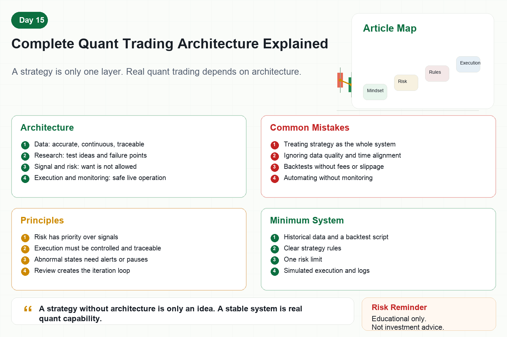

# Complete Quant Trading Architecture Explained

When people talk about quant trading, they often think of strategies first.

Moving averages, grids, arbitrage, AI strategies.

But anyone who has traded live knows that a strategy is only one part of the system.

A complete quant architecture must answer several questions.

Where does data come from?

How is the strategy validated?

How are orders executed safely?

How are failures detected and recovered from?

Without answers, even a beautiful strategy may not run reliably.

## 1. Data Layer

The data layer is the foundation.

It includes candles, trades, order books, funding rates, account data, orders, and positions.

The most important quality is not volume.

It is accuracy, continuity, and traceability.

If data is missing, misaligned, or abnormal, strategy research and backtesting become polluted.

Many profitable-looking strategies are illusions created by bad data.

The data layer must handle deduplication, missing values, time alignment, outliers, storage, and versioning.

## 2. Research and Backtesting Layer

The research layer turns trading ideas into testable strategies.

You cannot only say “this indicator seems useful.”

You must test with historical data.

When does it enter?

When does it exit?

How are fees and slippage modeled?

What is the maximum drawdown?

How does it behave in different market regimes?

The goal of backtesting is not to prove guaranteed profit.

It is to discover where the strategy may fail.

## 3. Signal and Risk Layer

The signal layer tells the system whether it wants to trade.

The risk layer tells the system whether it is allowed to trade.

These layers must be separate.

A buy signal does not automatically mean a buy order should be placed.

If account drawdown is too high, exposure is too large, volatility is abnormal, or the API is unhealthy, the risk layer can reject the trade.

In mature systems, risk has priority over signals.

## 4. Execution Layer

The execution layer turns trading instructions into real orders.

It handles limit orders, market orders, cancellations, chasing orders, partial fills, and failed retries.

It also handles exchange rate limits, network latency, and order-state synchronization.

Many systems fail not because of strategy logic but because of execution details.

The goal is not simply to place orders fast.

It is to place them reliably, controllably, and traceably.

## 5. Monitoring and Operations Layer

Live systems must be monitored.

Monitoring should track:

Is market data updating?

Is the account abnormal?

Are orders stuck?

Has the strategy stopped?

Is the server online?

Has loss exceeded the threshold?

When abnormal conditions happen, the system should alert humans and, if necessary, reduce size or pause.

Automated trading without monitoring is risk inside a black box.

## 6. Review and Iteration Layer

Quant trading is not finished after the first version.

Every trade, error, loss, and strategy failure should enter the review process.

The review should ask:

Did the loss come from normal volatility or flawed rules?

Did the error come from the exchange or from code?

Should the strategy reduce frequency, reduce size, or be retired?

A system becomes stronger only when review forms a closed loop.

## 7. How Beginners Should Think About Architecture

Beginners do not need a complex system on day one.

But they should know what a complete system looks like.

A minimal version can include:

A historical data file.

A backtest script.

A clear strategy rule set.

A risk limit.

A simulated execution process.

A log file.

Starting with a small architecture and adding modules gradually is more reliable than chasing complex strategies immediately.

## Conclusion

A complete quant architecture is not for appearance.

It helps a strategy survive the real world.

The strategy finds opportunity.

The architecture handles risk, abnormal conditions, and execution.

Remember:

A strategy without architecture is only an idea. A stable system is real quant capability.

> Risk warning: This article is for educational purposes only and does not constitute investment advice. Quant systems can lose money due to data, strategy, execution, or market risks.
