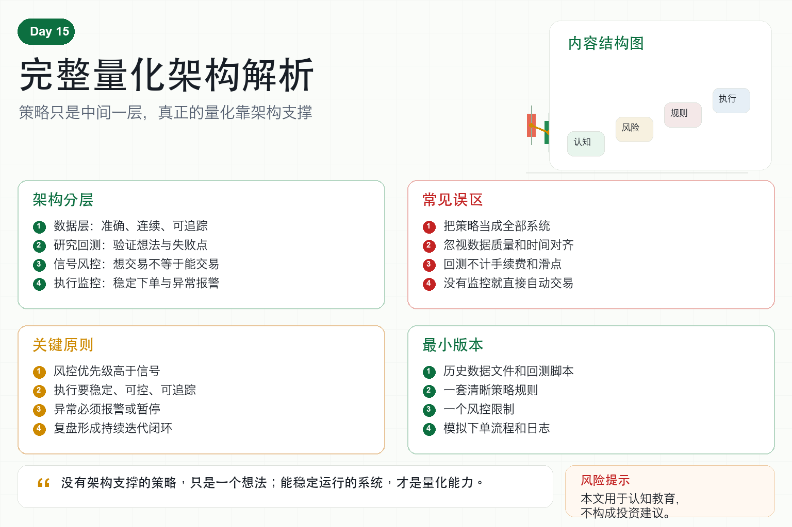

# 完整量化架构解析

很多人提到量化，第一反应就是策略。

均线策略、网格策略、套利策略、AI 策略。

但真正做过实盘的人都知道，策略只是量化系统的一部分。

一个完整的量化架构，至少要回答四个问题：

数据从哪里来？

策略如何验证？

订单如何安全执行？

系统出问题如何发现和恢复？

如果这些问题没有答案，策略再漂亮也很难稳定运行。

## 一、第一层：数据层

数据层是量化系统的地基。

它包括 K 线、成交、订单簿、资金费率、账户、订单和持仓等数据。

数据层最重要的不是多，而是准确、连续、可追踪。

如果数据缺失、时间错位、价格异常，后面的策略和回测都会被污染。

很多策略看起来赚钱，其实是数据质量问题造成的幻觉。

所以数据层必须处理：

去重、补缺、时间统一、异常值、存储和版本管理。

## 二、第二层：研究与回测层

研究层负责把交易想法变成可验证的策略。

你不能只说“这个指标好像有用”。

你要用历史数据测试：

什么时候入场？

什么时候出场？

手续费和滑点怎么算？

最大回撤是多少？

不同市场环境下表现如何？

回测层的目标不是证明策略一定赚钱，而是发现策略可能在哪里失败。

## 三、第三层：信号与风控层

信号层负责告诉系统要不要交易。

风控层负责告诉系统能不能交易。

这两层必须分开。

策略有买入信号，不代表一定能买。

如果账户回撤过大、单币种仓位过高、波动率异常、API 状态异常，风控层可以拒绝交易。

成熟系统里，风控的优先级永远高于信号。

## 四、第四层：执行层

执行层负责把交易指令变成真实订单。

它要处理限价单、市价单、撤单、追单、部分成交和失败重试。

还要处理交易所 API 限流、网络延迟、订单状态不同步等问题。

很多量化系统不是死在策略上，而是死在执行细节上。

执行层的目标不是下单越快越好，而是下单稳定、可控、可追踪。

## 五、第五层：监控与运维层

实盘系统必须被监控。

监控内容包括：

行情是否更新；

账户是否异常；

订单是否卡住；

策略是否停止；

服务器是否在线；

亏损是否超过阈值。

一旦异常发生，系统要报警，必要时自动降仓或暂停。

没有监控的自动交易，本质上是在黑箱里冒险。

## 六、第六层：复盘与迭代层

量化不是一次写完就结束。

每一次交易、异常、亏损和策略失效，都应该进入复盘流程。

复盘要回答：

亏损来自正常波动，还是规则错误？

异常来自交易所，还是代码问题？

策略是否需要降频、降仓或退出？

只有形成复盘闭环，系统才会越来越稳。

## 七、普通人如何理解完整架构？

普通人不需要一开始就做复杂系统。

但必须知道完整系统长什么样。

最小版本可以很简单：

历史数据文件；

一个回测脚本；

一套策略规则；

一个风控限制；

一个模拟下单流程；

一份日志记录。

从小架构开始，逐步补齐模块，比直接追求复杂策略更靠谱。

## 八、结语：架构决定策略能走多远

完整量化架构不是为了显得专业。

它是为了让策略在真实世界里活下来。

策略负责寻找机会，架构负责处理风险、异常和执行。

记住一句话：

没有架构支撑的策略，只是一个想法；能稳定运行的系统，才是量化能力。

> 风险提示：本文仅用于交易认知与风险教育，不构成任何投资建议。任何量化系统都可能因数据、策略、执行或市场风险产生亏损。
