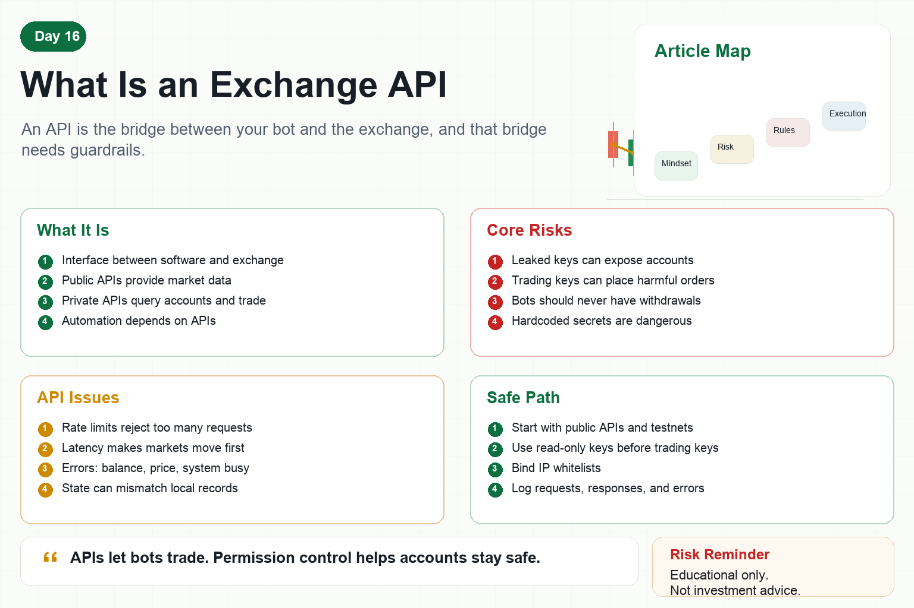

# What Is an Exchange API

When learning crypto quant trading, you will eventually meet the term API.

Many beginners hear it and think it is highly technical and distant.

It is not mysterious.

An exchange API is an interface provided by the exchange for programs.

Humans trade by clicking buttons on a website or app.

Bots use APIs to read market data, check accounts, and send orders.

If you want automated trading, APIs are unavoidable infrastructure.

## 1. What Is an API?

An API is a predefined way for software to communicate.

Your program sends requests in the format required by the exchange, and the exchange returns results.

For example:

Request the current Bitcoin price.

Request the latest 100 candles.

Check account balance.

Submit a buy order.

Cancel an open order.

A human can do these actions through a web interface.

A program can do them through an API.

## 2. Public and Private APIs

Exchange APIs usually have two categories.

The first is public API.

It does not require login or keys.

It is used for market data such as prices, candles, trades, and order books.

The second is private API.

It requires an API key and secret.

It is used to check accounts, read positions, place orders, and cancel orders.

Public APIs are about data.

Private APIs are about account security.

Private APIs require extra caution.

## 3. What Is an API Key?

An API key is like a key given to your program.

The exchange uses it to identify who is making the request.

The secret is used to sign requests and prove that the request comes from an authorized program.

Many exchanges allow permissions such as:

Read-only access.

Spot trading.

Futures trading.

Withdrawal permission.

IP whitelist.

For trading bots, the rule is simple.

Grant only the minimum permission needed for the task.

## 4. Why Permissions Matter

If an API key leaks, someone may operate your account.

If a read-only key leaks, they may only see data.

If a trading key leaks, they may place harmful orders.

If a withdrawal key leaks, the consequences can be far worse.

A trading bot should never have withdrawal permission.

It is also better to bind IP whitelists, rotate keys, and avoid hardcoding keys in source code.

Security is not something to consider later.

It starts on the first day you use APIs.

## 5. Common API Problems

First, rate limits.

Exchanges do not allow unlimited requests. Too many requests can be rejected.

Second, latency.

Requests and responses take time, and markets may move faster than your program.

Third, error codes.

Insufficient balance, invalid price, missing order, or system busy errors may occur.

Fourth, state mismatch.

An order may be filled on the exchange while your local program has not updated yet.

Fifth, API changes.

The exchange may upgrade endpoints, and old code may need changes.

Quant systems must handle these issues.

## 6. How Beginners Can Learn Safely

First, start with public APIs.

Read market data without touching funds.

Second, use a testnet or simulated environment.

Do not connect a real account immediately.

Third, create a read-only key.

Practice checking account and position data.

Fourth, use a small-permission trading key.

Bind it to a small account, restrict IP, and never enable withdrawals.

Fifth, log every request and error.

Only then can problems be reviewed.

## Conclusion

Exchange APIs are the entry point to quant trading.

They let programs connect to markets, but they also connect program mistakes directly to your account.

So learning APIs is not only about placing orders.

It is also about permissions, security, rate limits, and error handling.

Remember:

APIs let bots trade. Permission control helps accounts stay safe.

> Risk warning: This article is for educational and technical purposes only and does not constitute investment advice. Exchange APIs can cause losses due to permissions, code, network, or exchange failures.
