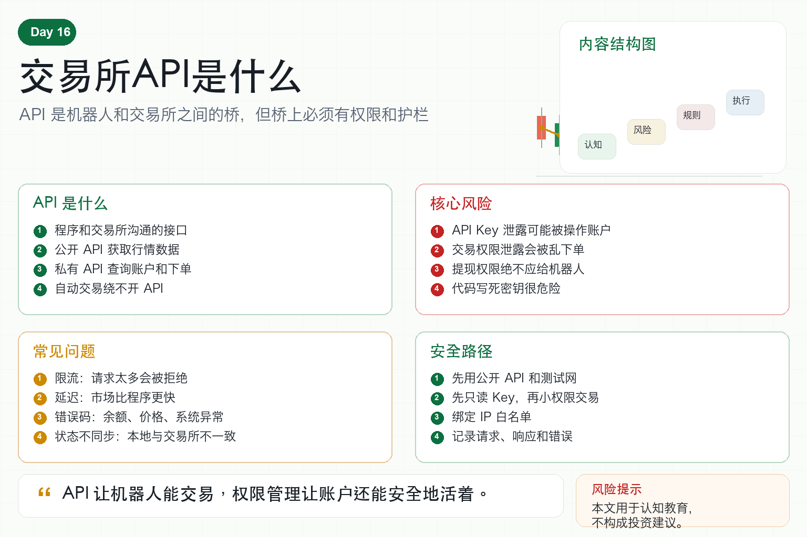

# 交易所API是什么

学习数字货币量化，迟早会遇到一个词：API。

很多新手一听 API，就觉得很技术、很遥远。

其实它并不神秘。

交易所 API，就是交易所提供给程序使用的接口。

人通过网页或 App 点按钮交易。

机器人通过 API 读取行情、查询账户、发送订单。

如果你想做自动交易，API 是绕不开的基础设施。

## 一、API 到底是什么？

API 可以理解为一套约定好的沟通方式。

程序按照交易所规定的格式发出请求，交易所返回对应结果。

比如：

请求 BTC 当前价格；

请求最近 100 根 K 线；

查询账户余额；

提交买入订单；

撤销未成交订单。

这些动作，人可以在网页上点，程序也可以通过 API 做。

## 二、公开 API 和私有 API

交易所 API 通常分为两类。

第一类是公开 API。

它不需要登录，也不需要密钥。

主要用于获取行情数据，比如价格、K 线、成交、订单簿。

第二类是私有 API。

它需要 API Key 和 Secret。

主要用于查询账户、读取持仓、下单、撤单等操作。

公开 API 关系到数据。

私有 API 关系到账户安全。

所以私有 API 必须格外谨慎。

## 三、API Key 是什么？

API Key 就像给程序的一把钥匙。

交易所用它识别是谁在请求。

Secret 用来签名，证明请求确实来自你授权的程序。

有些交易所还允许设置权限，比如：

只读权限；

现货交易权限；

合约交易权限；

提现权限；

IP 白名单。

对交易机器人来说，原则很简单：只给它完成任务所需的最小权限。

## 四、为什么 API 权限很重要？

因为一旦 API Key 泄露，别人可能操作你的账户。

如果只读 Key 泄露，别人最多看到数据。

如果交易权限泄露，别人可能乱下单。

如果提现权限泄露，后果可能更严重。

所以交易机器人绝对不应该开提现权限。

并且最好绑定 IP 白名单、定期更换 Key、不要把 Key 写死在代码里。

安全不是以后再说的事。

从第一天接触 API 就要重视。

## 五、API 还会遇到哪些问题？

第一，限流。

交易所不允许程序无限请求，超过频率会被拒绝。

第二，延迟。

请求和返回需要时间，行情变化可能比程序更快。

第三，错误码。

余额不足、价格不合法、订单不存在、系统繁忙，都可能返回错误。

第四，状态不同步。

订单在交易所已经成交，但本地程序还没更新。

第五，接口变更。

交易所升级 API，旧代码可能需要修改。

量化系统必须为这些问题做处理。

## 六、新手如何安全学习 API？

第一，先用公开 API。

读取行情，不涉及账户资金。

第二，使用模拟盘或测试网。

不要一开始就连接真实账户。

第三，创建只读 Key。

先练习查询账户和持仓。

第四，再开小权限交易 Key。

只绑定小资金账户，限制 IP，不开提现。

第五，记录所有请求和错误。

出现问题才能复盘。

## 七、结语：API 是工具，不是魔法

交易所 API 是量化交易的入口。

它让程序可以连接市场，但也把程序错误直接连接到账户。

所以学习 API，不能只学怎么下单，也要学权限、安全、限流和异常处理。

记住一句话：

API 让机器人能交易，权限管理让账户还能安全地活着。

> 风险提示：本文仅用于交易认知与技术教育，不构成任何投资建议。使用交易所 API 可能因权限、代码、网络或交易所异常造成损失。
