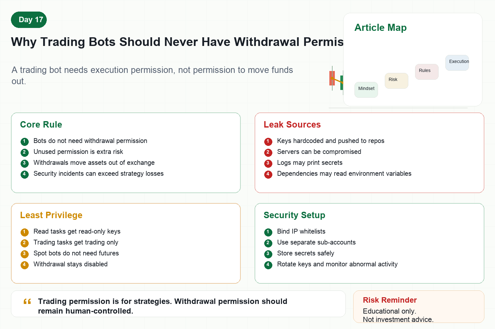

# Why Trading Bots Should Never Have Withdrawal Permission

When setting up automated trading, many people create API keys on exchanges.

During creation, the exchange usually asks which permissions to enable.

Read, trade, futures, withdrawal.

Some beginners select everything for convenience.

That is extremely dangerous.

Why should a trading bot never have withdrawal permission?

Because it does not need it.

A bot that trades needs market data, account queries, order placement, and order cancellation.

It does not need to move funds out of the exchange.

Any permission that is not needed becomes extra risk.

## 1. What Withdrawal Permission Means

Withdrawal permission allows an API to transfer assets out of the exchange account.

This is very different from trading permission.

Trading permission operates assets inside the account.

Withdrawal permission can move assets to external addresses.

If an API key leaks while withdrawal is enabled, an attacker may transfer funds away.

That is not a strategy loss or trading mistake.

It is a security incident.

## 2. Why Bots Do Not Need Withdrawals

A trading bot executes a trading strategy.

It needs to:

Read market data.

Check balances.

Read positions.

Submit orders.

Cancel orders.

Synchronize fills.

None of these actions require withdrawal permission.

Fund transfers should be manually confirmed by humans, preferably with multiple layers of verification.

Giving withdrawal permission to a bot is like giving a script the key to the vault.

The risk is much greater than the convenience.

## 3. How API Keys Can Leak

First, code leaks.

Hardcoding keys and pushing code to GitHub is a common accident.

Second, server compromise.

Weak server security can expose secrets.

Third, log leaks.

Some programs accidentally print secrets into logs.

Fourth, dependency risk.

Malicious or compromised libraries may read environment variables.

Fifth, local malware.

Configuration files stored on a computer can be stolen.

As long as a key can leak, it should not have unnecessary high permissions.

## 4. Principle of Least Privilege

Security has a key principle: least privilege.

A program should only have the minimum permissions required to perform its task.

Trading bots are no exception.

If the program only reads data, grant read-only permission.

If it needs to place orders, grant trading permission only.

If it only trades spot, do not enable futures.

If it runs on one server, bind the key to that server IP.

Withdrawal permission should be off by default.

## 5. What Else Should Be Done?

First, use an IP whitelist.

Only specified servers should be able to use the key.

Second, use a separate sub-account.

The bot should manage limited capital, not all assets.

Third, store secrets in environment variables or a secrets manager.

Do not hardcode them in source code.

Fourth, rotate API keys periodically.

Long-lived keys accumulate risk.

Fifth, monitor abnormal orders and login alerts.

If something looks wrong, freeze or delete the key quickly.

## 6. Permission Design in Quant Systems

Mature systems separate permissions.

Data services use read-only keys.

Trading services use trading keys.

Fund transfers use manual processes.

Different strategies may use different accounts or keys.

This way, if one module fails, it does not endanger all funds.

Permission isolation is a foundation of quant system security.

## Conclusion

Many people care about strategy return but ignore account security.

One security incident can be more serious than one strategy loss.

Bots should not have withdrawal permission, not because programs are evil, but because professional systems never give unnecessary power to any program.

Remember:

Trading permission is for executing strategies. Withdrawal permission should remain with confirmed human action.

> Risk warning: This article is for educational and security purposes only and does not constitute investment advice. Manage API permissions and secrets carefully to reduce asset security risk.
