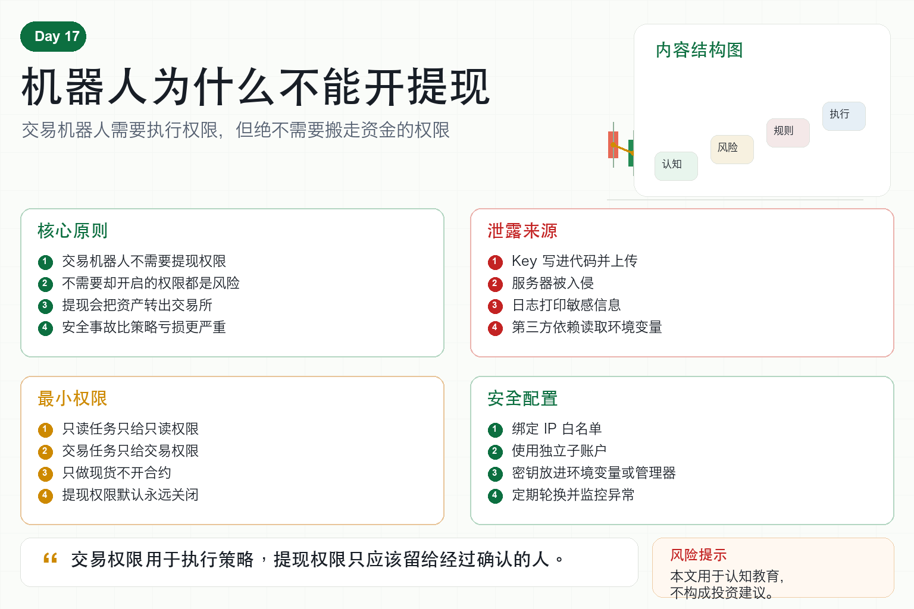

# 机器人为什么不能开提现

做自动交易时，很多人会在交易所创建 API Key。

创建时，交易所通常会让你选择权限。

读取、交易、合约、提现。

有些新手为了省事，直接全部勾选。

这是非常危险的做法。

交易机器人为什么不能开提现权限？

因为它根本不需要。

一个只负责交易的程序，需要的是读取行情、查询账户、下单和撤单。

它不需要把资金转出交易所。

凡是“不需要却开了”的权限，都是额外风险。

## 一、提现权限意味着什么？

提现权限，就是允许 API 把账户里的资产转出交易所。

这和买卖权限完全不同。

买卖权限最多是在账户内部操作资产。

提现权限则可能把资产转到外部地址。

一旦 API Key 泄露，并且开启了提现权限，攻击者可能直接转走资金。

这不是策略亏损，也不是交易失败。

这是安全事故。

## 二、机器人为什么不需要提现？

交易机器人负责的是执行交易策略。

它需要：

读取行情；

查询余额；

查看持仓；

提交订单；

撤销订单；

同步成交。

这些动作不需要提现权限。

资金转出应该由人手动确认，并且最好经过多重验证。

让机器人拥有提现权限，就像让一个自动脚本拿着金库钥匙到处跑。

风险远大于便利。

## 三、API Key 可能如何泄露？

第一，代码泄露。

把 Key 写进代码，再上传到 GitHub，是常见事故。

第二，服务器被入侵。

如果服务器安全薄弱，密钥可能被读取。

第三，日志泄露。

有些程序错误地把密钥打印到日志里。

第四，依赖包风险。

恶意或被污染的第三方库可能读取环境变量。

第五，电脑中毒。

本地保存的配置文件也可能被窃取。

只要 Key 有机会泄露，就不能给它不必要的高权限。

## 四、最小权限原则

安全里有一个非常重要的原则：最小权限。

意思是：一个程序只应该拥有完成任务所需的最低权限。

交易机器人也是一样。

如果只需要读取数据，就只给只读权限。

如果需要下单，就只给交易权限。

如果只做现货，就不要开合约权限。

如果只在一台服务器运行，就绑定这台服务器的 IP。

提现权限，默认永远关闭。

## 五、除了关闭提现，还要做什么？

第一，使用 IP 白名单。

只有指定服务器可以使用 API Key。

第二，使用独立子账户。

机器人只管理小资金账户，不接触全部资产。

第三，把密钥放在环境变量或密钥管理器里。

不要写进代码。

第四，定期轮换 API Key。

长期不换的 Key 风险会累积。

第五，监控异常订单和登录提醒。

发现异常要能快速冻结或删除 Key。

## 六、量化系统的权限设计

成熟系统会把权限分层。

数据服务使用只读 Key。

交易服务使用交易 Key。

资金转移由人工流程处理。

不同策略使用不同账户或不同 Key。

这样即使一个模块出问题，也不会影响全部资金。

权限隔离，是量化系统安全的基础。

## 七、结语：安全不是小事

很多人重视策略收益，却忽视账户安全。

但一次安全事故，可能比一次策略亏损更严重。

机器人不能开提现，不是因为我们不相信程序。

而是因为专业系统从来不把不必要的权限交给任何程序。

记住一句话：

交易权限用于执行策略，提现权限只应该留给经过确认的人。

> 风险提示：本文仅用于交易认知与安全教育，不构成任何投资建议。使用 API 时请谨慎管理权限和密钥，避免资产安全风险。
