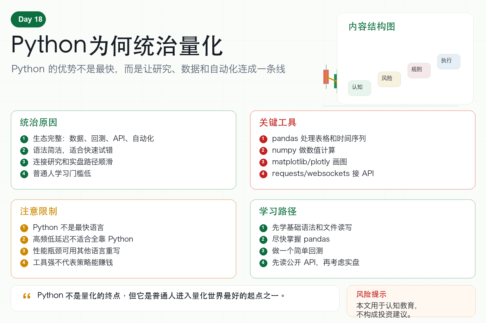

# Python为何统治量化

学习量化交易，很多人第一个问题是：用什么语言？

答案通常是 Python。

这不是因为 Python 在所有方面都最强。

也不是因为 Python 运行速度最快。

Python 之所以统治量化，是因为它把数据分析、策略研究、回测、接口调用和自动化连接得非常顺。

对个人学习者来说，这一点尤其重要。

## 一、Python 最大的优势是生态

量化交易需要处理很多事情。

读取数据、清洗数据、计算指标、画图、回测、机器学习、连接 API、写自动化脚本。

Python 在这些方面都有成熟工具。

比如：

pandas 用来处理表格和时间序列；

numpy 用来做数值计算；

matplotlib 和 plotly 用来画图；

scikit-learn 用来做机器学习；

requests 和 websockets 用来连接 API；

各种回测框架用来验证策略。

生态越完整，学习者越容易把想法快速变成实验。

## 二、Python 适合策略研究

量化研究需要大量试错。

你会不断尝试不同参数、不同指标、不同过滤条件。

Python 写起来简洁，修改快，反馈快。

这对研究非常重要。

如果每次改一个想法都要写很多工程代码，研究效率会很低。

Python 的优势，就是让你把注意力放在策略逻辑和数据结果上。

## 三、Python 适合数据分析

量化本质上离不开数据。

价格、成交量、资金费率、订单簿、账户净值、交易记录，都需要分析。

Python 的数据工具非常强。

你可以很方便地计算收益率、回撤、波动率、相关性、胜率和盈亏比。

也可以快速画出净值曲线、K 线图、分布图和热力图。

数据看得越清楚，策略幻想越少。

## 四、Python 也适合自动化

Python 不只适合研究，也适合写自动化脚本。

它可以定时获取行情，运行策略，发送订单，记录日志，推送报警。

很多交易所 SDK 和 API 示例也优先支持 Python。

这让新手从研究走向实盘更顺滑。

先用 Python 做回测，再用 Python 接 API，再用 Python 做监控，是非常自然的路径。

## 五、Python 的缺点是什么？

Python 不是完美的。

它的运行速度不如 C++、Rust、Go 这类语言。

在高频交易、极低延迟场景下，Python 可能不适合做核心执行引擎。

但大多数个人量化学习者，并不需要从高频开始。

低频策略、日内策略、网格、趋势、套利研究，Python 已经足够。

如果未来真的遇到性能瓶颈，也可以把关键模块用更快的语言重写。

## 六、新手应该怎么学 Python 量化？

第一，不要一开始追求复杂语法。

先学变量、函数、列表、字典、文件读写。

第二，尽快学习 pandas。

量化数据大部分是表格和时间序列。

第三，做一个简单回测。

比如均线交叉策略。

第四，学会画图。

图能帮助你发现策略问题。

第五，接一个公开 API。

先读取行情，不要急着下单。

第六，写日志和配置文件。

这是从脚本走向系统的开始。

## 七、结语：工具服务于系统

Python 统治量化，不是因为它神奇。

而是因为它足够简单、生态足够强、连接能力足够好。

它让普通人可以从一个小想法开始，逐步走向数据、回测和自动化。

记住一句话：

Python 不是量化的终点，但它是普通人进入量化世界最好的起点之一。

> 风险提示：本文仅用于交易认知与技术教育，不构成任何投资建议。编程工具不能保证策略盈利，实盘交易仍存在亏损风险。
