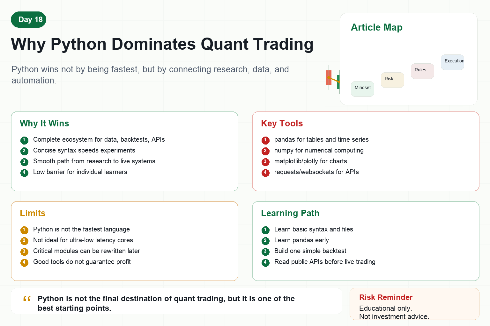

# Why Python Dominates Quant Trading

When learning quant trading, many people first ask: which programming language should I use?

The usual answer is Python.

Not because Python is best at everything.

Not because Python is the fastest language.

Python dominates quant trading because it connects data analysis, strategy research, backtesting, API access, and automation smoothly.

For individual learners, that matters a lot.

## 1. Python's Biggest Advantage Is Ecosystem

Quant trading involves many tasks.

Reading data, cleaning data, calculating indicators, plotting charts, backtesting, machine learning, connecting APIs, and writing automation scripts.

Python has mature tools for all of these.

For example:

pandas handles tables and time series.

numpy handles numerical computing.

matplotlib and plotly create charts.

scikit-learn supports machine learning.

requests and websockets connect APIs.

Backtesting frameworks help test strategies.

The more complete the ecosystem, the easier it is to turn ideas into experiments.

## 2. Python Fits Strategy Research

Quant research requires many iterations.

You will try different parameters, indicators, filters, and market conditions.

Python is concise, easy to modify, and fast to experiment with.

That is important for research.

If every idea required heavy engineering work, research speed would suffer.

Python helps you focus on strategy logic and data results.

## 3. Python Fits Data Analysis

Quant trading depends on data.

Prices, volume, funding rates, order books, account equity, and trade records all need analysis.

Python's data tools are strong.

You can calculate returns, drawdowns, volatility, correlation, win rate, and reward-risk ratio.

You can quickly plot equity curves, candles, distributions, and heatmaps.

The clearer the data, the fewer fantasies remain.

## 4. Python Fits Automation

Python is useful beyond research.

It can fetch data on schedule, run strategies, send orders, record logs, and push alerts.

Many exchange SDKs and API examples support Python first.

This makes the path from research to live testing smoother.

Backtest with Python, connect APIs with Python, and monitor with Python is a natural progression.

## 5. Python's Weaknesses

Python is not perfect.

It is slower than languages such as C++, Rust, or Go.

For high-frequency trading and ultra-low-latency systems, Python may not be suitable as the core execution engine.

But most individual learners do not need to start with high frequency.

Low-frequency strategies, intraday systems, grids, trend following, and arbitrage research are usually fine with Python.

If performance becomes a real bottleneck later, critical modules can be rewritten in faster languages.

## 6. How Beginners Should Learn Python for Quant

First, do not start with complex syntax.

Learn variables, functions, lists, dictionaries, and file handling.

Second, learn pandas early.

Most quant data is tabular or time-series data.

Third, build a simple backtest.

A moving-average crossover is enough.

Fourth, learn plotting.

Charts help reveal strategy problems.

Fifth, connect a public API.

Read market data before placing orders.

Sixth, write logs and configuration files.

That is the beginning of moving from scripts to systems.

## Conclusion

Python dominates quant trading not because it is magic.

It is simple enough, has a powerful ecosystem, and connects many tasks well.

It lets ordinary learners start with a small idea and gradually move toward data, backtesting, and automation.

Remember:

Python is not the final destination of quant trading, but it is one of the best starting points.

> Risk warning: This article is for educational and technical purposes only and does not constitute investment advice. Programming tools do not guarantee strategy profits, and live trading can lose money.
