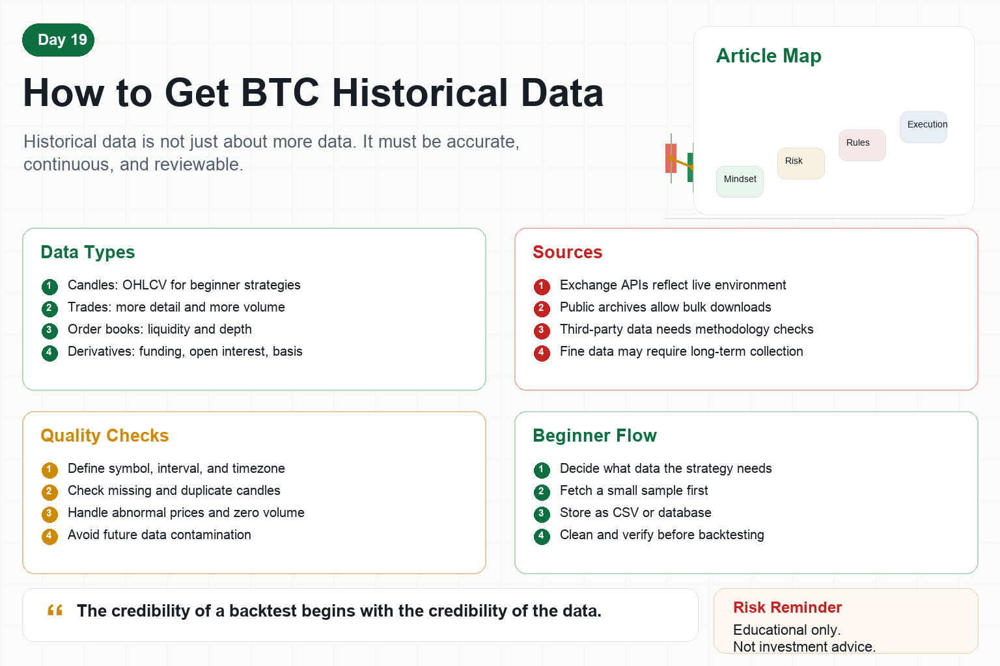

# How to Get BTC Historical Data

When starting quant trading, many people ask: where can I get Bitcoin historical data?

Without data, you cannot backtest.

Without backtesting, you cannot know how a strategy behaved in the past.

But getting historical data is not just downloading a file.

You need to know what data you need, where it comes from, how to clean it, how to store it, and how to check its quality.

If the data is dirty, strategy results are not trustworthy.

## 1. Types of Bitcoin Historical Data

The most common type is candlestick data.

It includes open, high, low, close, and volume, also called OHLCV.

Candles are enough for many beginner strategies such as moving averages, trend following, grids, and volatility analysis.

The second type is trade data.

It records each executed trade price and size. It is more detailed but much larger.

The third type is order book data.

It shows bid and ask depth and is useful for studying liquidity and market microstructure.

The fourth type is derivatives data.

Funding rates, open interest, liquidation data, and basis are examples.

Different strategies need different data.

Do not chase all data at the beginning.

## 2. Where to Get Data

First, exchange APIs.

This is the most common source, such as historical BTC/USDT candles.

The advantage is that it is close to the real trading environment.

The disadvantage is rate limits and possible limits on historical depth.

Second, exchange public data archives.

Some exchanges provide bulk downloadable files.

Third, third-party data platforms.

They may be cleaner, but you must understand their methodology and cost.

Fourth, collect data yourself over time.

If you need detailed data such as order books, long-term collection should start early.

## 3. What to Watch When Getting Candles

First, define the symbol clearly.

BTC/USDT, BTC/USD, spot, and perpetual futures are not the same.

Second, define the interval.

One minute, five minutes, one hour, and one day can lead to different strategy results.

Third, unify time zones.

Using UTC timestamps helps avoid misalignment.

Fourth, check missing candles.

If candles are missing, indicators may be wrong.

Fifth, remove duplicates.

Duplicate rows can distort backtests.

## 4. Why Cleaning Matters

Many backtest problems come from data, not strategy logic.

Examples include:

Abnormal price spikes.

Zero volume.

Incorrect time ordering.

Duplicate candles.

Mixing prices from different exchanges.

Accidentally using future data.

These issues can make a strategy look better than it is.

Every dataset should go through quality checks before backtesting.

## 5. Beginner Data Workflow

Step one: decide what data the strategy needs.

For a moving-average strategy, one-hour or daily candles may be enough.

Step two: fetch a small sample from a public exchange API.

Make the process work before downloading too much.

Step three: store the data as CSV or in a database.

File names should include symbol, interval, and source.

Step four: check missing values, duplicates, and anomalies.

Step five: run the backtest.

Do not mix data collection and strategy evaluation into one unclear process.

## 6. How Quant Systems Manage Data

Mature systems treat data as an asset.

They record source, download time, interval, symbol, cleaning rules, and version.

If a backtest result looks good, you must know exactly which dataset produced it.

Otherwise, you cannot reproduce the result or judge whether the strategy is valid.

Reproducible data is a basic requirement of quant research.

## Conclusion

Bitcoin historical data is not hard to obtain.

The harder part is making sure it is accurate, continuous, and reviewable.

Beginners should not start with the most complex data.

First, get candle data correctly, check it carefully, and store it well.

Remember:

The credibility of a backtest begins with the credibility of the data.

> Risk warning: This article is for educational and technical purposes only and does not constitute investment advice. Historical data does not guarantee future performance, and live trading can lose money.
