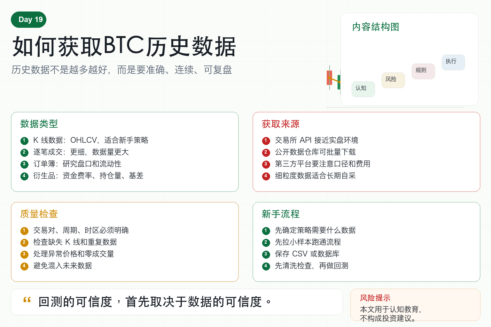

# 如何获取BTC历史数据

做量化第一步，很多人会问：BTC 历史数据从哪里来？

没有数据，就无法回测。

没有回测，就不知道策略过去表现如何。

但获取历史数据不是简单下载一个文件就结束。

你需要知道要什么数据、从哪里拿、怎么清洗、怎么保存、怎么检查质量。

数据不干净，策略结果就不可信。

## 一、BTC 历史数据有哪些类型？

最常见的是 K 线数据。

它包含开盘价、最高价、最低价、收盘价和成交量，也叫 OHLCV。

K 线适合大多数新手策略，比如均线、趋势、网格和波动率分析。

第二类是逐笔成交数据。

它记录每一笔成交价格和数量，更细，但数据量更大。

第三类是订单簿数据。

它显示买卖盘深度，适合研究盘口和流动性。

第四类是衍生品数据。

比如资金费率、持仓量、爆仓数据、基差等。

不同策略需要不同数据，不要一开始就追求全部。

## 二、数据可以从哪里获取？

第一，交易所 API。

这是最常见来源，比如获取 BTC/USDT 的历史 K 线。

优点是接近真实交易环境。

缺点是有请求限制，历史长度可能有限。

第二，交易所公开数据仓库。

有些交易所提供批量下载文件。

第三，第三方数据平台。

它们可能整理得更好，但要注意口径和费用。

第四，自己长期采集。

如果你需要更细的数据，比如订单簿，最好从现在开始持续记录。

## 三、获取 K 线时要注意什么？

第一，交易对要明确。

BTC/USDT、BTC/USD、现货、永续合约，数据并不一样。

第二，周期要明确。

1 分钟、5 分钟、1 小时、1 天，会影响策略结果。

第三，时区要统一。

时间戳最好统一使用 UTC，避免错位。

第四，缺失要检查。

如果中间少了几根 K 线，指标计算可能出错。

第五，重复要删除。

重复数据会影响回测结果。

## 四、为什么数据清洗很重要？

很多回测问题并不来自策略，而来自数据。

比如：

某个时间点价格异常跳动；

成交量为 0；

时间顺序错乱；

同一根 K 线重复出现；

不同交易所价格混在一起；

使用了未来数据。

这些问题会让策略看起来比真实情况更好。

所以每次拿到数据后，都要先做质量检查。

## 五、新手的数据获取流程

第一步，先确定策略需要的数据。

如果只是均线策略，1 小时或 1 天 K 线就够了。

第二步，从交易所公开 API 获取一小段数据。

先跑通流程，不要一次拉太多。

第三步，把数据保存成 CSV 或数据库。

文件名要包含交易对、周期和来源。

第四步，检查缺失、重复和异常。

第五步，再进行回测。

不要把数据获取和策略验证混在一起。

## 六、量化系统如何管理历史数据？

成熟系统会把数据当作资产管理。

它会记录数据来源、下载时间、周期、交易对、清洗规则和版本。

如果某次回测结果很好，必须能知道当时用了哪一份数据。

否则你无法复现结果，也无法判断策略是否真的有效。

数据可复现，是量化研究的基本要求。

## 七、结语：先把数据搞干净

BTC 历史数据并不难获取。

难的是获取之后还能保证准确、连续、可复盘。

新手不要一开始追求最复杂的数据。

先把 K 线数据拿稳、查清、存好，再谈更高级的数据。

记住一句话：

回测的可信度，首先取决于数据的可信度。

> 风险提示：本文仅用于交易认知与技术教育，不构成任何投资建议。历史数据不能保证未来表现，任何策略都可能在实盘中亏损。
