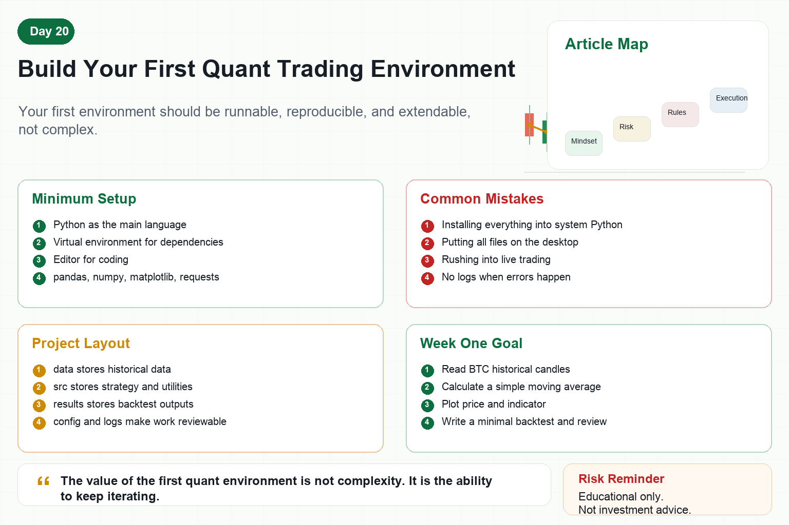

# Build Your First Quant Trading Environment

Many people want to learn quant trading but get stuck at the first step.

What should be installed on the computer?

How should Python be configured?

Where should data go?

How should code be managed?

Should the exchange API be connected immediately?

Your first quant environment does not need to be complex.

Its goal is simple: read data, run strategy code, see results, and reproduce them later.

## 1. What the First Environment Needs

A minimal environment includes five things.

First, Python.

It is the most common language for learning quant trading.

Second, a virtual environment.

It isolates project dependencies so different projects do not interfere with each other.

Third, a code editor.

VS Code, PyCharm, or any editor you are comfortable with is fine.

Fourth, common libraries.

pandas, numpy, matplotlib, and requests are enough to start.

Fifth, a project folder.

Code, data, results, and configuration should live in clear locations.

## 2. Why Use a Virtual Environment?

Many beginners install every library into the system Python.

It feels convenient at first, but becomes messy later.

Different projects may require different library versions.

Code that runs today may fail months later because dependencies changed.

A virtual environment gives each project its own small room.

The project installs only what it needs.

Reproduction, migration, and deployment become clearer.

## 3. Suggested Project Structure

Beginners can start with a simple structure:

project/

data/ for historical data.

notebooks/ for exploration and charts.

src/ for strategy and utility code.

results/ for backtest outputs.

config/ for configuration files.

logs/ for runtime logs.

The structure does not need to be complicated.

But avoid putting every file on the desktop.

A clear structure makes future learning easier.

## 4. Do Not Rush Into Live Trading

Many people want to place orders as soon as the environment is ready.

That is too fast.

The first environment should complete three goals first.

Read one Bitcoin historical candle dataset.

Calculate one simple indicator, such as a moving average.

Plot price and indicator on a chart.

If you can do these three things, your data, code, and charting workflow is working.

Then build a simple backtest.

Only later should you consider simulated trading and small-capital live testing.

## 5. Which Libraries Are Needed?

Beginners do not need many libraries at once.

Start with four basics:

pandas for tables and time series.

numpy for numerical computing.

matplotlib for charts.

requests for API data.

Later, add tools such as ccxt, backtrader, jupyter, or plotly only when needed.

More libraries do not make the system more professional.

A stable workflow matters more.

## 6. Logs and Configuration Are Required

Build the habit of recording things from day one.

Configuration files store symbols, intervals, data paths, and parameters.

Logs record program runs, errors, and key results.

Many beginners do not write logs and can only guess after errors happen.

A quant system should never leave you saying, “I do not know what happened.”

Logs make the system reviewable.

Configuration makes experiments reproducible.

## 7. A First-Week Goal

Day one: install Python and an editor.

Day two: create the project folder and virtual environment.

Day three: install basic libraries.

Day four: read a Bitcoin candle dataset.

Day five: calculate a moving average and plot it.

Day six: write a minimal backtest.

Day seven: organize logs, results, and review notes.

The first week does not need profit.

It only needs a working learning loop.

## Conclusion

Building your first quant environment is not about trading immediately.

It creates a stable place to learn.

Future strategies, data workflows, backtests, and automation will grow from this environment.

Remember:

The value of the first quant environment is not complexity. It is the ability to keep iterating.

> Risk warning: This article is for educational and technical purposes only and does not constitute investment advice. A technical environment does not make a strategy valid, and live trading should be approached carefully.
