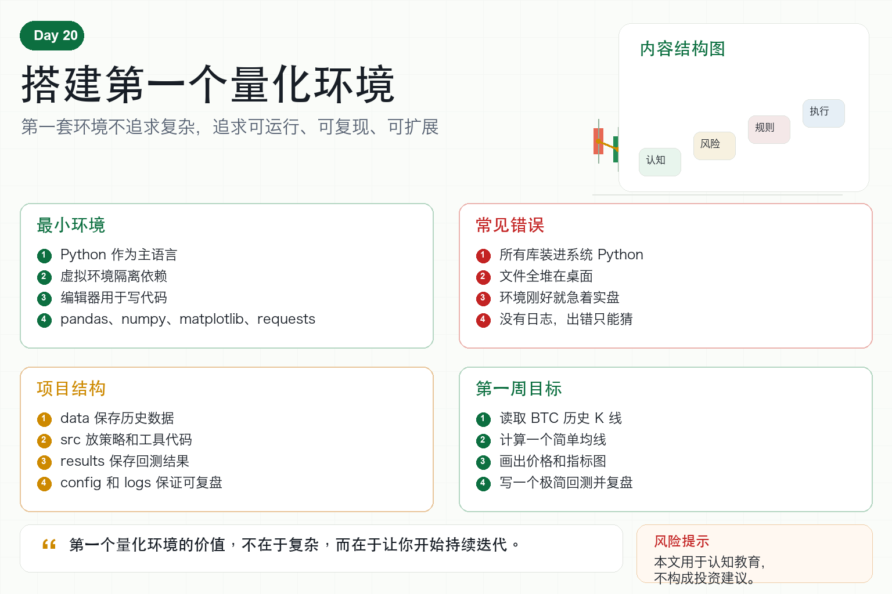

# 搭建第一个量化环境

很多人想学习量化，却卡在第一步。

电脑上到底要装什么？

Python 怎么配置？

数据放在哪里？

代码怎么管理？

要不要一开始就连交易所？

其实第一个量化环境不需要复杂。

它的目标只有一个：让你能稳定地读取数据、运行策略、看到结果，并且下次还能复现。

## 一、第一个环境需要什么？

最小环境包括五样东西。

第一，Python。

它是学习量化最常用的语言。

第二，虚拟环境。

把项目依赖隔离开，避免不同项目互相影响。

第三，代码编辑器。

比如 VS Code、PyCharm 或其他你熟悉的工具。

第四，常用库。

pandas、numpy、matplotlib、requests 足够开始。

第五，项目文件夹。

把代码、数据、结果和配置放在清晰的位置。

## 二、为什么要用虚拟环境？

很多新手直接把所有库装到系统 Python 里。

短期看省事，长期很混乱。

不同项目可能需要不同版本的库。

今天能运行的代码，过几个月可能因为依赖变化而报错。

虚拟环境的作用，就是给每个项目一个独立小房间。

这个项目需要什么库，就装在自己的环境里。

以后复现、迁移、部署都会更清楚。

## 三、推荐的项目结构

新手可以先用一个简单结构：

project/

data/ 保存历史数据；

notebooks/ 做探索和画图；

src/ 放策略和工具代码；

results/ 保存回测结果；

config/ 放配置文件；

logs/ 保存运行日志。

结构不需要一开始很复杂。

但一定要避免所有文件堆在桌面上。

清晰结构会让后续学习轻松很多。

## 四、第一个环境不要急着实盘

很多人环境刚装好，就想连接交易所下单。

这太快了。

第一套环境应该先完成三个目标。

第一，读取一份 BTC 历史 K 线。

第二，计算一个简单指标，比如均线。

第三，画出价格和指标图。

如果你能做到这三件事，说明数据、代码和图表流程已经跑通。

然后再做简单回测。

最后才考虑模拟交易和小资金实盘。

## 五、需要安装哪些库？

新手不需要一次安装很多库。

先装基础四件套：

pandas：处理表格和时间序列；

numpy：做数值计算；

matplotlib：画图；

requests：请求 API 数据。

如果后面需要，再逐步加入 ccxt、backtrader、jupyter、plotly 等工具。

库越多不代表越专业。

能稳定完成任务才重要。

## 六、环境里必须有日志和配置

从第一天开始，就要养成记录习惯。

配置文件用来保存交易对、周期、数据路径和参数。

日志用来记录程序运行、错误和关键结果。

很多新手不写日志，出错后只能猜。

量化系统最怕“我也不知道发生了什么”。

日志让系统变得可复盘。

配置让实验变得可复现。

## 七、普通人的第一周目标

第一天，安装 Python 和编辑器。

第二天，创建项目文件夹和虚拟环境。

第三天，安装基础库。

第四天，读取一份 BTC K 线数据。

第五天，计算均线并画图。

第六天，写一个极简回测。

第七天，整理日志、结果和复盘笔记。

一周不需要赚钱。

一周只需要把学习闭环跑起来。

## 八、结语：先让系统跑起来

搭建第一个量化环境，不是为了立刻交易。

而是为了让你有一个稳定的学习场地。

以后所有策略、数据、回测和自动化，都会从这个环境里长出来。

记住一句话：

第一个量化环境的价值，不在于复杂，而在于让你开始持续迭代。

> 风险提示：本文仅用于交易认知与技术教育，不构成任何投资建议。技术环境搭建不代表策略有效，实盘交易仍需谨慎。
